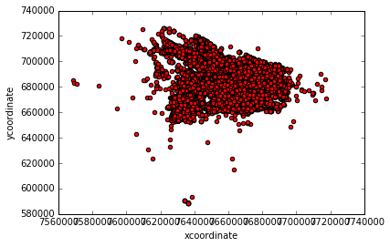
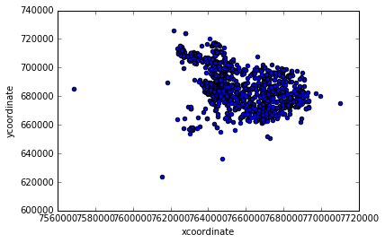
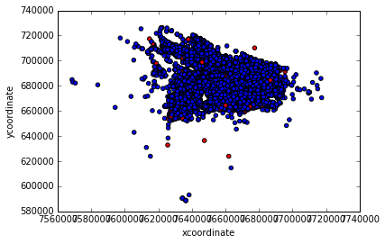
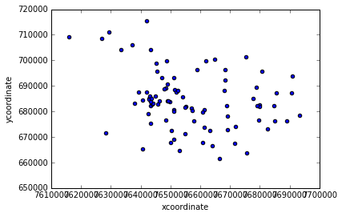
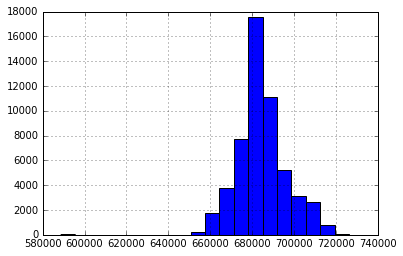
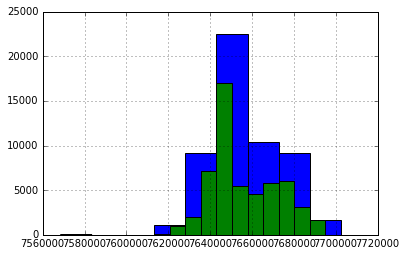
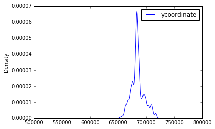

```python
import os
import pandas as pd
import numpy as np
import matplotlib.pyplot as plt
import mpld3
import seaborn
import json

pd.set_option('display.max_columns', 200)
pd.set_option('display.max_rows', 10)
%matplotlib inline
mpld3.enable_notebook()
```


```python
# df = pd.read_csv('../shared-resources/crimedata.csv')
df = pd.DataFrame.from_csv('../shared-resources/crimedata.csv', index_col=0)
df.tail()
```


<div>
<style>
    .dataframe thead tr:only-child th {
        text-align: right;
    }

    .dataframe thead th {
        text-align: left;
    }

    .dataframe tbody tr th {
        vertical-align: top;
    }
</style>
<table border="1" class="dataframe">
  <thead>
    <tr style="text-align: right;">
      <th></th>
      <th>record_id</th>
      <th>report_date</th>
      <th>report_time</th>
      <th>major_offense_type</th>
      <th>address</th>
      <th>neighborhood</th>
      <th>police_precinct</th>
      <th>police_district</th>
      <th>xcoordinate</th>
      <th>ycoordinate</th>
    </tr>
    <tr>
      <th>id</th>
      <th></th>
      <th></th>
      <th></th>
      <th></th>
      <th></th>
      <th></th>
      <th></th>
      <th></th>
      <th></th>
      <th></th>
    </tr>
  </thead>
  <tbody>
    <tr>
      <th>61502</th>
      <td>14462443</td>
      <td>2014-11-16</td>
      <td>19:19:00</td>
      <td>Larceny</td>
      <td>2001-2099 block of NW KEARNEY ST, PORTLAND, OR...</td>
      <td>NORTHWEST</td>
      <td>PORTLAND PREC CE</td>
      <td>810</td>
      <td>7.640298e+06</td>
      <td>686652.67979</td>
    </tr>
    <tr>
      <th>61503</th>
      <td>14380280</td>
      <td>2014-06-16</td>
      <td>08:39:00</td>
      <td>Disorderly Conduct</td>
      <td>1901-2099 block of NE HALSEY ST, PORTLAND, OR ...</td>
      <td>SULLIVANS GULCH</td>
      <td>PORTLAND PREC NO</td>
      <td>670</td>
      <td>7.652081e+06</td>
      <td>687944.91175</td>
    </tr>
    <tr>
      <th>61504</th>
      <td>14399950</td>
      <td>2014-07-16</td>
      <td>11:02:00</td>
      <td>Liquor Laws</td>
      <td>0-298 block of NW 22ND PL, PORTLAND, OR 97210</td>
      <td>NORTHWEST</td>
      <td>PORTLAND PREC CE</td>
      <td>810</td>
      <td>7.638988e+06</td>
      <td>684566.18996</td>
    </tr>
    <tr>
      <th>61505</th>
      <td>14426109</td>
      <td>2014-09-01</td>
      <td>15:33:00</td>
      <td>Larceny</td>
      <td>WASHINGTON PARK</td>
      <td>ARLINGTON HGHTS</td>
      <td>PORTLAND PREC CE</td>
      <td>860</td>
      <td>7.638009e+06</td>
      <td>683215.81507</td>
    </tr>
    <tr>
      <th>61506</th>
      <td>14424628</td>
      <td>2014-09-13</td>
      <td>19:55:00</td>
      <td>Larceny</td>
      <td>14133-14299 block of NE WEIDLER ST, PORTLAND, ...</td>
      <td>WILKES</td>
      <td>PORTLAND PREC EA</td>
      <td>942</td>
      <td>7.685328e+06</td>
      <td>687304.98392</td>
    </tr>
  </tbody>
</table>
</div>


### Lets set our index to the `report_date` column
(the 3rd column, or column number 2, in our CSV)


```python
df = pd.DataFrame.from_csv('../shared-resources/crimedata.csv', index_col=2)
df.tail()


```


<div>
<style>
    .dataframe thead tr:only-child th {
        text-align: right;
    }

    .dataframe thead th {
        text-align: left;
    }

    .dataframe tbody tr th {
        vertical-align: top;
    }
</style>
<table border="1" class="dataframe">
  <thead>
    <tr style="text-align: right;">
      <th></th>
      <th>id</th>
      <th>record_id</th>
      <th>report_time</th>
      <th>major_offense_type</th>
      <th>address</th>
      <th>neighborhood</th>
      <th>police_precinct</th>
      <th>police_district</th>
      <th>xcoordinate</th>
      <th>ycoordinate</th>
    </tr>
    <tr>
      <th>report_date</th>
      <th></th>
      <th></th>
      <th></th>
      <th></th>
      <th></th>
      <th></th>
      <th></th>
      <th></th>
      <th></th>
      <th></th>
    </tr>
  </thead>
  <tbody>
    <tr>
      <th>2014-11-16</th>
      <td>61502</td>
      <td>14462443</td>
      <td>19:19:00</td>
      <td>Larceny</td>
      <td>2001-2099 block of NW KEARNEY ST, PORTLAND, OR...</td>
      <td>NORTHWEST</td>
      <td>PORTLAND PREC CE</td>
      <td>810</td>
      <td>7.640298e+06</td>
      <td>686652.67979</td>
    </tr>
    <tr>
      <th>2014-06-16</th>
      <td>61503</td>
      <td>14380280</td>
      <td>08:39:00</td>
      <td>Disorderly Conduct</td>
      <td>1901-2099 block of NE HALSEY ST, PORTLAND, OR ...</td>
      <td>SULLIVANS GULCH</td>
      <td>PORTLAND PREC NO</td>
      <td>670</td>
      <td>7.652081e+06</td>
      <td>687944.91175</td>
    </tr>
    <tr>
      <th>2014-07-16</th>
      <td>61504</td>
      <td>14399950</td>
      <td>11:02:00</td>
      <td>Liquor Laws</td>
      <td>0-298 block of NW 22ND PL, PORTLAND, OR 97210</td>
      <td>NORTHWEST</td>
      <td>PORTLAND PREC CE</td>
      <td>810</td>
      <td>7.638988e+06</td>
      <td>684566.18996</td>
    </tr>
    <tr>
      <th>2014-09-01</th>
      <td>61505</td>
      <td>14426109</td>
      <td>15:33:00</td>
      <td>Larceny</td>
      <td>WASHINGTON PARK</td>
      <td>ARLINGTON HGHTS</td>
      <td>PORTLAND PREC CE</td>
      <td>860</td>
      <td>7.638009e+06</td>
      <td>683215.81507</td>
    </tr>
    <tr>
      <th>2014-09-13</th>
      <td>61506</td>
      <td>14424628</td>
      <td>19:55:00</td>
      <td>Larceny</td>
      <td>14133-14299 block of NE WEIDLER ST, PORTLAND, ...</td>
      <td>WILKES</td>
      <td>PORTLAND PREC EA</td>
      <td>942</td>
      <td>7.685328e+06</td>
      <td>687304.98392</td>
    </tr>
  </tbody>
</table>
</div>


```python
# Now we can retrieve all the crimes on a particular date just by using the `.loc` getitem method (square brackets)
df.loc['2014-06-16']
```


<div>
<style>
    .dataframe thead tr:only-child th {
        text-align: right;
    }

    .dataframe thead th {
        text-align: left;
    }

    .dataframe tbody tr th {
        vertical-align: top;
    }
</style>
<table border="1" class="dataframe">
  <thead>
    <tr style="text-align: right;">
      <th></th>
      <th>id</th>
      <th>record_id</th>
      <th>report_time</th>
      <th>major_offense_type</th>
      <th>address</th>
      <th>neighborhood</th>
      <th>police_precinct</th>
      <th>police_district</th>
      <th>xcoordinate</th>
      <th>ycoordinate</th>
    </tr>
    <tr>
      <th>report_date</th>
      <th></th>
      <th></th>
      <th></th>
      <th></th>
      <th></th>
      <th></th>
      <th></th>
      <th></th>
      <th></th>
      <th></th>
    </tr>
  </thead>
  <tbody>
    <tr>
      <th>2014-06-16</th>
      <td>6796</td>
      <td>14371447</td>
      <td>17:49:00</td>
      <td>Motor Vehicle Theft</td>
      <td>5801-5899 block of SE 15TH AVE, PORTLAND, OR 9...</td>
      <td>SELLWD-MORELAND</td>
      <td>PORTLAND PREC CE</td>
      <td>742</td>
      <td>7.650525e+06</td>
      <td>668745.03084</td>
    </tr>
    <tr>
      <th>2014-06-16</th>
      <td>7301</td>
      <td>14378337</td>
      <td>12:39:00</td>
      <td>Larceny</td>
      <td>2300-2378 block of W BURNSIDE ST, PORTLAND, OR...</td>
      <td>GOOSE HOLLOW</td>
      <td>PORTLAND PREC CE</td>
      <td>860</td>
      <td>7.638783e+06</td>
      <td>684594.23720</td>
    </tr>
    <tr>
      <th>2014-06-16</th>
      <td>7450</td>
      <td>14378334</td>
      <td>08:31:00</td>
      <td>Burglary</td>
      <td>2500-2698 block of NE 38TH AVE, PORTLAND, OR 9...</td>
      <td>GRANT PARK</td>
      <td>PORTLAND PREC NO</td>
      <td>660</td>
      <td>7.657960e+06</td>
      <td>690333.64501</td>
    </tr>
    <tr>
      <th>...</th>
      <td>...</td>
      <td>...</td>
      <td>...</td>
      <td>...</td>
      <td>...</td>
      <td>...</td>
      <td>...</td>
      <td>...</td>
      <td>...</td>
      <td>...</td>
    </tr>
    <tr>
      <th>2014-06-16</th>
      <td>61081</td>
      <td>14371440</td>
      <td>12:39:00</td>
      <td>Runaway</td>
      <td>Unknown/Not Available</td>
      <td>MULTNOMAH</td>
      <td>PORTLAND PREC CE</td>
      <td>882</td>
      <td>NaN</td>
      <td>NaN</td>
    </tr>
    <tr>
      <th>2014-06-16</th>
      <td>61352</td>
      <td>14372448</td>
      <td>18:29:00</td>
      <td>Larceny</td>
      <td>2500-2598 block of NE MULTNOMAH ST, PORTLAND, ...</td>
      <td>SULLIVANS GULCH</td>
      <td>PORTLAND PREC NO</td>
      <td>670</td>
      <td>7.653786e+06</td>
      <td>687113.71916</td>
    </tr>
    <tr>
      <th>2014-06-16</th>
      <td>61503</td>
      <td>14380280</td>
      <td>08:39:00</td>
      <td>Disorderly Conduct</td>
      <td>1901-2099 block of NE HALSEY ST, PORTLAND, OR ...</td>
      <td>SULLIVANS GULCH</td>
      <td>PORTLAND PREC NO</td>
      <td>670</td>
      <td>7.652081e+06</td>
      <td>687944.91175</td>
    </tr>
  </tbody>
</table>
<p>175 rows × 10 columns</p>
</div>


```python
# What are the types and sizes of each of our columns?
df.info()
```

    <class 'pandas.core.frame.DataFrame'>
    DatetimeIndex: 61497 entries, 2014-01-06 to 2014-09-13
    Data columns (total 10 columns):
    id                    61497 non-null int64
    record_id             61497 non-null int64
    report_time           61497 non-null object
    major_offense_type    61497 non-null object
    address               61497 non-null object
    neighborhood          60616 non-null object
    police_precinct       61493 non-null object
    police_district       61493 non-null object
    xcoordinate           53963 non-null float64
    ycoordinate           53963 non-null float64
    dtypes: float64(2), int64(2), object(6)
    memory usage: 6.4+ MB


### Why didn't Pandas import all those `police_district` numbers as integers?

(They are listed as `<object>` above and the first few in `.head()` all look like integers)
So let's try to manually convert them ourselves


```python
df.police_district.astype(int)
```


    ---------------------------------------------------------------------------

    ValueError                                Traceback (most recent call last)

    <ipython-input-12-54d99d0d6b7a> in <module>()
    ----> 1 df.police_district.astype(int)
    

    ~/.virtualenvs/civicu/lib/python3.5/site-packages/pandas/util/_decorators.py in wrapper(*args, **kwargs)
         89                 else:
         90                     kwargs[new_arg_name] = new_arg_value
    ---> 91             return func(*args, **kwargs)
         92         return wrapper
         93     return _deprecate_kwarg


    ~/.virtualenvs/civicu/lib/python3.5/site-packages/pandas/core/generic.py in astype(self, dtype, copy, errors, **kwargs)
       3408         # else, only a single dtype is given
       3409         new_data = self._data.astype(dtype=dtype, copy=copy, errors=errors,
    -> 3410                                      **kwargs)
       3411         return self._constructor(new_data).__finalize__(self)
       3412 


    ~/.virtualenvs/civicu/lib/python3.5/site-packages/pandas/core/internals.py in astype(self, dtype, **kwargs)
       3222 
       3223     def astype(self, dtype, **kwargs):
    -> 3224         return self.apply('astype', dtype=dtype, **kwargs)
       3225 
       3226     def convert(self, **kwargs):


    ~/.virtualenvs/civicu/lib/python3.5/site-packages/pandas/core/internals.py in apply(self, f, axes, filter, do_integrity_check, consolidate, **kwargs)
       3089 
       3090             kwargs['mgr'] = self
    -> 3091             applied = getattr(b, f)(**kwargs)
       3092             result_blocks = _extend_blocks(applied, result_blocks)
       3093 


    ~/.virtualenvs/civicu/lib/python3.5/site-packages/pandas/core/internals.py in astype(self, dtype, copy, errors, values, **kwargs)
        469     def astype(self, dtype, copy=False, errors='raise', values=None, **kwargs):
        470         return self._astype(dtype, copy=copy, errors=errors, values=values,
    --> 471                             **kwargs)
        472 
        473     def _astype(self, dtype, copy=False, errors='raise', values=None,


    ~/.virtualenvs/civicu/lib/python3.5/site-packages/pandas/core/internals.py in _astype(self, dtype, copy, errors, values, klass, mgr, raise_on_error, **kwargs)
        519 
        520                 # _astype_nansafe works fine with 1-d only
    --> 521                 values = astype_nansafe(values.ravel(), dtype, copy=True)
        522                 values = values.reshape(self.shape)
        523 


    ~/.virtualenvs/civicu/lib/python3.5/site-packages/pandas/core/dtypes/cast.py in astype_nansafe(arr, dtype, copy)
        623     elif arr.dtype == np.object_ and np.issubdtype(dtype.type, np.integer):
        624         # work around NumPy brokenness, #1987
    --> 625         return lib.astype_intsafe(arr.ravel(), dtype).reshape(arr.shape)
        626 
        627     if dtype.name in ("datetime64", "timedelta64"):


    pandas/_libs/lib.pyx in pandas._libs.lib.astype_intsafe (pandas/_libs/lib.c:16264)()


    pandas/_libs/src/util.pxd in util.set_value_at_unsafe (pandas/_libs/lib.c:72625)()


    ValueError: invalid literal for int() with base 10: 'OP'


```python
# Can we mask out everything except crimes in this nonnumbered police district called "OP"
mask = (df.police_district == 'OP')
df[mask].head()
```


<div>
<style>
    .dataframe thead tr:only-child th {
        text-align: right;
    }

    .dataframe thead th {
        text-align: left;
    }

    .dataframe tbody tr th {
        vertical-align: top;
    }
</style>
<table border="1" class="dataframe">
  <thead>
    <tr style="text-align: right;">
      <th></th>
      <th>id</th>
      <th>record_id</th>
      <th>report_time</th>
      <th>major_offense_type</th>
      <th>address</th>
      <th>neighborhood</th>
      <th>police_precinct</th>
      <th>police_district</th>
      <th>xcoordinate</th>
      <th>ycoordinate</th>
    </tr>
    <tr>
      <th>report_date</th>
      <th></th>
      <th></th>
      <th></th>
      <th></th>
      <th></th>
      <th></th>
      <th></th>
      <th></th>
      <th></th>
      <th></th>
    </tr>
  </thead>
  <tbody>
    <tr>
      <th>2014-07-11</th>
      <td>8715</td>
      <td>14395231</td>
      <td>12:05:00</td>
      <td>Trespass</td>
      <td>8200-8698 block of SE CLATSOP ST, PORTLAND, OR...</td>
      <td>NaN</td>
      <td>CLACKAMAS PREC OP</td>
      <td>OP</td>
      <td>7.668727e+06</td>
      <td>661219.86253</td>
    </tr>
    <tr>
      <th>2014-07-11</th>
      <td>8716</td>
      <td>14395141</td>
      <td>12:17:00</td>
      <td>Sex Offenses</td>
      <td>Unknown/Not Available</td>
      <td>NaN</td>
      <td>CLACKAMAS PREC OP</td>
      <td>OP</td>
      <td>NaN</td>
      <td>NaN</td>
    </tr>
    <tr>
      <th>2014-07-11</th>
      <td>9630</td>
      <td>14395227</td>
      <td>12:05:00</td>
      <td>Aggravated Assault</td>
      <td>8200-8698 block of SE CLATSOP ST, PORTLAND, OR...</td>
      <td>NaN</td>
      <td>CLACKAMAS PREC OP</td>
      <td>OP</td>
      <td>7.668727e+06</td>
      <td>661219.86253</td>
    </tr>
    <tr>
      <th>2014-01-18</th>
      <td>25330</td>
      <td>14283731</td>
      <td>08:40:00</td>
      <td>Fraud</td>
      <td>12100-12198 block of SE 82ND AVE, HAPPY VALLEY...</td>
      <td>NaN</td>
      <td>CLACKAMAS PREC OP</td>
      <td>OP</td>
      <td>7.668486e+06</td>
      <td>651852.74541</td>
    </tr>
    <tr>
      <th>2014-01-20</th>
      <td>25962</td>
      <td>14290611</td>
      <td>03:34:00</td>
      <td>Drugs</td>
      <td>SE JOHNSON CREEK BLVD and SE 82ND AVE, MILWAUK...</td>
      <td>NaN</td>
      <td>CLACKAMAS PREC OP</td>
      <td>OP</td>
      <td>7.668667e+06</td>
      <td>659564.25755</td>
    </tr>
  </tbody>
</table>
</div>


```python
# let's clean up that major_offense_type string to make it consistently spelled and capitalized
df.major_offense_type = df.major_offense_type.str.lower().str.strip()
# now let's count them up
df.major_offense_type.value_counts()
```


    larceny      24178
    vandalism     4411
    burglary      4102
                 ...  
    curfew          24
    kidnap          20
    gambling         1
    Name: major_offense_type, Length: 27, dtype: int64


*Looks like gambling is not a popular crime*  
(or at least not a popular *police reported* crime)  


```python
# Now let's count up crimes by police district
# Notice any non-integer values?
district_counts = trespasses.police_district.value_counts()
district_counts
```


    822    208
    830    171
    690    151
          ... 
    WL2      1
    PA       1
    130      1
    Name: police_district, Length: 71, dtype: int64


```python
mask = df.major_offense_type == 'trespass'
trespasses = df[mask]
df[mask].describe()
```


<div>
<style>
    .dataframe thead tr:only-child th {
        text-align: right;
    }

    .dataframe thead th {
        text-align: left;
    }

    .dataframe tbody tr th {
        vertical-align: top;
    }
</style>
<table border="1" class="dataframe">
  <thead>
    <tr style="text-align: right;">
      <th></th>
      <th>id</th>
      <th>record_id</th>
      <th>xcoordinate</th>
      <th>ycoordinate</th>
    </tr>
  </thead>
  <tbody>
    <tr>
      <th>count</th>
      <td>2805.000000</td>
      <td>2.805000e+03</td>
      <td>2.336000e+03</td>
      <td>2336.000000</td>
    </tr>
    <tr>
      <th>mean</th>
      <td>31501.791800</td>
      <td>1.438067e+07</td>
      <td>7.654999e+06</td>
      <td>685287.317006</td>
    </tr>
    <tr>
      <th>std</th>
      <td>18132.340337</td>
      <td>6.305688e+04</td>
      <td>1.587560e+04</td>
      <td>10823.867973</td>
    </tr>
    <tr>
      <th>...</th>
      <td>...</td>
      <td>...</td>
      <td>...</td>
      <td>...</td>
    </tr>
    <tr>
      <th>50%</th>
      <td>32751.000000</td>
      <td>1.437741e+07</td>
      <td>7.648121e+06</td>
      <td>684309.884840</td>
    </tr>
    <tr>
      <th>75%</th>
      <td>45359.000000</td>
      <td>1.443537e+07</td>
      <td>7.669134e+06</td>
      <td>687827.310282</td>
    </tr>
    <tr>
      <th>max</th>
      <td>61445.000000</td>
      <td>1.454167e+07</td>
      <td>7.710211e+06</td>
      <td>725838.940620</td>
    </tr>
  </tbody>
</table>
<p>8 rows × 4 columns</p>
</div>


```python
district_counts

```


    822    208
    830    171
    690    151
          ... 
    WL2      1
    PA       1
    130      1
    Name: police_district, Length: 71, dtype: int64


```python
# let's create a dictionary of all the crime counts in all the districts
dict(zip(district_counts.index, district_counts))

```


    {'130': 1,
     '141': 1,
     '151': 2,
     '161': 1,
     '162': 11,
     '352': 1,
     '510': 32,
     '520': 30,
     '530': 62,
     '540': 67,
     '550': 25,
     '560': 32,
     '570': 32,
     '580': 22,
     '590': 58,
     '610': 25,
     '620': 19,
     '630': 32,
     '641': 30,
     '642': 33,
     '651': 93,
     '652': 25,
     '660': 17,
     '670': 18,
     '680': 40,
     '690': 151,
     '711': 64,
     '712': 25,
     '720': 19,
     '730': 34,
     '741': 31,
     '742': 21,
     '800': 14,
     '810': 70,
     '821': 40,
     '822': 208,
     '830': 171,
     '841': 20,
     '842': 116,
     '850': 96,
     '860': 10,
     '871': 45,
     '872': 6,
     '881': 15,
     '882': 16,
     '890': 12,
     '901': 56,
     '902': 42,
     '911': 34,
     '912': 21,
     '921': 33,
     '922': 27,
     '923': 37,
     '931': 45,
     '932': 27,
     '941': 106,
     '942': 34,
     '951': 49,
     '952': 66,
     '961': 63,
     '962': 48,
     '971': 58,
     '972': 61,
     '981': 29,
     '982': 25,
     '990': 44,
     'HP3': 1,
     'OP': 2,
     'PA': 1,
     'T24': 1,
     'WL2': 1}


```python
# Let's talk about dict and zip to make sure you understand the code above
dict([('a', 0), ('b', 1), ('c', 2), ('d', 3), ('e', 4)])
```


    {'a': 0, 'b': 1, 'c': 2, 'd': 3, 'e': 4}


```python
# dict will accept any sequences of pairings (2-tuples)
# but what if we have two sequences of values that we want to "pair up"
# zip brings the two sides of a pair (the sides of a zipper) together in an alligned pairing
list(zip(['a', 'b', 'c', 'd', 'e'], [0, 1, 2, 3, 4]))
```


    [('a', 0), ('b', 1), ('c', 2), ('d', 3), ('e', 4)]


```python
# and a dict is can take a list of pairs, like before... so
dict(zip(['a', 'b', 'c', 'd', 'e'], [0, 1, 2, 3, 4]))
```


    {'a': 0, 'b': 1, 'c': 2, 'd': 3, 'e': 4}


```python
# and `range(5)` is a sequence (iterable)
dict(zip(['a', 'b', 'c', 'd', 'e'], range(5)))
```


    {'a': 0, 'b': 1, 'c': 2, 'd': 3, 'e': 4}


```python
# if we get the length wrong, the zipper will get "stuck" on the shortest sequence
dict(zip(['a', 'b', 'c', 'd', 'e'], range(4)))
```


    {'a': 0, 'b': 1, 'c': 2, 'd': 3}


```python
# or because any sequence will do, and a str is a sequence of characters:
dict(zip('abcde', range(5)))
```


    {'a': 0, 'b': 1, 'c': 2, 'd': 3, 'e': 4}


```python
# What will happen if you try to coerce a list of 3-tuples into a dict?
dict([('a', 1, 2), ('b', 3, 4)])
```


```python
x = list(range(3))
y = list(range(4))
print(x)
print(y)
list(zip(x, y, range(5)))

```

    [0, 1, 2]
    [0, 1, 2, 3]


    [(0, 0, 0), (1, 1, 1), (2, 2, 2)]


```python
x = [(0, 0, 0), (1, 1, 1), (2, 2, 2)]
list(zip(*x))

```


    [(0, 1, 2), (0, 1, 2), (0, 1, 2)]


```python
list(zip(x[0], x[1], x[2]))
```


    [(0, 1, 2), (0, 1, 2), (0, 1, 2)]


```python
df.report_date = pd.to_datetime(df.report_date)
df.report_date
```


    id
    10      2014-01-06
    11      2014-01-05
    12      2014-01-23
    13      2014-01-14
    14      2014-01-19
    15      2014-01-08
    16      2014-01-07
    17      2014-01-09
    18      2014-01-02
    19      2014-01-14
    20      2014-01-16
    21      2014-01-24
    22      2014-01-05
    23      2014-01-05
    24      2014-01-01
    25      2014-01-02
    26      2014-01-14
    27      2014-01-12
    28      2014-01-10
    29      2014-01-09
    30      2014-01-24
    31      2014-01-24
    32      2014-01-01
    33      2014-01-06
    34      2014-01-04
    35      2014-01-03
    36      2014-01-16
    37      2014-01-11
    38      2014-01-04
    39      2014-01-01
               ...    
    61477   2014-05-09
    61478   2014-09-08
    61479   2014-07-24
    61480   2014-08-24
    61481   2014-11-23
    61482   2014-12-30
    61483   2014-11-09
    61484   2014-09-10
    61485   2014-05-11
    61486   2014-06-28
    61487   2014-07-25
    61488   2014-08-30
    61489   2014-01-03
    61490   2014-02-27
    61491   2014-05-06
    61492   2014-06-04
    61493   2014-06-17
    61494   2014-07-23
    61495   2014-08-01
    61496   2014-03-13
    61497   2014-02-21
    61498   2014-09-20
    61499   2014-12-10
    61500   2014-11-22
    61501   2014-08-19
    61502   2014-11-16
    61503   2014-06-16
    61504   2014-07-16
    61505   2014-09-01
    61506   2014-09-13
    Name: report_date, Length: 61497, dtype: datetime64[ns]


```python
def fun(x):
    return str(x)

df.report_date.apply(fun)
# df.

```


    id
    10       2014-01-06 00:00:00
    11       2014-01-05 00:00:00
    12       2014-01-23 00:00:00
    13       2014-01-14 00:00:00
    14       2014-01-19 00:00:00
    15       2014-01-08 00:00:00
    16       2014-01-07 00:00:00
    17       2014-01-09 00:00:00
    18       2014-01-02 00:00:00
    19       2014-01-14 00:00:00
    20       2014-01-16 00:00:00
    21       2014-01-24 00:00:00
    22       2014-01-05 00:00:00
    23       2014-01-05 00:00:00
    24       2014-01-01 00:00:00
    25       2014-01-02 00:00:00
    26       2014-01-14 00:00:00
    27       2014-01-12 00:00:00
    28       2014-01-10 00:00:00
    29       2014-01-09 00:00:00
    30       2014-01-24 00:00:00
    31       2014-01-24 00:00:00
    32       2014-01-01 00:00:00
    33       2014-01-06 00:00:00
    34       2014-01-04 00:00:00
    35       2014-01-03 00:00:00
    36       2014-01-16 00:00:00
    37       2014-01-11 00:00:00
    38       2014-01-04 00:00:00
    39       2014-01-01 00:00:00
                    ...         
    61477    2014-05-09 00:00:00
    61478    2014-09-08 00:00:00
    61479    2014-07-24 00:00:00
    61480    2014-08-24 00:00:00
    61481    2014-11-23 00:00:00
    61482    2014-12-30 00:00:00
    61483    2014-11-09 00:00:00
    61484    2014-09-10 00:00:00
    61485    2014-05-11 00:00:00
    61486    2014-06-28 00:00:00
    61487    2014-07-25 00:00:00
    61488    2014-08-30 00:00:00
    61489    2014-01-03 00:00:00
    61490    2014-02-27 00:00:00
    61491    2014-05-06 00:00:00
    61492    2014-06-04 00:00:00
    61493    2014-06-17 00:00:00
    61494    2014-07-23 00:00:00
    61495    2014-08-01 00:00:00
    61496    2014-03-13 00:00:00
    61497    2014-02-21 00:00:00
    61498    2014-09-20 00:00:00
    61499    2014-12-10 00:00:00
    61500    2014-11-22 00:00:00
    61501    2014-08-19 00:00:00
    61502    2014-11-16 00:00:00
    61503    2014-06-16 00:00:00
    61504    2014-07-16 00:00:00
    61505    2014-09-01 00:00:00
    61506    2014-09-13 00:00:00
    Name: report_date, Length: 61497, dtype: object


```python
# df.plot.scatter(x='xcoordinate', y='ycoordinate', c='r')
df.plot(kind='scatter', x='xcoordinate', y='ycoordinate', c='r')

from matplotlib import pyplot as plt
plt.show()
```





```python
df.std()
```


    record_id      63997.072010
    xcoordinate    16113.946724
    ycoordinate    11582.723344
    dtype: float64


```python
trespasses.plot(kind='scatter', x='xcoordinate', y='ycoordinate')
plt.show()
```





```python
colornums = mask.astype(int)
# print(type(colornums))
# colornums?
# print(colornums.__dict__)
# print(colornums)
```


```python
# colornums.index = pd.Series(colornums.index).apply(chr)
colornums
```


    0        0
    1        0
    2        0
    3        0
    4        1
    5        0
    6        0
    7        0
    8        0
    9        0
    10       0
    11       0
    12       0
    13       0
    14       0
    15       1
    16       0
    17       0
    18       0
    19       0
    20       0
    21       0
    22       0
    23       0
    24       0
    25       0
    26       0
    27       0
    28       0
    29       0
            ..
    61467    0
    61468    0
    61469    0
    61470    0
    61471    0
    61472    0
    61473    0
    61474    0
    61475    0
    61476    0
    61477    0
    61478    0
    61479    0
    61480    0
    61481    0
    61482    0
    61483    0
    61484    0
    61485    0
    61486    0
    61487    0
    61488    0
    61489    0
    61490    0
    61491    0
    61492    0
    61493    0
    61494    0
    61495    0
    61496    0
    Name: major_offense_type, Length: 61497, dtype: int64


```python
colors = np.array(['b', 'r'])[colornums]
colors
```


    array(['b', 'b', 'b', ..., 'b', 'b', 'b'],
          dtype='<U1')


```python

```


```python
df.plot(kind='scatter', x='xcoordinate', y='ycoordinate', c=colors)
```


    <matplotlib.axes._subplots.AxesSubplot at 0x7f2c1a194390>


```python
plt.show()
```





```python
df.sample(100).plot.scatter(x='xcoordinate', y='ycoordinate')
```


    <matplotlib.axes._subplots.AxesSubplot at 0x7f2c1a151240>


```python
plt.show()
```





```python
df.xcoordinate.hist(bins=20)
```


    <matplotlib.axes._subplots.AxesSubplot at 0x7f2c18ad79b0>


```python
df.ycoordinate.hist(bins=20)
plt.show()
```





```python
df.plot?

```


```python
plt.show()

```





```python
df.plot.density(x='xcoordinate', y='ycoordinate')
```


    <matplotlib.axes._subplots.AxesSubplot at 0x7f2c18ccb6a0>


```python
!pip install mpld3
import mpld3

```

    Collecting mpld3
    Installing collected packages: mpld3
    Successfully installed mpld3-0.3


```python
df.sample(1000).plot.scatter(x='xcoordinate', y='ycoordinate')
mpld3.enable_notebook()
plt.show()
```


<style>

</style>

<div id="fig_el126281398273755290961318347800"></div>
<script>
function mpld3_load_lib(url, callback){
  var s = document.createElement('script');
  s.src = url;
  s.async = true;
  s.onreadystatechange = s.onload = callback;
  s.onerror = function(){console.warn("failed to load library " + url);};
  document.getElementsByTagName("head")[0].appendChild(s);
}

if(typeof(mpld3) !== "undefined" && mpld3._mpld3IsLoaded){
   // already loaded: just create the figure
   !function(mpld3){
       
       mpld3.draw_figure("fig_el126281398273755290961318347800", {"plugins": [{"type": "reset"}, {"enabled": false, "button": true, "type": "zoom"}, {"enabled": false, "button": true, "type": "boxzoom"}], "height": 288.0, "data": {"data01": [[7650873.92126, 680692.81463], [7654036.13419, 674397.24606], [7649493.013780001, 678134.96227], [7632156.610560001, 659274.24344], [7645421.60335, 683309.75427], [7674780.0187, 687331.96818], [7684900.82185, 694543.98097], [7631871.30938, 665922.37008], [7686162.63615, 682924.23917], [7643563.02345, 680562.54321], [7662862.977689999, 663965.34974], [7679669.30085, 673909.2919899999], [7678988.82677, 679210.04987], [7648277.01936, 663817.40059], [7637243.120730001, 701176.68537], [7648738.3248, 687267.8284100001], [7674850.301260001, 691573.0415899999], [7644931.85105, 683511.54429], [7644338.442910001, 679956.2687], [7639426.209969999, 702199.51181], [7652236.75919, 678784.15026], [7656649.29364, 681568.8838600001], [7642089.66175, 703428.31037], [7647050.6339300005, 686840.79776], [7625841.50295, 711370.67487], [7648210.53675, 687025.74606], [7630097.717189999, 704893.4311], [7641917.62402, 698831.39206], [7683137.90092, 668199.3353], [7624527.361880001, 712886.95899], [7679615.493439999, 672070.8481], [7684412.890089999, 679620.09088], [7649534.566000001, 687622.382], [7656185.62533, 677329.88878], [7673382.791010001, 668544.72014], [7643602.577760001, 679572.02526], [7650646.67585, 681740.4750699999], [7668783.92126, 663331.6309100001], [7648373.01837, 683892.9986899999], [7680339.907810001, 666429.7874], [7643156.21621, 683961.18865], [7644357.576119999, 685869.0971100001], [7640883.631689999, 683945.5217], [7658452.2680399995, 689300.21588], [7656199.27657, 678016.25394], [7645378.254919999, 698732.91798], [7643723.515089999, 679224.99344], [7641659.48163, 681766.2523], [7686782.45407, 681784.05938], [7679402.26837, 676481.10794], [7647427.52625, 687049.53281], [7670837.07677, 667638.34318], [7624046.414369999, 716044.06923], [7644391.64272, 709861.71785], [7649802.25295, 688009.479], [7641488.191930001, 683523.99508], [7645665.13826, 682757.65683], [7643631.5692300005, 678816.04593], [7673205.16995, 682084.2270300001], [7624968.60892, 709326.94062], [7659608.02657, 687811.46391], [7674132.3047899995, 687346.4580100001], [7630217.373360001, 673171.49606], [7655075.9675199995, 688181.61319], [7662330.908139999, 695661.22277], [7665810.808730001, 669149.05938], [7685493.1647, 678301.46785], [7653811.42684, 697639.84318], [7657624.1227, 681800.71227], [7624847.408139999, 709456.1902899999], [7668777.869419999, 663175.6601], [7651256.11778, 695939.92192], [7679146.9225699995, 699440.9311], [7676951.90715, 671309.03215], [7642376.53609, 684830.6246699999], [7647757.77723, 699564.37894], [7643439.05643, 703381.4225699999], [7671623.8937, 669947.24508], [7658240.89206, 667937.37073], [7642994.629269999, 679531.69915], [7629736.931760001, 709827.9461899999], [7662970.74114, 668133.83268], [7656690.083660001, 667194.9977], [7680026.82087, 687724.85335], [7650160.718489999, 686973.53657], [7641646.915030001, 719253.20965], [7656976.647639999, 679957.6601], [7647715.06102, 687821.6669899999], [7676649.95505, 699920.0003300001], [7645430.75295, 684086.21621], [7647011.31299, 690263.71063], [7669057.3563, 671694.3399], [7651719.001639999, 682747.2962600001], [7669074.42192, 672113.93734], [7670547.08924, 675391.93996], [7669718.44915, 695444.43307], [7654379.2293300005, 685624.33202], [7644616.541339999, 684828.40715], [7646712.594819999, 698705.0708699999], [7649501.16896, 678394.83497], [7632356.682089999, 706516.8563], [7657361.03478, 673640.30217], [7639260.405839999, 688733.7034100001], [7643118.79528, 683130.58825], [7649823.00919, 664038.09252], [7667560.33136, 672653.00919], [7660080.08005, 667882.44816], [7675173.28675, 687318.9274899999], [7643676.797239999, 685089.33694], [7642896.53773, 684830.11024], [7641724.533139999, 706540.11877], [7675425.50197, 677812.29724], [7651382.22178, 669272.08793], [7656573.15978, 684171.20604], [7641184.796589999, 684207.5652899999], [7654929.8353, 691523.83104], [7648868.29823, 683097.04003], [7642710.05512, 671207.03937], [7650735.808069999, 673068.7962600001], [7662973.49705, 677355.55807], [7644855.058730001, 694427.88714], [7647148.270010001, 706069.82612], [7676878.341860001, 681970.08399], [7644535.90978, 682549.85728], [7644832.86713, 683271.1223800001], [7660158.98885, 686389.3313600001], [7679402.26837, 676481.10794], [7641077.567260001, 685871.90945], [7634294.4708, 657639.30217], [7644709.0479, 686801.6752], [7635631.48228, 671154.93832], [7669095.392999999, 672751.084], [7645009.50098, 689925.9918], [7646933.56299, 687876.97802], [7680180.78806, 698649.25492], [7643424.69882, 686128.03675], [7642897.05512, 685350.10794], [7639259.890089999, 688213.70604], [7668718.6752, 684894.96555], [7615843.0977, 709203.0051399999], [7669095.392999999, 672751.084], [7677110.40879, 684052.70702], [7645344.03707, 686016.2149], [7634247.81562, 708516.31496], [7648402.80413, 693395.70997], [7650078.442910001, 688527.93668], [7632913.71391, 656624.43012], [7673350.7593, 686217.78173], [7668950.674869999, 688835.51706], [7654602.07415, 680836.61286], [7643118.79528, 683130.58825], [7677728.388119999, 696250.26148], [7680983.70801, 671160.55512], [7682819.16109, 681858.74016], [7669045.174869999, 700318.73294], [7629298.71325, 708485.21785], [7673150.057, 681009.3809999999], [7633355.3956699995, 705959.79495], [7652218.69751, 677991.56135], [7665118.53478, 676173.33399], [7650614.05512, 680700.98753], [7636853.79396, 667373.6003899999], [7638742.41109, 690033.91601], [7668981.1542, 669856.7477], [7656939.102689999, 666927.76312], [7676561.58005, 691273.2208], [7680011.21325, 687212.26083], [7650406.79692, 693332.5958], [7641488.191930001, 683523.99508], [7643151.3569600005, 684309.6437], [7658832.611219999, 687840.15912], [7642132.041339999, 680727.86581], [7643738.6437, 709707.79724], [7643243.33038, 699300.03215], [7645378.254919999, 698732.91798], [7675836.49902, 695274.05315], [7649623.495730001, 682292.9058399999], [7646337.98917, 691461.3605600001], [7661106.68537, 695373.79298], [7670356.26115, 669616.5229699999], [7659217.700130001, 688836.17782], [7653394.87467, 670094.68898], [7667393.6227, 676545.93701], [7643560.54823, 682389.08005], [7651798.190939999, 693291.96818], [7660124.59285, 685130.5492100001], [7659300.423880001, 667905.73031], [7647015.79265, 690403.5990800001], [7645024.59613, 683753.91798], [7680011.21325, 687212.26083], [7654856.22113, 699834.60302], [7673150.057, 681009.3809999999], [7641658.13287, 700173.35991], [7680983.70801, 671160.55512], [7669358.53707, 685591.13484], [7646093.7401600005, 699618.02165], [7642608.241, 717350.521], [7663634.85892, 671838.43701], [7643835.4793300005, 675908.39304], [7636230.71325, 689586.76509], [7685326.69062, 679009.51411], [7660231.513119999, 703977.62795], [7652482.45801, 689891.75295], [7664918.64173, 671289.7240800001], [7642260.566930001, 706005.29528], [7645136.54396, 684827.89206], [7668326.79298, 674322.8503899999], [7649607.18635, 681773.16404], [7645209.64993, 690830.86581], [7648813.09843, 681017.7513100001], [7671612.81299, 669551.4212600001], [7669095.392999999, 672751.084], [7633600.19915, 669121.00295], [7653530.76017, 696688.77428], [7648250.729660001, 679994.92585], [7648746.95374, 703947.9940899999], [7660382.26017, 677402.68799], [7645969.41175, 684826.9439], [7626154.6168, 714101.5682399999], [7644875.664039999, 684308.09022], [7657175.07283, 677302.0853], [7669009.88222, 670478.55085], [7669095.392999999, 672751.084], [7639930.78609, 668444.52395], [7643216.235889999, 695860.63648], [7642378.557089999, 686912.7979], [7668726.897310001, 661219.86253], [7645139.23392, 684309.88484], [7647748.22178, 688861.13419], [7643500.343830001, 696135.00394], [7658576.497380001, 692655.33727], [7668865.91929, 666778.49016], [7642896.53773, 684830.11024], [7643500.1227, 682976.29101], [7647687.94915, 691085.28281], [7642120.44718, 686653.54101], [7655148.78379, 693866.98392], [7629525.39272, 706060.14108], [7627851.71325, 672340.3549899999], [7669593.00886, 692133.6961899999], [7688513.10794, 664400.10991], [7658936.16798, 662748.38911], [7654523.92093, 687420.2296600001], [7649916.341860001, 691673.7919899999], [7638738.33825, 686654.2253899999], [7658785.15092, 699740.31627], [7644357.058069999, 685349.09941], [7643461.04528, 682148.8546600001], [7641500.011810001, 667326.02526], [7679895.67848, 683740.7066899999], [7658059.209969999, 692670.94685], [7644785.60728, 682447.05774], [7673150.057, 681009.3809999999], [7638123.55085, 679278.08891], [7620822.1857, 707685.42388], [7644595.1542, 694895.7962600001], [7669149.27657, 674300.56299], [7647238.37205, 700521.61483], [7659637.702760001, 677912.62992], [7666569.19488, 684960.45702], [7669676.58202, 694352.32316], [7654032.29298, 699808.63714], [7679791.1430399995, 678914.83202], [7642954.88419, 682357.63878], [7683166.298880001, 669314.37927], [7631992.00033, 708958.07513], [7641078.60105, 686911.90682], [7651767.709969999, 684306.53117], [7660316.97113, 667085.52395], [7644733.88287, 683030.70013], [7661308.40125, 683794.67979], [7687992.09285, 690576.1378], [7673258.99081, 683381.70702], [7645129.82152, 683993.42651], [7647690.80085, 687042.04462], [7689280.604660001, 676359.88812], [7672881.931760001, 667273.1309100001], [7662571.878939999, 670992.76804], [7639259.201119999, 684538.7477], [7645257.038389999, 713406.96621], [7628136.80282, 706723.87008], [7691857.1273, 671349.18077], [7644356.8002, 685088.66404], [7636286.317589999, 676482.56365], [7648181.113189999, 666361.54724], [7643778.522969999, 681457.9288100001], [7646138.7975699995, 701017.29298], [7643449.49245, 694934.78707], [7644358.904860001, 685609.65781], [7655106.960960001, 674955.46063], [7643388.7149, 703390.68143], [7679886.28609, 692496.51378], [7657933.163710001, 675978.38517], [7644119.2313, 683005.4580100001], [7678994.110239999, 676496.37434], [7673350.7593, 686217.78173], [7679784.10367, 678629.17224], [7648171.021980001, 694783.61417], [7646751.689960001, 690271.85728], [7654804.842189999, 696160.2208], [7645082.565939999, 683168.31988], [7636182.07677, 688997.31102], [7630844.8848399995, 666819.28904], [7677506.71522, 685271.31102], [7679766.413710001, 677827.7582], [7658047.3497399995, 671992.0738199999], [7643045.15322, 678834.8733600001], [7644785.60728, 682447.05774], [7686782.45407, 681784.05938], [7654333.3353, 690400.57349], [7669622.8956699995, 669226.0203399999], [7663439.0853, 686448.98327], [7648356.70801, 683373.25623], [7650794.57119, 697280.8809100001], [7663506.9521, 691936.2523], [7647309.544160001, 687388.46877], [7645969.454919999, 684272.37317], [7655730.234910001, 667999.98097], [7669379.67323, 686524.42815], [7657658.20505, 687956.0757899999], [7657945.49278, 702051.73885], [7648094.994089999, 683641.61483], [7643853.12402, 677244.81562], [7651270.13648, 673515.375], [7643957.05184, 683350.5229699999], [7657641.05381, 664532.09875], [7640489.00066, 681123.65223], [7664337.10728, 673158.12205], [7681169.9819600005, 687479.66404], [7663123.307089999, 685327.8441600001], [7658554.88517, 697883.49606], [7642119.933730001, 684569.87303], [7645933.43799, 684063.6811], [7643835.36614, 684567.51083], [7646933.56299, 687876.97802], [7645136.54396, 684827.89206], [7648739.70177, 678678.90781], [7679895.67848, 683740.7066899999], [7643118.79528, 683130.58825], [7669082.3930399995, 672357.31299], [7675802.110239999, 693954.6414], [7673150.057, 681009.3809999999], [7674620.83104, 683395.7270300001], [7649907.02723, 693347.7808399999], [7675179.26115, 687557.06234], [7680339.907810001, 666429.7874], [7645139.23392, 684309.88484], [7648006.79396, 680783.75689], [7646976.17028, 689145.6046600001], [7689738.941269999, 681046.4973800001], [7666252.076119999, 667383.33104], [7643599.288389999, 687895.229], [7676007.56857, 689164.9665399999], [7675251.08038, 701601.18701], [7668529.030180001, 670872.93274], [7642410.33694, 680332.52395], [7680318.98064, 699524.98294], [7657567.23917, 674531.12927], [7643118.79528, 683130.58825], [7652798.51673, 684014.19915], [7650914.871060001, 667138.63287], [7642641.41109, 686127.14304], [7642378.557089999, 686912.7979], [7645954.18537, 685086.0351], [7681358.23228, 695523.26017], [7645378.254919999, 698732.91798], [7634832.700130001, 665589.7933100001], [7668326.79298, 674322.8503899999], [7646773.73228, 697905.67388], [7671759.88025, 673907.0689], [7646696.461610001, 688641.26083], [7643045.15322, 678834.8733600001], [7669095.392999999, 672751.084], [7686708.74311, 679188.05906], [7645660.98655, 684293.62894], [7667252.14403, 692215.81135], [7657285.2303100005, 676778.66798], [7657525.226710001, 670688.8097100001], [7647332.0252600005, 703215.31365], [7674070.39895, 682063.88419], [7649733.41699, 677524.63287], [7638009.40829, 683215.81507], [7649534.566000001, 687622.382], [7642119.933730001, 684569.87303], [7656960.765089999, 682602.18898], [7650160.718489999, 686973.53657], [7631403.49081, 668613.3622], [7642897.05512, 685350.10794], [7677728.388119999, 696250.26148], [7669721.5702100005, 680756.96982], [7643797.081689999, 683697.55512], [7675693.87598, 681800.23622], [7648526.91896, 680506.49508], [7665061.280839999, 671203.5013100001], [7680109.4147, 690018.65682], [7653976.49803, 670706.38845], [7642608.241, 717350.521], [7644629.666339999, 681388.42684], [7654366.07677, 677886.1742100001], [7640298.85663, 687172.6788100001], [7659867.684710001, 665234.33465], [7643554.478999999, 676226.73491], [7688108.67618, 677308.78937], [7644931.85105, 683511.54429], [7665395.030180001, 682966.1601], [7685959.628610001, 676346.42782], [7677428.6063, 696296.1217199999], [7669266.73983, 681949.04987], [7642123.861880001, 687170.87073], [7649808.64108, 663518.29134], [7643156.79626, 685089.8520300001], [7644196.75468, 697574.53378], [7642292.4803100005, 684035.93209], [7676391.70308, 684643.81627], [7661665.6348399995, 683783.80282], [7650078.442910001, 688527.93668], [7650963.586610001, 683551.40322], [7661814.6348399995, 672932.68799], [7669473.666010001, 668704.1988199999], [7637923.0502, 717057.8832], [7649347.31332, 681781.33596], [7654274.718830001, 673731.39206], [7644535.90978, 682549.85728], [7636226.66699, 663742.9311], [7639390.3143, 704164.12402], [7642212.10105, 679851.18077], [7692274.2303100005, 673044.0259199999], [7641341.6725699995, 688469.30512], [7681613.979660001, 685591.64928], [7644472.67192, 695359.00197], [7685025.2792, 676349.38058], [7673727.4101, 685236.98064], [7676086.2582, 670119.1712600001], [7684841.47441, 682970.78182], [7665618.77723, 692428.5397], [7646659.17749, 687539.9101], [7645660.98655, 684293.62894], [7641076.2742800005, 684571.91207], [7667888.30217, 684919.86877], [7644176.29692, 682411.97277], [7645665.13826, 682757.65683], [7644091.746719999, 715623.69259], [7639777.56332, 685873.19685], [7652269.57808, 675448.48819], [7644733.88287, 683030.70013], [7644474.93963, 683137.3067600001], [7650160.718489999, 686973.53657], [7670547.08924, 675391.93996], [7644924.354660001, 696122.35991], [7623821.38517, 711060.68963], [7644641.90682, 658005.24442], [7658699.82874, 688833.4767100001], [7683217.95801, 693985.19849], [7666826.76608, 684952.63714], [7642639.38025, 687690.36024], [7657961.00295, 677020.51083], [7686875.780180001, 684446.66535], [7641334.265089999, 684832.41076], [7659501.578410001, 689732.15781], [7644855.058730001, 694427.88714], [7631184.513780001, 706818.16601], [7642641.41109, 686127.14304], [7687884.14206, 684417.3832], [7687732.6374699995, 694715.02198], [7642193.3727, 678563.53871], [7690150.935039999, 673379.55774], [7659826.78675, 685120.0541300001], [7642378.557089999, 686912.7979], [7632514.323489999, 709494.97802], [7655878.69587, 674411.41995], [7642650.6278800005, 710713.80115], [7675092.11581, 687048.11844], [7648181.113189999, 666361.54724], [7642566.3946899995, 679986.49016], [7668915.31562, 668014.65879], [7642895.41962, 684313.0305100001], [7615788.520339999, 702269.06791], [7642608.241, 717350.521], [7642123.861880001, 687170.87073], [7654520.567260001, 673203.76181], [7642120.067260001, 686392.40223], [7678006.02559, 678551.0200100001], [7683218.68865, 688471.23917], [7644616.28412, 684568.40682], [7679869.23917, 682913.73589], [7637438.59613, 686915.51083], [7653976.49803, 670706.38845], [7647345.44783, 703714.80184], [7671067.621060001, 682156.21325], [7641079.11811, 687431.9058399999], [7655180.216860001, 666764.21686], [7644616.28412, 684568.40682], [7661923.0, 675947.50755], [7689929.6584600005, 689736.0502], [7649095.594819999, 682049.37894], [7666151.67913, 663887.7355600001], [7644357.576119999, 685869.0971100001], [7629075.63583, 680129.8211899999], [7642810.236880001, 683822.66568], [7645209.932739999, 673674.79232], [7686587.70308, 673622.13615], [7641858.343830001, 686651.50984], [7642378.557089999, 686912.7979], [7680647.32677, 681896.7080100001], [7653228.291010001, 678744.46719], [7671647.6069600005, 670754.2270300001], [7682414.470139999, 696746.40879], [7643457.77953, 704055.73819], [7647142.164369999, 686272.9665399999], [7674132.3047899995, 687346.4580100001], [7643118.79528, 683130.58825], [7641339.63615, 687951.646], [7638604.254919999, 684823.99573], [7687479.889110001, 682874.89108], [7668261.60892, 668333.03018], [7646982.08202, 689351.03871], [7678904.343830001, 676498.62205], [7642090.5702100005, 694633.35302], [7668291.40682, 692179.26214], [7683312.718830001, 675103.75722], [7673205.16995, 682084.2270300001], [7640956.529860001, 684305.0351], [7655679.870730001, 677344.15026], [7670002.50919, 697265.1558399999], [7644474.93963, 683137.3067600001], [7643500.1227, 682976.29101], [7674988.602689999, 701758.68668], [7651375.237860001, 688487.2749300001], [7647471.01608, 688344.45013], [7641077.825130001, 686131.90879], [7644807.33104, 696629.31627], [7645082.565939999, 683168.31988], [7680262.72605, 676453.94291], [7650078.442910001, 688527.93668], [7637853.235889999, 708398.33891], [7643118.79528, 683130.58825], [7673800.770339999, 666830.39764], [7669160.87795, 674710.14304], [7674688.13848, 673453.08978], [7641595.06857, 685869.6338600001], [7647913.2313, 708928.94193], [7625435.418310001, 709095.06365], [7654061.42848, 674831.1437], [7631870.834319999, 706434.3996100001], [7661361.91896, 673788.33629], [7643898.0242800005, 680270.80774], [7681827.727030001, 681875.5082], [7675693.87598, 681800.23622], [7645139.23392, 684309.88484], [7689105.03675, 681724.90157], [7645396.14403, 684306.4740800001], [7652054.1122, 708910.2700100001], [7680112.49902, 673918.88419], [7664265.15125, 690781.20013], [7642038.28478, 676007.1761800001], [7647244.12205, 681068.16109], [7639778.59777, 686913.1939], [7676468.327760001, 686289.34088], [7643759.07677, 682869.6811], [7669149.27657, 674300.56299], [7642378.557089999, 686912.7979], [7645396.14403, 684306.4740800001], [7673025.19587, 682089.83071], [7660124.59285, 685130.5492100001], [7690339.83104, 678959.07972], [7647112.44685, 694349.53773], [7637732.646980001, 654680.75689], [7648242.58202, 679735.0541300001], [7650273.11829, 686703.0634], [7656299.431760001, 681578.81726], [7643772.93898, 697429.4439], [7644569.18635, 710850.78379], [7644573.923880001, 683377.729], [7640929.8415399995, 676744.71293], [7639258.59711, 686913.70833], [7666544.75787, 684121.65682], [7687649.058069999, 677992.99016], [7664677.754919999, 669606.73294], [7644931.85105, 683511.54429], [7626695.844819999, 708917.6020300001], [7650160.718489999, 686973.53657], [7644357.576119999, 685869.0971100001], [7644337.755910001, 682068.9799899999], [7624269.245080001, 709395.08891], [7624896.5915399995, 663920.9954100001], [7642637.70604, 686911.05151], [7643169.09424, 696378.0098], [7669338.378939999, 684876.25492], [7669095.392999999, 672751.084], [7670872.227030001, 702409.73753], [7643663.683730001, 695845.19488], [7651182.08038, 680162.44849], [7688617.42093, 676352.83891], [7677371.685039999, 695235.04068], [7652056.42881, 687165.0597100001], [7649615.34121, 682033.03379], [7642035.95801, 701792.22343], [7647660.701119999, 695256.6217199999], [7643555.17863, 682817.9554699999], [7652428.235560001, 700641.78182], [7669149.27657, 674300.56299], [7644876.2851, 684568.15125], [7643677.11975, 684309.88484], [7679655.395010001, 665226.86188], [7690516.03543, 684342.33694], [7669783.66699, 687484.0249300001], [7645647.59899, 684289.8575800001], [7659083.41109, 698411.86778], [7657426.4042, 695680.5308399999], [7659217.700130001, 688836.17782], [7668935.61778, 668565.55217], [7642500.604989999, 704437.76608], [7644357.833989999, 686128.6601], [7641079.89337, 688211.9028899999], [7652989.74902, 681854.94783], [7633915.9708, 703952.50525], [7638550.077760001, 706696.1223800001], [7613736.272310001, 707193.58071], [7673015.05381, 681827.22178], [7647816.23228, 704232.3458], [7659459.9074800005, 680187.80709], [7666601.775889999, 668487.51649], [7645421.60335, 683309.75427], [7680159.64108, 684557.1975100001], [7649410.673560001, 683340.06201], [7643439.05643, 703381.4225699999], [7637709.369089999, 687695.2418], [7669578.9649, 667718.50984], [7666221.014760001, 666524.47178], [7643993.217189999, 680523.88878], [7645320.798880001, 716686.58793], [7648047.754919999, 700025.28445], [7643555.17863, 682817.9554699999], [7679196.71325, 682676.6742100001], [7661610.22867, 681476.54396], [7673229.557739999, 702642.7962600001], [7674436.220210001, 683366.39512], [7691645.52625, 675173.5561], [7683678.521980001, 681840.2103], [7648250.729660001, 679994.92585], [7653786.200789999, 687113.7191600001], [7654049.50886, 674541.1791300001], [7647687.94915, 691085.28281], [7675236.190939999, 669651.91798], [7624707.333660001, 709675.23196], [7669095.392999999, 672751.084], [7674132.3047899995, 687346.4580100001], [7686162.63615, 682924.23917], [7643925.371060001, 704062.35564], [7642637.56988, 685870.36319], [7652052.407810001, 702981.26706], [7671225.74803, 665474.79134], [7637974.611880001, 663265.84186], [7646976.146000001, 680814.92487], [7643979.93734, 702407.78707], [7648064.78576, 707584.80282], [7672586.42085, 695456.68507], [7644357.576119999, 685869.0971100001], [7631645.79495, 658250.85892], [7644728.31513, 673246.02825], [7629376.99803, 707928.95735], [7671460.756560001, 663170.7418], [7641724.533139999, 706540.11877], [7656252.059710001, 679978.46391], [7685688.10105, 694325.7270300001], [7654584.359910001, 674962.23327], [7642449.22605, 715274.69915], [7664490.83891, 673793.75722], [7670640.59941, 668256.34514], [7643677.960960001, 681213.83202], [7644634.8992800005, 682790.2792], [7674112.71522, 679218.12992], [7644876.2851, 684568.15125], [7643723.515089999, 679224.99344], [7630212.67618, 673458.8832], [7660158.98885, 686389.3313600001], [7645623.88287, 713697.21752], [7692869.7628, 677167.39272], [7664918.32185, 667099.12697], [7685959.628610001, 676346.42782], [7673112.423880001, 702864.66371], [7642523.64206, 696508.00427], [7633063.43832, 709475.8979699999], [7647837.00787, 683389.59777], [7653277.68602, 682959.4973800001], [7643118.79528, 683130.58825], [7649607.18635, 681773.16404], [7652592.9603, 677433.34318], [7642819.76281, 714475.8045399999], [7642119.11975, 687430.875], [7685795.74705, 674427.6437], [7684061.79823, 678598.96785], [7633671.22178, 705598.51837], [7644343.513780001, 684308.6788100001], [7644569.18635, 710850.78379], [7674132.3047899995, 687346.4580100001], [7679669.30085, 673909.2919899999], [7684135.4675199995, 681830.79167], [7668961.8651600005, 669243.8832], [7643135.48587, 710552.72045], [7639660.21358, 701531.25197], [7680955.1125300005, 683726.1669899999], [7643454.639760001, 695396.7526199999], [7645835.98097, 675063.29232], [7657180.50295, 664044.73622], [7645136.28609, 684567.89304], [7669028.476710001, 670858.38025], [7629298.71325, 708485.21785], [7639778.59777, 686913.1939], [7669095.392999999, 672751.084], [7636570.94816, 683963.18438], [7649298.38287, 680222.10991], [7643687.11877, 674346.21752], [7648339.9757199995, 691151.0771], [7648228.84777, 703691.47802], [7633827.245080001, 707765.4402899999], [7644641.90682, 658005.24442], [7657698.057089999, 685871.14633], [7671759.88025, 673907.0689], [7643118.79528, 683130.58825], [7666464.12697, 694448.42979], [7657557.057089999, 679941.21325], [7654699.2303100005, 690390.9544], [7676391.70308, 684643.81627], [7679533.816930001, 670167.3937], [7630024.4393, 706555.00394], [7647740.0128, 688606.26608], [7666561.575789999, 697676.64403], [7644095.49967, 684828.59383], [7645665.13826, 682757.65683], [7665172.610560001, 688728.09514], [7647160.17913, 685369.6092899999], [7642396.53609, 694509.33432], [7645656.28576, 684567.37795], [7668788.155839999, 663580.1039999999], [7673752.977689999, 685877.43963], [7642638.27165, 686386.97014], [7642176.793310001, 681553.1378], [7670600.84875, 688457.0259199999], [7644357.058069999, 685349.09941], [7661348.80512, 670587.64108], [7646398.834319999, 700548.66929], [7643118.79528, 683130.58825], [7654490.452760001, 686560.94062], [7644876.54298, 684828.14928], [7645665.13826, 682757.65683], [7616763.807410001, 699084.10302], [7639778.59777, 686913.1939], [7642638.27165, 686386.97014], [7644036.30413, 698761.52986], [7641759.4675199995, 682006.25525], [7660945.422239999, 667857.22343], [7648866.18799, 682577.41371], [7664011.67946, 695603.26083], [7642871.191269999, 683235.22375], [7653724.66798, 698512.64633], [7632171.522310001, 705596.06037], [7618922.36877, 691632.2815], [7659475.977689999, 688812.38812], [7643151.3569600005, 684309.6437], [7639777.04626, 685353.1975100001], [7647991.19619, 688328.25919], [7657660.458660001, 666041.40617], [7672113.806760001, 688076.82218], [7654873.79823, 700500.21293], [7652519.40223, 680085.15223], [7643195.068239999, 717063.08891], [7643416.021980001, 684309.5958], [7642353.33825, 683448.45997], [7650216.59022, 684615.40682], [7679728.086289999, 676467.03675], [7656275.4875300005, 687026.0475699999], [7649128.31398, 683089.78182], [7679196.71325, 682676.6742100001], [7643599.11581, 683216.71227], [7657940.4442300005, 666896.375], [7643661.512139999, 682626.0229699999], [7661118.20604, 695701.0482300001], [7643536.62205, 710372.52657], [7638415.479660001, 685092.0876], [7647996.73097, 660965.67585], [7652448.094160001, 701392.28773], [7645139.23392, 684309.88484], [7660158.98885, 686389.3313600001], [7650813.556760001, 669036.41273], [7663629.52493, 687681.48196], [7641892.896000001, 677657.04692], [7663474.853019999, 687430.3248], [7689587.25886, 689460.0315], [7689243.83038, 684901.05807], [7623174.04823, 708694.74278], [7642608.241, 717350.521], [7670941.18012, 693014.33038], [7671274.03923, 670592.0689], [7679799.25787, 679183.21785], [7644630.3425199995, 689728.88287], [7665894.6729, 672306.65486], [7665411.3622, 673763.9019], [7643634.10007, 680378.03871], [7645139.23392, 684309.88484], [7651270.13648, 673515.375], [7641019.549869999, 681747.01673], [7639260.14895, 688473.7037399999], [7649534.566000001, 687622.382], [7651983.9252, 677451.9986899999], [7679720.08117, 683182.27355], [7689398.6939, 687010.75295], [7659073.08301, 692073.66371], [7683293.823489999, 674102.77264], [7640297.82316, 686132.6817600001], [7638009.40829, 683215.81507], [7644616.719160001, 684308.09022], [7644357.4977, 684829.01673], [7654802.665680001, 671286.61089], [7637209.78773, 706121.96391], [7645181.55085, 683408.7411399999], [7642896.53773, 684830.11024], [7686447.30118, 682977.42651], [7644119.966680001, 682702.8685699999], [7655616.11778, 697127.83071], [7659946.789039999, 679598.93898], [7643118.79528, 683130.58825], [7644215.996060001, 683243.91634], [7672363.05938, 694688.98294], [7643153.309060001, 684570.13681], [7648247.6624, 662780.93799], [7677823.32087, 699888.14633], [7644357.058069999, 685349.09941], [7648816.62434, 705354.62008], [7648909.075130001, 684396.39665], [7655691.28379, 678262.11319], [7643004.0771, 681774.71424], [7675251.08038, 701601.18701], [7675900.46227, 697528.72867], [7642089.66175, 703428.31037], [7645139.23392, 684309.88484], [7644119.2313, 683005.4580100001], [7689796.9793300005, 682639.48819], [7668402.0561, 696398.93898], [7657211.363189999, 680253.16273], [7661348.80512, 670587.64108], [7650078.442910001, 688527.93668], [7670601.807739999, 662357.93799], [7648202.17028, 686756.33071], [7683727.78609, 688465.79888], [7686626.46555, 676664.2240800001], [7668923.60892, 668187.7270300001], [7640221.734910001, 682541.41568], [7649534.566000001, 687622.382], [7645280.5351, 683649.16109], [7658582.943239999, 687844.24016], [7680272.344160001, 673922.2808399999], [7644733.88287, 683030.70013], [7663683.1168, 683723.7231], [7647097.138119999, 693425.91076], [7645954.18537, 685086.0351], [7655968.00295, 682368.53871], [7684935.638119999, 678247.20997], [7669403.18012, 687213.53904], [7672974.40879, 679138.86385], [7655075.9675199995, 688181.61319], [7654886.7706699995, 676906.3458], [7643976.6620000005, 682667.11], [7644876.80085, 685088.1479699999], [7669276.8497399995, 681138.2962600001], [7628247.29199, 708346.51083], [7645609.828, 697911.905], [7669057.3563, 671694.3399], [7642117.5689, 685870.88025], [7680856.04396, 676432.09285], [7645379.253939999, 683894.01083], [7635973.439960001, 685413.9977], [7670393.76772, 668367.33104], [7639865.56463, 684477.7080100001], [7658515.770010001, 667929.16175], [7649883.369419999, 682284.73392], [7642896.05381, 686388.39698], [7671424.610889999, 687734.09941], [7654398.006560001, 684232.5981], [7654646.020339999, 687935.0794], [7650560.146000001, 700642.04528], [7644629.666339999, 681388.42684], [7648291.51345, 681294.2851], [7644033.68062, 711901.3139300001], [7641019.549869999, 681747.01673], [7690738.73294, 687195.49442], [7675096.603019999, 687180.93012], [7640299.11581, 687432.67782], [7690242.9101, 681698.88287], [7650993.78478, 695950.98392], [7636929.612860001, 686432.53773], [7643439.05643, 703381.4225699999], [7638181.496389999, 690904.17684], [7638175.789039999, 704743.5419899999], [7679669.30085, 673909.2919899999], [7671227.967189999, 674241.10663], [7650103.28576, 676065.14895], [7644569.18635, 710850.78379], [7647160.17913, 685369.6092899999], [7639778.59777, 686913.1939], [7669473.666010001, 668704.1988199999], [7629395.57677, 711145.91404]]}, "axes": [{"ylim": [650000.0, 730000.0], "zoomable": true, "id": "el12628139827411947192", "xdomain": [7600000.0, 7700000.0], "xscale": "linear", "axesbg": "#FFFFFF", "axes": [{"tickvalues": null, "visible": true, "tickformat": null, "nticks": 6, "scale": "linear", "grid": {"gridOn": false}, "fontsize": 10.0, "position": "bottom"}, {"tickvalues": null, "visible": true, "tickformat": null, "nticks": 9, "scale": "linear", "grid": {"gridOn": false}, "fontsize": 10.0, "position": "left"}], "yscale": "linear", "texts": [{"alpha": 1, "fontsize": 10.0, "v_baseline": "hanging", "color": "#000000", "rotation": -0.0, "h_anchor": "middle", "coordinates": "axes", "zorder": 3, "id": "el12628139827368881512", "position": [0.49999999999999994, -0.08512544802867385], "text": "xcoordinate"}, {"alpha": 1, "fontsize": 10.0, "v_baseline": "auto", "color": "#000000", "rotation": -90.0, "h_anchor": "middle", "coordinates": "axes", "zorder": 3, "id": "el12628139827375502672", "position": [-0.13963560334528077, 0.5], "text": "ycoordinate"}], "xlim": [7600000.0, 7700000.0], "paths": [], "sharex": [], "ydomain": [650000.0, 730000.0], "images": [], "lines": [], "markers": [], "bbox": [0.125, 0.125, 0.775, 0.775], "collections": [{"pathtransforms": [[4.47213595499958, 0.0, 0.0, 4.47213595499958, 0.0, 0.0]], "edgewidths": [1.0], "facecolors": ["#0000FF"], "edgecolors": ["#000000"], "zorder": 1, "pathcoordinates": "display", "id": "el12628139827375331648", "offsets": "data01", "offsetcoordinates": "data", "paths": [[[[0.0, -0.5], [0.13260155, -0.5], [0.25978993539242673, -0.44731684579412084], [0.3535533905932738, -0.3535533905932738], [0.44731684579412084, -0.25978993539242673], [0.5, -0.13260155], [0.5, 0.0], [0.5, 0.13260155], [0.44731684579412084, 0.25978993539242673], [0.3535533905932738, 0.3535533905932738], [0.25978993539242673, 0.44731684579412084], [0.13260155, 0.5], [0.0, 0.5], [-0.13260155, 0.5], [-0.25978993539242673, 0.44731684579412084], [-0.3535533905932738, 0.3535533905932738], [-0.44731684579412084, 0.25978993539242673], [-0.5, 0.13260155], [-0.5, 0.0], [-0.5, -0.13260155], [-0.44731684579412084, -0.25978993539242673], [-0.3535533905932738, -0.3535533905932738], [-0.25978993539242673, -0.44731684579412084], [-0.13260155, -0.5], [0.0, -0.5]], ["M", "C", "C", "C", "C", "C", "C", "C", "C", "Z"]]], "xindex": 0, "yindex": 1, "alphas": [null]}], "axesbgalpha": null, "sharey": []}], "id": "el12628139827375529096", "width": 432.0});
   }(mpld3);
}else if(typeof define === "function" && define.amd){
   // require.js is available: use it to load d3/mpld3
   require.config({paths: {d3: "https://mpld3.github.io/js/d3.v3.min"}});
   require(["d3"], function(d3){
      window.d3 = d3;
      mpld3_load_lib("https://mpld3.github.io/js/mpld3.v0.3.js", function(){
         
         mpld3.draw_figure("fig_el126281398273755290961318347800", {"plugins": [{"type": "reset"}, {"enabled": false, "button": true, "type": "zoom"}, {"enabled": false, "button": true, "type": "boxzoom"}], "height": 288.0, "data": {"data01": [[7650873.92126, 680692.81463], [7654036.13419, 674397.24606], [7649493.013780001, 678134.96227], [7632156.610560001, 659274.24344], [7645421.60335, 683309.75427], [7674780.0187, 687331.96818], [7684900.82185, 694543.98097], [7631871.30938, 665922.37008], [7686162.63615, 682924.23917], [7643563.02345, 680562.54321], [7662862.977689999, 663965.34974], [7679669.30085, 673909.2919899999], [7678988.82677, 679210.04987], [7648277.01936, 663817.40059], [7637243.120730001, 701176.68537], [7648738.3248, 687267.8284100001], [7674850.301260001, 691573.0415899999], [7644931.85105, 683511.54429], [7644338.442910001, 679956.2687], [7639426.209969999, 702199.51181], [7652236.75919, 678784.15026], [7656649.29364, 681568.8838600001], [7642089.66175, 703428.31037], [7647050.6339300005, 686840.79776], [7625841.50295, 711370.67487], [7648210.53675, 687025.74606], [7630097.717189999, 704893.4311], [7641917.62402, 698831.39206], [7683137.90092, 668199.3353], [7624527.361880001, 712886.95899], [7679615.493439999, 672070.8481], [7684412.890089999, 679620.09088], [7649534.566000001, 687622.382], [7656185.62533, 677329.88878], [7673382.791010001, 668544.72014], [7643602.577760001, 679572.02526], [7650646.67585, 681740.4750699999], [7668783.92126, 663331.6309100001], [7648373.01837, 683892.9986899999], [7680339.907810001, 666429.7874], [7643156.21621, 683961.18865], [7644357.576119999, 685869.0971100001], [7640883.631689999, 683945.5217], [7658452.2680399995, 689300.21588], [7656199.27657, 678016.25394], [7645378.254919999, 698732.91798], [7643723.515089999, 679224.99344], [7641659.48163, 681766.2523], [7686782.45407, 681784.05938], [7679402.26837, 676481.10794], [7647427.52625, 687049.53281], [7670837.07677, 667638.34318], [7624046.414369999, 716044.06923], [7644391.64272, 709861.71785], [7649802.25295, 688009.479], [7641488.191930001, 683523.99508], [7645665.13826, 682757.65683], [7643631.5692300005, 678816.04593], [7673205.16995, 682084.2270300001], [7624968.60892, 709326.94062], [7659608.02657, 687811.46391], [7674132.3047899995, 687346.4580100001], [7630217.373360001, 673171.49606], [7655075.9675199995, 688181.61319], [7662330.908139999, 695661.22277], [7665810.808730001, 669149.05938], [7685493.1647, 678301.46785], [7653811.42684, 697639.84318], [7657624.1227, 681800.71227], [7624847.408139999, 709456.1902899999], [7668777.869419999, 663175.6601], [7651256.11778, 695939.92192], [7679146.9225699995, 699440.9311], [7676951.90715, 671309.03215], [7642376.53609, 684830.6246699999], [7647757.77723, 699564.37894], [7643439.05643, 703381.4225699999], [7671623.8937, 669947.24508], [7658240.89206, 667937.37073], [7642994.629269999, 679531.69915], [7629736.931760001, 709827.9461899999], [7662970.74114, 668133.83268], [7656690.083660001, 667194.9977], [7680026.82087, 687724.85335], [7650160.718489999, 686973.53657], [7641646.915030001, 719253.20965], [7656976.647639999, 679957.6601], [7647715.06102, 687821.6669899999], [7676649.95505, 699920.0003300001], [7645430.75295, 684086.21621], [7647011.31299, 690263.71063], [7669057.3563, 671694.3399], [7651719.001639999, 682747.2962600001], [7669074.42192, 672113.93734], [7670547.08924, 675391.93996], [7669718.44915, 695444.43307], [7654379.2293300005, 685624.33202], [7644616.541339999, 684828.40715], [7646712.594819999, 698705.0708699999], [7649501.16896, 678394.83497], [7632356.682089999, 706516.8563], [7657361.03478, 673640.30217], [7639260.405839999, 688733.7034100001], [7643118.79528, 683130.58825], [7649823.00919, 664038.09252], [7667560.33136, 672653.00919], [7660080.08005, 667882.44816], [7675173.28675, 687318.9274899999], [7643676.797239999, 685089.33694], [7642896.53773, 684830.11024], [7641724.533139999, 706540.11877], [7675425.50197, 677812.29724], [7651382.22178, 669272.08793], [7656573.15978, 684171.20604], [7641184.796589999, 684207.5652899999], [7654929.8353, 691523.83104], [7648868.29823, 683097.04003], [7642710.05512, 671207.03937], [7650735.808069999, 673068.7962600001], [7662973.49705, 677355.55807], [7644855.058730001, 694427.88714], [7647148.270010001, 706069.82612], [7676878.341860001, 681970.08399], [7644535.90978, 682549.85728], [7644832.86713, 683271.1223800001], [7660158.98885, 686389.3313600001], [7679402.26837, 676481.10794], [7641077.567260001, 685871.90945], [7634294.4708, 657639.30217], [7644709.0479, 686801.6752], [7635631.48228, 671154.93832], [7669095.392999999, 672751.084], [7645009.50098, 689925.9918], [7646933.56299, 687876.97802], [7680180.78806, 698649.25492], [7643424.69882, 686128.03675], [7642897.05512, 685350.10794], [7639259.890089999, 688213.70604], [7668718.6752, 684894.96555], [7615843.0977, 709203.0051399999], [7669095.392999999, 672751.084], [7677110.40879, 684052.70702], [7645344.03707, 686016.2149], [7634247.81562, 708516.31496], [7648402.80413, 693395.70997], [7650078.442910001, 688527.93668], [7632913.71391, 656624.43012], [7673350.7593, 686217.78173], [7668950.674869999, 688835.51706], [7654602.07415, 680836.61286], [7643118.79528, 683130.58825], [7677728.388119999, 696250.26148], [7680983.70801, 671160.55512], [7682819.16109, 681858.74016], [7669045.174869999, 700318.73294], [7629298.71325, 708485.21785], [7673150.057, 681009.3809999999], [7633355.3956699995, 705959.79495], [7652218.69751, 677991.56135], [7665118.53478, 676173.33399], [7650614.05512, 680700.98753], [7636853.79396, 667373.6003899999], [7638742.41109, 690033.91601], [7668981.1542, 669856.7477], [7656939.102689999, 666927.76312], [7676561.58005, 691273.2208], [7680011.21325, 687212.26083], [7650406.79692, 693332.5958], [7641488.191930001, 683523.99508], [7643151.3569600005, 684309.6437], [7658832.611219999, 687840.15912], [7642132.041339999, 680727.86581], [7643738.6437, 709707.79724], [7643243.33038, 699300.03215], [7645378.254919999, 698732.91798], [7675836.49902, 695274.05315], [7649623.495730001, 682292.9058399999], [7646337.98917, 691461.3605600001], [7661106.68537, 695373.79298], [7670356.26115, 669616.5229699999], [7659217.700130001, 688836.17782], [7653394.87467, 670094.68898], [7667393.6227, 676545.93701], [7643560.54823, 682389.08005], [7651798.190939999, 693291.96818], [7660124.59285, 685130.5492100001], [7659300.423880001, 667905.73031], [7647015.79265, 690403.5990800001], [7645024.59613, 683753.91798], [7680011.21325, 687212.26083], [7654856.22113, 699834.60302], [7673150.057, 681009.3809999999], [7641658.13287, 700173.35991], [7680983.70801, 671160.55512], [7669358.53707, 685591.13484], [7646093.7401600005, 699618.02165], [7642608.241, 717350.521], [7663634.85892, 671838.43701], [7643835.4793300005, 675908.39304], [7636230.71325, 689586.76509], [7685326.69062, 679009.51411], [7660231.513119999, 703977.62795], [7652482.45801, 689891.75295], [7664918.64173, 671289.7240800001], [7642260.566930001, 706005.29528], [7645136.54396, 684827.89206], [7668326.79298, 674322.8503899999], [7649607.18635, 681773.16404], [7645209.64993, 690830.86581], [7648813.09843, 681017.7513100001], [7671612.81299, 669551.4212600001], [7669095.392999999, 672751.084], [7633600.19915, 669121.00295], [7653530.76017, 696688.77428], [7648250.729660001, 679994.92585], [7648746.95374, 703947.9940899999], [7660382.26017, 677402.68799], [7645969.41175, 684826.9439], [7626154.6168, 714101.5682399999], [7644875.664039999, 684308.09022], [7657175.07283, 677302.0853], [7669009.88222, 670478.55085], [7669095.392999999, 672751.084], [7639930.78609, 668444.52395], [7643216.235889999, 695860.63648], [7642378.557089999, 686912.7979], [7668726.897310001, 661219.86253], [7645139.23392, 684309.88484], [7647748.22178, 688861.13419], [7643500.343830001, 696135.00394], [7658576.497380001, 692655.33727], [7668865.91929, 666778.49016], [7642896.53773, 684830.11024], [7643500.1227, 682976.29101], [7647687.94915, 691085.28281], [7642120.44718, 686653.54101], [7655148.78379, 693866.98392], [7629525.39272, 706060.14108], [7627851.71325, 672340.3549899999], [7669593.00886, 692133.6961899999], [7688513.10794, 664400.10991], [7658936.16798, 662748.38911], [7654523.92093, 687420.2296600001], [7649916.341860001, 691673.7919899999], [7638738.33825, 686654.2253899999], [7658785.15092, 699740.31627], [7644357.058069999, 685349.09941], [7643461.04528, 682148.8546600001], [7641500.011810001, 667326.02526], [7679895.67848, 683740.7066899999], [7658059.209969999, 692670.94685], [7644785.60728, 682447.05774], [7673150.057, 681009.3809999999], [7638123.55085, 679278.08891], [7620822.1857, 707685.42388], [7644595.1542, 694895.7962600001], [7669149.27657, 674300.56299], [7647238.37205, 700521.61483], [7659637.702760001, 677912.62992], [7666569.19488, 684960.45702], [7669676.58202, 694352.32316], [7654032.29298, 699808.63714], [7679791.1430399995, 678914.83202], [7642954.88419, 682357.63878], [7683166.298880001, 669314.37927], [7631992.00033, 708958.07513], [7641078.60105, 686911.90682], [7651767.709969999, 684306.53117], [7660316.97113, 667085.52395], [7644733.88287, 683030.70013], [7661308.40125, 683794.67979], [7687992.09285, 690576.1378], [7673258.99081, 683381.70702], [7645129.82152, 683993.42651], [7647690.80085, 687042.04462], [7689280.604660001, 676359.88812], [7672881.931760001, 667273.1309100001], [7662571.878939999, 670992.76804], [7639259.201119999, 684538.7477], [7645257.038389999, 713406.96621], [7628136.80282, 706723.87008], [7691857.1273, 671349.18077], [7644356.8002, 685088.66404], [7636286.317589999, 676482.56365], [7648181.113189999, 666361.54724], [7643778.522969999, 681457.9288100001], [7646138.7975699995, 701017.29298], [7643449.49245, 694934.78707], [7644358.904860001, 685609.65781], [7655106.960960001, 674955.46063], [7643388.7149, 703390.68143], [7679886.28609, 692496.51378], [7657933.163710001, 675978.38517], [7644119.2313, 683005.4580100001], [7678994.110239999, 676496.37434], [7673350.7593, 686217.78173], [7679784.10367, 678629.17224], [7648171.021980001, 694783.61417], [7646751.689960001, 690271.85728], [7654804.842189999, 696160.2208], [7645082.565939999, 683168.31988], [7636182.07677, 688997.31102], [7630844.8848399995, 666819.28904], [7677506.71522, 685271.31102], [7679766.413710001, 677827.7582], [7658047.3497399995, 671992.0738199999], [7643045.15322, 678834.8733600001], [7644785.60728, 682447.05774], [7686782.45407, 681784.05938], [7654333.3353, 690400.57349], [7669622.8956699995, 669226.0203399999], [7663439.0853, 686448.98327], [7648356.70801, 683373.25623], [7650794.57119, 697280.8809100001], [7663506.9521, 691936.2523], [7647309.544160001, 687388.46877], [7645969.454919999, 684272.37317], [7655730.234910001, 667999.98097], [7669379.67323, 686524.42815], [7657658.20505, 687956.0757899999], [7657945.49278, 702051.73885], [7648094.994089999, 683641.61483], [7643853.12402, 677244.81562], [7651270.13648, 673515.375], [7643957.05184, 683350.5229699999], [7657641.05381, 664532.09875], [7640489.00066, 681123.65223], [7664337.10728, 673158.12205], [7681169.9819600005, 687479.66404], [7663123.307089999, 685327.8441600001], [7658554.88517, 697883.49606], [7642119.933730001, 684569.87303], [7645933.43799, 684063.6811], [7643835.36614, 684567.51083], [7646933.56299, 687876.97802], [7645136.54396, 684827.89206], [7648739.70177, 678678.90781], [7679895.67848, 683740.7066899999], [7643118.79528, 683130.58825], [7669082.3930399995, 672357.31299], [7675802.110239999, 693954.6414], [7673150.057, 681009.3809999999], [7674620.83104, 683395.7270300001], [7649907.02723, 693347.7808399999], [7675179.26115, 687557.06234], [7680339.907810001, 666429.7874], [7645139.23392, 684309.88484], [7648006.79396, 680783.75689], [7646976.17028, 689145.6046600001], [7689738.941269999, 681046.4973800001], [7666252.076119999, 667383.33104], [7643599.288389999, 687895.229], [7676007.56857, 689164.9665399999], [7675251.08038, 701601.18701], [7668529.030180001, 670872.93274], [7642410.33694, 680332.52395], [7680318.98064, 699524.98294], [7657567.23917, 674531.12927], [7643118.79528, 683130.58825], [7652798.51673, 684014.19915], [7650914.871060001, 667138.63287], [7642641.41109, 686127.14304], [7642378.557089999, 686912.7979], [7645954.18537, 685086.0351], [7681358.23228, 695523.26017], [7645378.254919999, 698732.91798], [7634832.700130001, 665589.7933100001], [7668326.79298, 674322.8503899999], [7646773.73228, 697905.67388], [7671759.88025, 673907.0689], [7646696.461610001, 688641.26083], [7643045.15322, 678834.8733600001], [7669095.392999999, 672751.084], [7686708.74311, 679188.05906], [7645660.98655, 684293.62894], [7667252.14403, 692215.81135], [7657285.2303100005, 676778.66798], [7657525.226710001, 670688.8097100001], [7647332.0252600005, 703215.31365], [7674070.39895, 682063.88419], [7649733.41699, 677524.63287], [7638009.40829, 683215.81507], [7649534.566000001, 687622.382], [7642119.933730001, 684569.87303], [7656960.765089999, 682602.18898], [7650160.718489999, 686973.53657], [7631403.49081, 668613.3622], [7642897.05512, 685350.10794], [7677728.388119999, 696250.26148], [7669721.5702100005, 680756.96982], [7643797.081689999, 683697.55512], [7675693.87598, 681800.23622], [7648526.91896, 680506.49508], [7665061.280839999, 671203.5013100001], [7680109.4147, 690018.65682], [7653976.49803, 670706.38845], [7642608.241, 717350.521], [7644629.666339999, 681388.42684], [7654366.07677, 677886.1742100001], [7640298.85663, 687172.6788100001], [7659867.684710001, 665234.33465], [7643554.478999999, 676226.73491], [7688108.67618, 677308.78937], [7644931.85105, 683511.54429], [7665395.030180001, 682966.1601], [7685959.628610001, 676346.42782], [7677428.6063, 696296.1217199999], [7669266.73983, 681949.04987], [7642123.861880001, 687170.87073], [7649808.64108, 663518.29134], [7643156.79626, 685089.8520300001], [7644196.75468, 697574.53378], [7642292.4803100005, 684035.93209], [7676391.70308, 684643.81627], [7661665.6348399995, 683783.80282], [7650078.442910001, 688527.93668], [7650963.586610001, 683551.40322], [7661814.6348399995, 672932.68799], [7669473.666010001, 668704.1988199999], [7637923.0502, 717057.8832], [7649347.31332, 681781.33596], [7654274.718830001, 673731.39206], [7644535.90978, 682549.85728], [7636226.66699, 663742.9311], [7639390.3143, 704164.12402], [7642212.10105, 679851.18077], [7692274.2303100005, 673044.0259199999], [7641341.6725699995, 688469.30512], [7681613.979660001, 685591.64928], [7644472.67192, 695359.00197], [7685025.2792, 676349.38058], [7673727.4101, 685236.98064], [7676086.2582, 670119.1712600001], [7684841.47441, 682970.78182], [7665618.77723, 692428.5397], [7646659.17749, 687539.9101], [7645660.98655, 684293.62894], [7641076.2742800005, 684571.91207], [7667888.30217, 684919.86877], [7644176.29692, 682411.97277], [7645665.13826, 682757.65683], [7644091.746719999, 715623.69259], [7639777.56332, 685873.19685], [7652269.57808, 675448.48819], [7644733.88287, 683030.70013], [7644474.93963, 683137.3067600001], [7650160.718489999, 686973.53657], [7670547.08924, 675391.93996], [7644924.354660001, 696122.35991], [7623821.38517, 711060.68963], [7644641.90682, 658005.24442], [7658699.82874, 688833.4767100001], [7683217.95801, 693985.19849], [7666826.76608, 684952.63714], [7642639.38025, 687690.36024], [7657961.00295, 677020.51083], [7686875.780180001, 684446.66535], [7641334.265089999, 684832.41076], [7659501.578410001, 689732.15781], [7644855.058730001, 694427.88714], [7631184.513780001, 706818.16601], [7642641.41109, 686127.14304], [7687884.14206, 684417.3832], [7687732.6374699995, 694715.02198], [7642193.3727, 678563.53871], [7690150.935039999, 673379.55774], [7659826.78675, 685120.0541300001], [7642378.557089999, 686912.7979], [7632514.323489999, 709494.97802], [7655878.69587, 674411.41995], [7642650.6278800005, 710713.80115], [7675092.11581, 687048.11844], [7648181.113189999, 666361.54724], [7642566.3946899995, 679986.49016], [7668915.31562, 668014.65879], [7642895.41962, 684313.0305100001], [7615788.520339999, 702269.06791], [7642608.241, 717350.521], [7642123.861880001, 687170.87073], [7654520.567260001, 673203.76181], [7642120.067260001, 686392.40223], [7678006.02559, 678551.0200100001], [7683218.68865, 688471.23917], [7644616.28412, 684568.40682], [7679869.23917, 682913.73589], [7637438.59613, 686915.51083], [7653976.49803, 670706.38845], [7647345.44783, 703714.80184], [7671067.621060001, 682156.21325], [7641079.11811, 687431.9058399999], [7655180.216860001, 666764.21686], [7644616.28412, 684568.40682], [7661923.0, 675947.50755], [7689929.6584600005, 689736.0502], [7649095.594819999, 682049.37894], [7666151.67913, 663887.7355600001], [7644357.576119999, 685869.0971100001], [7629075.63583, 680129.8211899999], [7642810.236880001, 683822.66568], [7645209.932739999, 673674.79232], [7686587.70308, 673622.13615], [7641858.343830001, 686651.50984], [7642378.557089999, 686912.7979], [7680647.32677, 681896.7080100001], [7653228.291010001, 678744.46719], [7671647.6069600005, 670754.2270300001], [7682414.470139999, 696746.40879], [7643457.77953, 704055.73819], [7647142.164369999, 686272.9665399999], [7674132.3047899995, 687346.4580100001], [7643118.79528, 683130.58825], [7641339.63615, 687951.646], [7638604.254919999, 684823.99573], [7687479.889110001, 682874.89108], [7668261.60892, 668333.03018], [7646982.08202, 689351.03871], [7678904.343830001, 676498.62205], [7642090.5702100005, 694633.35302], [7668291.40682, 692179.26214], [7683312.718830001, 675103.75722], [7673205.16995, 682084.2270300001], [7640956.529860001, 684305.0351], [7655679.870730001, 677344.15026], [7670002.50919, 697265.1558399999], [7644474.93963, 683137.3067600001], [7643500.1227, 682976.29101], [7674988.602689999, 701758.68668], [7651375.237860001, 688487.2749300001], [7647471.01608, 688344.45013], [7641077.825130001, 686131.90879], [7644807.33104, 696629.31627], [7645082.565939999, 683168.31988], [7680262.72605, 676453.94291], [7650078.442910001, 688527.93668], [7637853.235889999, 708398.33891], [7643118.79528, 683130.58825], [7673800.770339999, 666830.39764], [7669160.87795, 674710.14304], [7674688.13848, 673453.08978], [7641595.06857, 685869.6338600001], [7647913.2313, 708928.94193], [7625435.418310001, 709095.06365], [7654061.42848, 674831.1437], [7631870.834319999, 706434.3996100001], [7661361.91896, 673788.33629], [7643898.0242800005, 680270.80774], [7681827.727030001, 681875.5082], [7675693.87598, 681800.23622], [7645139.23392, 684309.88484], [7689105.03675, 681724.90157], [7645396.14403, 684306.4740800001], [7652054.1122, 708910.2700100001], [7680112.49902, 673918.88419], [7664265.15125, 690781.20013], [7642038.28478, 676007.1761800001], [7647244.12205, 681068.16109], [7639778.59777, 686913.1939], [7676468.327760001, 686289.34088], [7643759.07677, 682869.6811], [7669149.27657, 674300.56299], [7642378.557089999, 686912.7979], [7645396.14403, 684306.4740800001], [7673025.19587, 682089.83071], [7660124.59285, 685130.5492100001], [7690339.83104, 678959.07972], [7647112.44685, 694349.53773], [7637732.646980001, 654680.75689], [7648242.58202, 679735.0541300001], [7650273.11829, 686703.0634], [7656299.431760001, 681578.81726], [7643772.93898, 697429.4439], [7644569.18635, 710850.78379], [7644573.923880001, 683377.729], [7640929.8415399995, 676744.71293], [7639258.59711, 686913.70833], [7666544.75787, 684121.65682], [7687649.058069999, 677992.99016], [7664677.754919999, 669606.73294], [7644931.85105, 683511.54429], [7626695.844819999, 708917.6020300001], [7650160.718489999, 686973.53657], [7644357.576119999, 685869.0971100001], [7644337.755910001, 682068.9799899999], [7624269.245080001, 709395.08891], [7624896.5915399995, 663920.9954100001], [7642637.70604, 686911.05151], [7643169.09424, 696378.0098], [7669338.378939999, 684876.25492], [7669095.392999999, 672751.084], [7670872.227030001, 702409.73753], [7643663.683730001, 695845.19488], [7651182.08038, 680162.44849], [7688617.42093, 676352.83891], [7677371.685039999, 695235.04068], [7652056.42881, 687165.0597100001], [7649615.34121, 682033.03379], [7642035.95801, 701792.22343], [7647660.701119999, 695256.6217199999], [7643555.17863, 682817.9554699999], [7652428.235560001, 700641.78182], [7669149.27657, 674300.56299], [7644876.2851, 684568.15125], [7643677.11975, 684309.88484], [7679655.395010001, 665226.86188], [7690516.03543, 684342.33694], [7669783.66699, 687484.0249300001], [7645647.59899, 684289.8575800001], [7659083.41109, 698411.86778], [7657426.4042, 695680.5308399999], [7659217.700130001, 688836.17782], [7668935.61778, 668565.55217], [7642500.604989999, 704437.76608], [7644357.833989999, 686128.6601], [7641079.89337, 688211.9028899999], [7652989.74902, 681854.94783], [7633915.9708, 703952.50525], [7638550.077760001, 706696.1223800001], [7613736.272310001, 707193.58071], [7673015.05381, 681827.22178], [7647816.23228, 704232.3458], [7659459.9074800005, 680187.80709], [7666601.775889999, 668487.51649], [7645421.60335, 683309.75427], [7680159.64108, 684557.1975100001], [7649410.673560001, 683340.06201], [7643439.05643, 703381.4225699999], [7637709.369089999, 687695.2418], [7669578.9649, 667718.50984], [7666221.014760001, 666524.47178], [7643993.217189999, 680523.88878], [7645320.798880001, 716686.58793], [7648047.754919999, 700025.28445], [7643555.17863, 682817.9554699999], [7679196.71325, 682676.6742100001], [7661610.22867, 681476.54396], [7673229.557739999, 702642.7962600001], [7674436.220210001, 683366.39512], [7691645.52625, 675173.5561], [7683678.521980001, 681840.2103], [7648250.729660001, 679994.92585], [7653786.200789999, 687113.7191600001], [7654049.50886, 674541.1791300001], [7647687.94915, 691085.28281], [7675236.190939999, 669651.91798], [7624707.333660001, 709675.23196], [7669095.392999999, 672751.084], [7674132.3047899995, 687346.4580100001], [7686162.63615, 682924.23917], [7643925.371060001, 704062.35564], [7642637.56988, 685870.36319], [7652052.407810001, 702981.26706], [7671225.74803, 665474.79134], [7637974.611880001, 663265.84186], [7646976.146000001, 680814.92487], [7643979.93734, 702407.78707], [7648064.78576, 707584.80282], [7672586.42085, 695456.68507], [7644357.576119999, 685869.0971100001], [7631645.79495, 658250.85892], [7644728.31513, 673246.02825], [7629376.99803, 707928.95735], [7671460.756560001, 663170.7418], [7641724.533139999, 706540.11877], [7656252.059710001, 679978.46391], [7685688.10105, 694325.7270300001], [7654584.359910001, 674962.23327], [7642449.22605, 715274.69915], [7664490.83891, 673793.75722], [7670640.59941, 668256.34514], [7643677.960960001, 681213.83202], [7644634.8992800005, 682790.2792], [7674112.71522, 679218.12992], [7644876.2851, 684568.15125], [7643723.515089999, 679224.99344], [7630212.67618, 673458.8832], [7660158.98885, 686389.3313600001], [7645623.88287, 713697.21752], [7692869.7628, 677167.39272], [7664918.32185, 667099.12697], [7685959.628610001, 676346.42782], [7673112.423880001, 702864.66371], [7642523.64206, 696508.00427], [7633063.43832, 709475.8979699999], [7647837.00787, 683389.59777], [7653277.68602, 682959.4973800001], [7643118.79528, 683130.58825], [7649607.18635, 681773.16404], [7652592.9603, 677433.34318], [7642819.76281, 714475.8045399999], [7642119.11975, 687430.875], [7685795.74705, 674427.6437], [7684061.79823, 678598.96785], [7633671.22178, 705598.51837], [7644343.513780001, 684308.6788100001], [7644569.18635, 710850.78379], [7674132.3047899995, 687346.4580100001], [7679669.30085, 673909.2919899999], [7684135.4675199995, 681830.79167], [7668961.8651600005, 669243.8832], [7643135.48587, 710552.72045], [7639660.21358, 701531.25197], [7680955.1125300005, 683726.1669899999], [7643454.639760001, 695396.7526199999], [7645835.98097, 675063.29232], [7657180.50295, 664044.73622], [7645136.28609, 684567.89304], [7669028.476710001, 670858.38025], [7629298.71325, 708485.21785], [7639778.59777, 686913.1939], [7669095.392999999, 672751.084], [7636570.94816, 683963.18438], [7649298.38287, 680222.10991], [7643687.11877, 674346.21752], [7648339.9757199995, 691151.0771], [7648228.84777, 703691.47802], [7633827.245080001, 707765.4402899999], [7644641.90682, 658005.24442], [7657698.057089999, 685871.14633], [7671759.88025, 673907.0689], [7643118.79528, 683130.58825], [7666464.12697, 694448.42979], [7657557.057089999, 679941.21325], [7654699.2303100005, 690390.9544], [7676391.70308, 684643.81627], [7679533.816930001, 670167.3937], [7630024.4393, 706555.00394], [7647740.0128, 688606.26608], [7666561.575789999, 697676.64403], [7644095.49967, 684828.59383], [7645665.13826, 682757.65683], [7665172.610560001, 688728.09514], [7647160.17913, 685369.6092899999], [7642396.53609, 694509.33432], [7645656.28576, 684567.37795], [7668788.155839999, 663580.1039999999], [7673752.977689999, 685877.43963], [7642638.27165, 686386.97014], [7642176.793310001, 681553.1378], [7670600.84875, 688457.0259199999], [7644357.058069999, 685349.09941], [7661348.80512, 670587.64108], [7646398.834319999, 700548.66929], [7643118.79528, 683130.58825], [7654490.452760001, 686560.94062], [7644876.54298, 684828.14928], [7645665.13826, 682757.65683], [7616763.807410001, 699084.10302], [7639778.59777, 686913.1939], [7642638.27165, 686386.97014], [7644036.30413, 698761.52986], [7641759.4675199995, 682006.25525], [7660945.422239999, 667857.22343], [7648866.18799, 682577.41371], [7664011.67946, 695603.26083], [7642871.191269999, 683235.22375], [7653724.66798, 698512.64633], [7632171.522310001, 705596.06037], [7618922.36877, 691632.2815], [7659475.977689999, 688812.38812], [7643151.3569600005, 684309.6437], [7639777.04626, 685353.1975100001], [7647991.19619, 688328.25919], [7657660.458660001, 666041.40617], [7672113.806760001, 688076.82218], [7654873.79823, 700500.21293], [7652519.40223, 680085.15223], [7643195.068239999, 717063.08891], [7643416.021980001, 684309.5958], [7642353.33825, 683448.45997], [7650216.59022, 684615.40682], [7679728.086289999, 676467.03675], [7656275.4875300005, 687026.0475699999], [7649128.31398, 683089.78182], [7679196.71325, 682676.6742100001], [7643599.11581, 683216.71227], [7657940.4442300005, 666896.375], [7643661.512139999, 682626.0229699999], [7661118.20604, 695701.0482300001], [7643536.62205, 710372.52657], [7638415.479660001, 685092.0876], [7647996.73097, 660965.67585], [7652448.094160001, 701392.28773], [7645139.23392, 684309.88484], [7660158.98885, 686389.3313600001], [7650813.556760001, 669036.41273], [7663629.52493, 687681.48196], [7641892.896000001, 677657.04692], [7663474.853019999, 687430.3248], [7689587.25886, 689460.0315], [7689243.83038, 684901.05807], [7623174.04823, 708694.74278], [7642608.241, 717350.521], [7670941.18012, 693014.33038], [7671274.03923, 670592.0689], [7679799.25787, 679183.21785], [7644630.3425199995, 689728.88287], [7665894.6729, 672306.65486], [7665411.3622, 673763.9019], [7643634.10007, 680378.03871], [7645139.23392, 684309.88484], [7651270.13648, 673515.375], [7641019.549869999, 681747.01673], [7639260.14895, 688473.7037399999], [7649534.566000001, 687622.382], [7651983.9252, 677451.9986899999], [7679720.08117, 683182.27355], [7689398.6939, 687010.75295], [7659073.08301, 692073.66371], [7683293.823489999, 674102.77264], [7640297.82316, 686132.6817600001], [7638009.40829, 683215.81507], [7644616.719160001, 684308.09022], [7644357.4977, 684829.01673], [7654802.665680001, 671286.61089], [7637209.78773, 706121.96391], [7645181.55085, 683408.7411399999], [7642896.53773, 684830.11024], [7686447.30118, 682977.42651], [7644119.966680001, 682702.8685699999], [7655616.11778, 697127.83071], [7659946.789039999, 679598.93898], [7643118.79528, 683130.58825], [7644215.996060001, 683243.91634], [7672363.05938, 694688.98294], [7643153.309060001, 684570.13681], [7648247.6624, 662780.93799], [7677823.32087, 699888.14633], [7644357.058069999, 685349.09941], [7648816.62434, 705354.62008], [7648909.075130001, 684396.39665], [7655691.28379, 678262.11319], [7643004.0771, 681774.71424], [7675251.08038, 701601.18701], [7675900.46227, 697528.72867], [7642089.66175, 703428.31037], [7645139.23392, 684309.88484], [7644119.2313, 683005.4580100001], [7689796.9793300005, 682639.48819], [7668402.0561, 696398.93898], [7657211.363189999, 680253.16273], [7661348.80512, 670587.64108], [7650078.442910001, 688527.93668], [7670601.807739999, 662357.93799], [7648202.17028, 686756.33071], [7683727.78609, 688465.79888], [7686626.46555, 676664.2240800001], [7668923.60892, 668187.7270300001], [7640221.734910001, 682541.41568], [7649534.566000001, 687622.382], [7645280.5351, 683649.16109], [7658582.943239999, 687844.24016], [7680272.344160001, 673922.2808399999], [7644733.88287, 683030.70013], [7663683.1168, 683723.7231], [7647097.138119999, 693425.91076], [7645954.18537, 685086.0351], [7655968.00295, 682368.53871], [7684935.638119999, 678247.20997], [7669403.18012, 687213.53904], [7672974.40879, 679138.86385], [7655075.9675199995, 688181.61319], [7654886.7706699995, 676906.3458], [7643976.6620000005, 682667.11], [7644876.80085, 685088.1479699999], [7669276.8497399995, 681138.2962600001], [7628247.29199, 708346.51083], [7645609.828, 697911.905], [7669057.3563, 671694.3399], [7642117.5689, 685870.88025], [7680856.04396, 676432.09285], [7645379.253939999, 683894.01083], [7635973.439960001, 685413.9977], [7670393.76772, 668367.33104], [7639865.56463, 684477.7080100001], [7658515.770010001, 667929.16175], [7649883.369419999, 682284.73392], [7642896.05381, 686388.39698], [7671424.610889999, 687734.09941], [7654398.006560001, 684232.5981], [7654646.020339999, 687935.0794], [7650560.146000001, 700642.04528], [7644629.666339999, 681388.42684], [7648291.51345, 681294.2851], [7644033.68062, 711901.3139300001], [7641019.549869999, 681747.01673], [7690738.73294, 687195.49442], [7675096.603019999, 687180.93012], [7640299.11581, 687432.67782], [7690242.9101, 681698.88287], [7650993.78478, 695950.98392], [7636929.612860001, 686432.53773], [7643439.05643, 703381.4225699999], [7638181.496389999, 690904.17684], [7638175.789039999, 704743.5419899999], [7679669.30085, 673909.2919899999], [7671227.967189999, 674241.10663], [7650103.28576, 676065.14895], [7644569.18635, 710850.78379], [7647160.17913, 685369.6092899999], [7639778.59777, 686913.1939], [7669473.666010001, 668704.1988199999], [7629395.57677, 711145.91404]]}, "axes": [{"ylim": [650000.0, 730000.0], "zoomable": true, "id": "el12628139827411947192", "xdomain": [7600000.0, 7700000.0], "xscale": "linear", "axesbg": "#FFFFFF", "axes": [{"tickvalues": null, "visible": true, "tickformat": null, "nticks": 6, "scale": "linear", "grid": {"gridOn": false}, "fontsize": 10.0, "position": "bottom"}, {"tickvalues": null, "visible": true, "tickformat": null, "nticks": 9, "scale": "linear", "grid": {"gridOn": false}, "fontsize": 10.0, "position": "left"}], "yscale": "linear", "texts": [{"alpha": 1, "fontsize": 10.0, "v_baseline": "hanging", "color": "#000000", "rotation": -0.0, "h_anchor": "middle", "coordinates": "axes", "zorder": 3, "id": "el12628139827368881512", "position": [0.49999999999999994, -0.08512544802867385], "text": "xcoordinate"}, {"alpha": 1, "fontsize": 10.0, "v_baseline": "auto", "color": "#000000", "rotation": -90.0, "h_anchor": "middle", "coordinates": "axes", "zorder": 3, "id": "el12628139827375502672", "position": [-0.13963560334528077, 0.5], "text": "ycoordinate"}], "xlim": [7600000.0, 7700000.0], "paths": [], "sharex": [], "ydomain": [650000.0, 730000.0], "images": [], "lines": [], "markers": [], "bbox": [0.125, 0.125, 0.775, 0.775], "collections": [{"pathtransforms": [[4.47213595499958, 0.0, 0.0, 4.47213595499958, 0.0, 0.0]], "edgewidths": [1.0], "facecolors": ["#0000FF"], "edgecolors": ["#000000"], "zorder": 1, "pathcoordinates": "display", "id": "el12628139827375331648", "offsets": "data01", "offsetcoordinates": "data", "paths": [[[[0.0, -0.5], [0.13260155, -0.5], [0.25978993539242673, -0.44731684579412084], [0.3535533905932738, -0.3535533905932738], [0.44731684579412084, -0.25978993539242673], [0.5, -0.13260155], [0.5, 0.0], [0.5, 0.13260155], [0.44731684579412084, 0.25978993539242673], [0.3535533905932738, 0.3535533905932738], [0.25978993539242673, 0.44731684579412084], [0.13260155, 0.5], [0.0, 0.5], [-0.13260155, 0.5], [-0.25978993539242673, 0.44731684579412084], [-0.3535533905932738, 0.3535533905932738], [-0.44731684579412084, 0.25978993539242673], [-0.5, 0.13260155], [-0.5, 0.0], [-0.5, -0.13260155], [-0.44731684579412084, -0.25978993539242673], [-0.3535533905932738, -0.3535533905932738], [-0.25978993539242673, -0.44731684579412084], [-0.13260155, -0.5], [0.0, -0.5]], ["M", "C", "C", "C", "C", "C", "C", "C", "C", "Z"]]], "xindex": 0, "yindex": 1, "alphas": [null]}], "axesbgalpha": null, "sharey": []}], "id": "el12628139827375529096", "width": 432.0});
      });
    });
}else{
    // require.js not available: dynamically load d3 & mpld3
    mpld3_load_lib("https://mpld3.github.io/js/d3.v3.min.js", function(){
         mpld3_load_lib("https://mpld3.github.io/js/mpld3.v0.3.js", function(){
                 
                 mpld3.draw_figure("fig_el126281398273755290961318347800", {"plugins": [{"type": "reset"}, {"enabled": false, "button": true, "type": "zoom"}, {"enabled": false, "button": true, "type": "boxzoom"}], "height": 288.0, "data": {"data01": [[7650873.92126, 680692.81463], [7654036.13419, 674397.24606], [7649493.013780001, 678134.96227], [7632156.610560001, 659274.24344], [7645421.60335, 683309.75427], [7674780.0187, 687331.96818], [7684900.82185, 694543.98097], [7631871.30938, 665922.37008], [7686162.63615, 682924.23917], [7643563.02345, 680562.54321], [7662862.977689999, 663965.34974], [7679669.30085, 673909.2919899999], [7678988.82677, 679210.04987], [7648277.01936, 663817.40059], [7637243.120730001, 701176.68537], [7648738.3248, 687267.8284100001], [7674850.301260001, 691573.0415899999], [7644931.85105, 683511.54429], [7644338.442910001, 679956.2687], [7639426.209969999, 702199.51181], [7652236.75919, 678784.15026], [7656649.29364, 681568.8838600001], [7642089.66175, 703428.31037], [7647050.6339300005, 686840.79776], [7625841.50295, 711370.67487], [7648210.53675, 687025.74606], [7630097.717189999, 704893.4311], [7641917.62402, 698831.39206], [7683137.90092, 668199.3353], [7624527.361880001, 712886.95899], [7679615.493439999, 672070.8481], [7684412.890089999, 679620.09088], [7649534.566000001, 687622.382], [7656185.62533, 677329.88878], [7673382.791010001, 668544.72014], [7643602.577760001, 679572.02526], [7650646.67585, 681740.4750699999], [7668783.92126, 663331.6309100001], [7648373.01837, 683892.9986899999], [7680339.907810001, 666429.7874], [7643156.21621, 683961.18865], [7644357.576119999, 685869.0971100001], [7640883.631689999, 683945.5217], [7658452.2680399995, 689300.21588], [7656199.27657, 678016.25394], [7645378.254919999, 698732.91798], [7643723.515089999, 679224.99344], [7641659.48163, 681766.2523], [7686782.45407, 681784.05938], [7679402.26837, 676481.10794], [7647427.52625, 687049.53281], [7670837.07677, 667638.34318], [7624046.414369999, 716044.06923], [7644391.64272, 709861.71785], [7649802.25295, 688009.479], [7641488.191930001, 683523.99508], [7645665.13826, 682757.65683], [7643631.5692300005, 678816.04593], [7673205.16995, 682084.2270300001], [7624968.60892, 709326.94062], [7659608.02657, 687811.46391], [7674132.3047899995, 687346.4580100001], [7630217.373360001, 673171.49606], [7655075.9675199995, 688181.61319], [7662330.908139999, 695661.22277], [7665810.808730001, 669149.05938], [7685493.1647, 678301.46785], [7653811.42684, 697639.84318], [7657624.1227, 681800.71227], [7624847.408139999, 709456.1902899999], [7668777.869419999, 663175.6601], [7651256.11778, 695939.92192], [7679146.9225699995, 699440.9311], [7676951.90715, 671309.03215], [7642376.53609, 684830.6246699999], [7647757.77723, 699564.37894], [7643439.05643, 703381.4225699999], [7671623.8937, 669947.24508], [7658240.89206, 667937.37073], [7642994.629269999, 679531.69915], [7629736.931760001, 709827.9461899999], [7662970.74114, 668133.83268], [7656690.083660001, 667194.9977], [7680026.82087, 687724.85335], [7650160.718489999, 686973.53657], [7641646.915030001, 719253.20965], [7656976.647639999, 679957.6601], [7647715.06102, 687821.6669899999], [7676649.95505, 699920.0003300001], [7645430.75295, 684086.21621], [7647011.31299, 690263.71063], [7669057.3563, 671694.3399], [7651719.001639999, 682747.2962600001], [7669074.42192, 672113.93734], [7670547.08924, 675391.93996], [7669718.44915, 695444.43307], [7654379.2293300005, 685624.33202], [7644616.541339999, 684828.40715], [7646712.594819999, 698705.0708699999], [7649501.16896, 678394.83497], [7632356.682089999, 706516.8563], [7657361.03478, 673640.30217], [7639260.405839999, 688733.7034100001], [7643118.79528, 683130.58825], [7649823.00919, 664038.09252], [7667560.33136, 672653.00919], [7660080.08005, 667882.44816], [7675173.28675, 687318.9274899999], [7643676.797239999, 685089.33694], [7642896.53773, 684830.11024], [7641724.533139999, 706540.11877], [7675425.50197, 677812.29724], [7651382.22178, 669272.08793], [7656573.15978, 684171.20604], [7641184.796589999, 684207.5652899999], [7654929.8353, 691523.83104], [7648868.29823, 683097.04003], [7642710.05512, 671207.03937], [7650735.808069999, 673068.7962600001], [7662973.49705, 677355.55807], [7644855.058730001, 694427.88714], [7647148.270010001, 706069.82612], [7676878.341860001, 681970.08399], [7644535.90978, 682549.85728], [7644832.86713, 683271.1223800001], [7660158.98885, 686389.3313600001], [7679402.26837, 676481.10794], [7641077.567260001, 685871.90945], [7634294.4708, 657639.30217], [7644709.0479, 686801.6752], [7635631.48228, 671154.93832], [7669095.392999999, 672751.084], [7645009.50098, 689925.9918], [7646933.56299, 687876.97802], [7680180.78806, 698649.25492], [7643424.69882, 686128.03675], [7642897.05512, 685350.10794], [7639259.890089999, 688213.70604], [7668718.6752, 684894.96555], [7615843.0977, 709203.0051399999], [7669095.392999999, 672751.084], [7677110.40879, 684052.70702], [7645344.03707, 686016.2149], [7634247.81562, 708516.31496], [7648402.80413, 693395.70997], [7650078.442910001, 688527.93668], [7632913.71391, 656624.43012], [7673350.7593, 686217.78173], [7668950.674869999, 688835.51706], [7654602.07415, 680836.61286], [7643118.79528, 683130.58825], [7677728.388119999, 696250.26148], [7680983.70801, 671160.55512], [7682819.16109, 681858.74016], [7669045.174869999, 700318.73294], [7629298.71325, 708485.21785], [7673150.057, 681009.3809999999], [7633355.3956699995, 705959.79495], [7652218.69751, 677991.56135], [7665118.53478, 676173.33399], [7650614.05512, 680700.98753], [7636853.79396, 667373.6003899999], [7638742.41109, 690033.91601], [7668981.1542, 669856.7477], [7656939.102689999, 666927.76312], [7676561.58005, 691273.2208], [7680011.21325, 687212.26083], [7650406.79692, 693332.5958], [7641488.191930001, 683523.99508], [7643151.3569600005, 684309.6437], [7658832.611219999, 687840.15912], [7642132.041339999, 680727.86581], [7643738.6437, 709707.79724], [7643243.33038, 699300.03215], [7645378.254919999, 698732.91798], [7675836.49902, 695274.05315], [7649623.495730001, 682292.9058399999], [7646337.98917, 691461.3605600001], [7661106.68537, 695373.79298], [7670356.26115, 669616.5229699999], [7659217.700130001, 688836.17782], [7653394.87467, 670094.68898], [7667393.6227, 676545.93701], [7643560.54823, 682389.08005], [7651798.190939999, 693291.96818], [7660124.59285, 685130.5492100001], [7659300.423880001, 667905.73031], [7647015.79265, 690403.5990800001], [7645024.59613, 683753.91798], [7680011.21325, 687212.26083], [7654856.22113, 699834.60302], [7673150.057, 681009.3809999999], [7641658.13287, 700173.35991], [7680983.70801, 671160.55512], [7669358.53707, 685591.13484], [7646093.7401600005, 699618.02165], [7642608.241, 717350.521], [7663634.85892, 671838.43701], [7643835.4793300005, 675908.39304], [7636230.71325, 689586.76509], [7685326.69062, 679009.51411], [7660231.513119999, 703977.62795], [7652482.45801, 689891.75295], [7664918.64173, 671289.7240800001], [7642260.566930001, 706005.29528], [7645136.54396, 684827.89206], [7668326.79298, 674322.8503899999], [7649607.18635, 681773.16404], [7645209.64993, 690830.86581], [7648813.09843, 681017.7513100001], [7671612.81299, 669551.4212600001], [7669095.392999999, 672751.084], [7633600.19915, 669121.00295], [7653530.76017, 696688.77428], [7648250.729660001, 679994.92585], [7648746.95374, 703947.9940899999], [7660382.26017, 677402.68799], [7645969.41175, 684826.9439], [7626154.6168, 714101.5682399999], [7644875.664039999, 684308.09022], [7657175.07283, 677302.0853], [7669009.88222, 670478.55085], [7669095.392999999, 672751.084], [7639930.78609, 668444.52395], [7643216.235889999, 695860.63648], [7642378.557089999, 686912.7979], [7668726.897310001, 661219.86253], [7645139.23392, 684309.88484], [7647748.22178, 688861.13419], [7643500.343830001, 696135.00394], [7658576.497380001, 692655.33727], [7668865.91929, 666778.49016], [7642896.53773, 684830.11024], [7643500.1227, 682976.29101], [7647687.94915, 691085.28281], [7642120.44718, 686653.54101], [7655148.78379, 693866.98392], [7629525.39272, 706060.14108], [7627851.71325, 672340.3549899999], [7669593.00886, 692133.6961899999], [7688513.10794, 664400.10991], [7658936.16798, 662748.38911], [7654523.92093, 687420.2296600001], [7649916.341860001, 691673.7919899999], [7638738.33825, 686654.2253899999], [7658785.15092, 699740.31627], [7644357.058069999, 685349.09941], [7643461.04528, 682148.8546600001], [7641500.011810001, 667326.02526], [7679895.67848, 683740.7066899999], [7658059.209969999, 692670.94685], [7644785.60728, 682447.05774], [7673150.057, 681009.3809999999], [7638123.55085, 679278.08891], [7620822.1857, 707685.42388], [7644595.1542, 694895.7962600001], [7669149.27657, 674300.56299], [7647238.37205, 700521.61483], [7659637.702760001, 677912.62992], [7666569.19488, 684960.45702], [7669676.58202, 694352.32316], [7654032.29298, 699808.63714], [7679791.1430399995, 678914.83202], [7642954.88419, 682357.63878], [7683166.298880001, 669314.37927], [7631992.00033, 708958.07513], [7641078.60105, 686911.90682], [7651767.709969999, 684306.53117], [7660316.97113, 667085.52395], [7644733.88287, 683030.70013], [7661308.40125, 683794.67979], [7687992.09285, 690576.1378], [7673258.99081, 683381.70702], [7645129.82152, 683993.42651], [7647690.80085, 687042.04462], [7689280.604660001, 676359.88812], [7672881.931760001, 667273.1309100001], [7662571.878939999, 670992.76804], [7639259.201119999, 684538.7477], [7645257.038389999, 713406.96621], [7628136.80282, 706723.87008], [7691857.1273, 671349.18077], [7644356.8002, 685088.66404], [7636286.317589999, 676482.56365], [7648181.113189999, 666361.54724], [7643778.522969999, 681457.9288100001], [7646138.7975699995, 701017.29298], [7643449.49245, 694934.78707], [7644358.904860001, 685609.65781], [7655106.960960001, 674955.46063], [7643388.7149, 703390.68143], [7679886.28609, 692496.51378], [7657933.163710001, 675978.38517], [7644119.2313, 683005.4580100001], [7678994.110239999, 676496.37434], [7673350.7593, 686217.78173], [7679784.10367, 678629.17224], [7648171.021980001, 694783.61417], [7646751.689960001, 690271.85728], [7654804.842189999, 696160.2208], [7645082.565939999, 683168.31988], [7636182.07677, 688997.31102], [7630844.8848399995, 666819.28904], [7677506.71522, 685271.31102], [7679766.413710001, 677827.7582], [7658047.3497399995, 671992.0738199999], [7643045.15322, 678834.8733600001], [7644785.60728, 682447.05774], [7686782.45407, 681784.05938], [7654333.3353, 690400.57349], [7669622.8956699995, 669226.0203399999], [7663439.0853, 686448.98327], [7648356.70801, 683373.25623], [7650794.57119, 697280.8809100001], [7663506.9521, 691936.2523], [7647309.544160001, 687388.46877], [7645969.454919999, 684272.37317], [7655730.234910001, 667999.98097], [7669379.67323, 686524.42815], [7657658.20505, 687956.0757899999], [7657945.49278, 702051.73885], [7648094.994089999, 683641.61483], [7643853.12402, 677244.81562], [7651270.13648, 673515.375], [7643957.05184, 683350.5229699999], [7657641.05381, 664532.09875], [7640489.00066, 681123.65223], [7664337.10728, 673158.12205], [7681169.9819600005, 687479.66404], [7663123.307089999, 685327.8441600001], [7658554.88517, 697883.49606], [7642119.933730001, 684569.87303], [7645933.43799, 684063.6811], [7643835.36614, 684567.51083], [7646933.56299, 687876.97802], [7645136.54396, 684827.89206], [7648739.70177, 678678.90781], [7679895.67848, 683740.7066899999], [7643118.79528, 683130.58825], [7669082.3930399995, 672357.31299], [7675802.110239999, 693954.6414], [7673150.057, 681009.3809999999], [7674620.83104, 683395.7270300001], [7649907.02723, 693347.7808399999], [7675179.26115, 687557.06234], [7680339.907810001, 666429.7874], [7645139.23392, 684309.88484], [7648006.79396, 680783.75689], [7646976.17028, 689145.6046600001], [7689738.941269999, 681046.4973800001], [7666252.076119999, 667383.33104], [7643599.288389999, 687895.229], [7676007.56857, 689164.9665399999], [7675251.08038, 701601.18701], [7668529.030180001, 670872.93274], [7642410.33694, 680332.52395], [7680318.98064, 699524.98294], [7657567.23917, 674531.12927], [7643118.79528, 683130.58825], [7652798.51673, 684014.19915], [7650914.871060001, 667138.63287], [7642641.41109, 686127.14304], [7642378.557089999, 686912.7979], [7645954.18537, 685086.0351], [7681358.23228, 695523.26017], [7645378.254919999, 698732.91798], [7634832.700130001, 665589.7933100001], [7668326.79298, 674322.8503899999], [7646773.73228, 697905.67388], [7671759.88025, 673907.0689], [7646696.461610001, 688641.26083], [7643045.15322, 678834.8733600001], [7669095.392999999, 672751.084], [7686708.74311, 679188.05906], [7645660.98655, 684293.62894], [7667252.14403, 692215.81135], [7657285.2303100005, 676778.66798], [7657525.226710001, 670688.8097100001], [7647332.0252600005, 703215.31365], [7674070.39895, 682063.88419], [7649733.41699, 677524.63287], [7638009.40829, 683215.81507], [7649534.566000001, 687622.382], [7642119.933730001, 684569.87303], [7656960.765089999, 682602.18898], [7650160.718489999, 686973.53657], [7631403.49081, 668613.3622], [7642897.05512, 685350.10794], [7677728.388119999, 696250.26148], [7669721.5702100005, 680756.96982], [7643797.081689999, 683697.55512], [7675693.87598, 681800.23622], [7648526.91896, 680506.49508], [7665061.280839999, 671203.5013100001], [7680109.4147, 690018.65682], [7653976.49803, 670706.38845], [7642608.241, 717350.521], [7644629.666339999, 681388.42684], [7654366.07677, 677886.1742100001], [7640298.85663, 687172.6788100001], [7659867.684710001, 665234.33465], [7643554.478999999, 676226.73491], [7688108.67618, 677308.78937], [7644931.85105, 683511.54429], [7665395.030180001, 682966.1601], [7685959.628610001, 676346.42782], [7677428.6063, 696296.1217199999], [7669266.73983, 681949.04987], [7642123.861880001, 687170.87073], [7649808.64108, 663518.29134], [7643156.79626, 685089.8520300001], [7644196.75468, 697574.53378], [7642292.4803100005, 684035.93209], [7676391.70308, 684643.81627], [7661665.6348399995, 683783.80282], [7650078.442910001, 688527.93668], [7650963.586610001, 683551.40322], [7661814.6348399995, 672932.68799], [7669473.666010001, 668704.1988199999], [7637923.0502, 717057.8832], [7649347.31332, 681781.33596], [7654274.718830001, 673731.39206], [7644535.90978, 682549.85728], [7636226.66699, 663742.9311], [7639390.3143, 704164.12402], [7642212.10105, 679851.18077], [7692274.2303100005, 673044.0259199999], [7641341.6725699995, 688469.30512], [7681613.979660001, 685591.64928], [7644472.67192, 695359.00197], [7685025.2792, 676349.38058], [7673727.4101, 685236.98064], [7676086.2582, 670119.1712600001], [7684841.47441, 682970.78182], [7665618.77723, 692428.5397], [7646659.17749, 687539.9101], [7645660.98655, 684293.62894], [7641076.2742800005, 684571.91207], [7667888.30217, 684919.86877], [7644176.29692, 682411.97277], [7645665.13826, 682757.65683], [7644091.746719999, 715623.69259], [7639777.56332, 685873.19685], [7652269.57808, 675448.48819], [7644733.88287, 683030.70013], [7644474.93963, 683137.3067600001], [7650160.718489999, 686973.53657], [7670547.08924, 675391.93996], [7644924.354660001, 696122.35991], [7623821.38517, 711060.68963], [7644641.90682, 658005.24442], [7658699.82874, 688833.4767100001], [7683217.95801, 693985.19849], [7666826.76608, 684952.63714], [7642639.38025, 687690.36024], [7657961.00295, 677020.51083], [7686875.780180001, 684446.66535], [7641334.265089999, 684832.41076], [7659501.578410001, 689732.15781], [7644855.058730001, 694427.88714], [7631184.513780001, 706818.16601], [7642641.41109, 686127.14304], [7687884.14206, 684417.3832], [7687732.6374699995, 694715.02198], [7642193.3727, 678563.53871], [7690150.935039999, 673379.55774], [7659826.78675, 685120.0541300001], [7642378.557089999, 686912.7979], [7632514.323489999, 709494.97802], [7655878.69587, 674411.41995], [7642650.6278800005, 710713.80115], [7675092.11581, 687048.11844], [7648181.113189999, 666361.54724], [7642566.3946899995, 679986.49016], [7668915.31562, 668014.65879], [7642895.41962, 684313.0305100001], [7615788.520339999, 702269.06791], [7642608.241, 717350.521], [7642123.861880001, 687170.87073], [7654520.567260001, 673203.76181], [7642120.067260001, 686392.40223], [7678006.02559, 678551.0200100001], [7683218.68865, 688471.23917], [7644616.28412, 684568.40682], [7679869.23917, 682913.73589], [7637438.59613, 686915.51083], [7653976.49803, 670706.38845], [7647345.44783, 703714.80184], [7671067.621060001, 682156.21325], [7641079.11811, 687431.9058399999], [7655180.216860001, 666764.21686], [7644616.28412, 684568.40682], [7661923.0, 675947.50755], [7689929.6584600005, 689736.0502], [7649095.594819999, 682049.37894], [7666151.67913, 663887.7355600001], [7644357.576119999, 685869.0971100001], [7629075.63583, 680129.8211899999], [7642810.236880001, 683822.66568], [7645209.932739999, 673674.79232], [7686587.70308, 673622.13615], [7641858.343830001, 686651.50984], [7642378.557089999, 686912.7979], [7680647.32677, 681896.7080100001], [7653228.291010001, 678744.46719], [7671647.6069600005, 670754.2270300001], [7682414.470139999, 696746.40879], [7643457.77953, 704055.73819], [7647142.164369999, 686272.9665399999], [7674132.3047899995, 687346.4580100001], [7643118.79528, 683130.58825], [7641339.63615, 687951.646], [7638604.254919999, 684823.99573], [7687479.889110001, 682874.89108], [7668261.60892, 668333.03018], [7646982.08202, 689351.03871], [7678904.343830001, 676498.62205], [7642090.5702100005, 694633.35302], [7668291.40682, 692179.26214], [7683312.718830001, 675103.75722], [7673205.16995, 682084.2270300001], [7640956.529860001, 684305.0351], [7655679.870730001, 677344.15026], [7670002.50919, 697265.1558399999], [7644474.93963, 683137.3067600001], [7643500.1227, 682976.29101], [7674988.602689999, 701758.68668], [7651375.237860001, 688487.2749300001], [7647471.01608, 688344.45013], [7641077.825130001, 686131.90879], [7644807.33104, 696629.31627], [7645082.565939999, 683168.31988], [7680262.72605, 676453.94291], [7650078.442910001, 688527.93668], [7637853.235889999, 708398.33891], [7643118.79528, 683130.58825], [7673800.770339999, 666830.39764], [7669160.87795, 674710.14304], [7674688.13848, 673453.08978], [7641595.06857, 685869.6338600001], [7647913.2313, 708928.94193], [7625435.418310001, 709095.06365], [7654061.42848, 674831.1437], [7631870.834319999, 706434.3996100001], [7661361.91896, 673788.33629], [7643898.0242800005, 680270.80774], [7681827.727030001, 681875.5082], [7675693.87598, 681800.23622], [7645139.23392, 684309.88484], [7689105.03675, 681724.90157], [7645396.14403, 684306.4740800001], [7652054.1122, 708910.2700100001], [7680112.49902, 673918.88419], [7664265.15125, 690781.20013], [7642038.28478, 676007.1761800001], [7647244.12205, 681068.16109], [7639778.59777, 686913.1939], [7676468.327760001, 686289.34088], [7643759.07677, 682869.6811], [7669149.27657, 674300.56299], [7642378.557089999, 686912.7979], [7645396.14403, 684306.4740800001], [7673025.19587, 682089.83071], [7660124.59285, 685130.5492100001], [7690339.83104, 678959.07972], [7647112.44685, 694349.53773], [7637732.646980001, 654680.75689], [7648242.58202, 679735.0541300001], [7650273.11829, 686703.0634], [7656299.431760001, 681578.81726], [7643772.93898, 697429.4439], [7644569.18635, 710850.78379], [7644573.923880001, 683377.729], [7640929.8415399995, 676744.71293], [7639258.59711, 686913.70833], [7666544.75787, 684121.65682], [7687649.058069999, 677992.99016], [7664677.754919999, 669606.73294], [7644931.85105, 683511.54429], [7626695.844819999, 708917.6020300001], [7650160.718489999, 686973.53657], [7644357.576119999, 685869.0971100001], [7644337.755910001, 682068.9799899999], [7624269.245080001, 709395.08891], [7624896.5915399995, 663920.9954100001], [7642637.70604, 686911.05151], [7643169.09424, 696378.0098], [7669338.378939999, 684876.25492], [7669095.392999999, 672751.084], [7670872.227030001, 702409.73753], [7643663.683730001, 695845.19488], [7651182.08038, 680162.44849], [7688617.42093, 676352.83891], [7677371.685039999, 695235.04068], [7652056.42881, 687165.0597100001], [7649615.34121, 682033.03379], [7642035.95801, 701792.22343], [7647660.701119999, 695256.6217199999], [7643555.17863, 682817.9554699999], [7652428.235560001, 700641.78182], [7669149.27657, 674300.56299], [7644876.2851, 684568.15125], [7643677.11975, 684309.88484], [7679655.395010001, 665226.86188], [7690516.03543, 684342.33694], [7669783.66699, 687484.0249300001], [7645647.59899, 684289.8575800001], [7659083.41109, 698411.86778], [7657426.4042, 695680.5308399999], [7659217.700130001, 688836.17782], [7668935.61778, 668565.55217], [7642500.604989999, 704437.76608], [7644357.833989999, 686128.6601], [7641079.89337, 688211.9028899999], [7652989.74902, 681854.94783], [7633915.9708, 703952.50525], [7638550.077760001, 706696.1223800001], [7613736.272310001, 707193.58071], [7673015.05381, 681827.22178], [7647816.23228, 704232.3458], [7659459.9074800005, 680187.80709], [7666601.775889999, 668487.51649], [7645421.60335, 683309.75427], [7680159.64108, 684557.1975100001], [7649410.673560001, 683340.06201], [7643439.05643, 703381.4225699999], [7637709.369089999, 687695.2418], [7669578.9649, 667718.50984], [7666221.014760001, 666524.47178], [7643993.217189999, 680523.88878], [7645320.798880001, 716686.58793], [7648047.754919999, 700025.28445], [7643555.17863, 682817.9554699999], [7679196.71325, 682676.6742100001], [7661610.22867, 681476.54396], [7673229.557739999, 702642.7962600001], [7674436.220210001, 683366.39512], [7691645.52625, 675173.5561], [7683678.521980001, 681840.2103], [7648250.729660001, 679994.92585], [7653786.200789999, 687113.7191600001], [7654049.50886, 674541.1791300001], [7647687.94915, 691085.28281], [7675236.190939999, 669651.91798], [7624707.333660001, 709675.23196], [7669095.392999999, 672751.084], [7674132.3047899995, 687346.4580100001], [7686162.63615, 682924.23917], [7643925.371060001, 704062.35564], [7642637.56988, 685870.36319], [7652052.407810001, 702981.26706], [7671225.74803, 665474.79134], [7637974.611880001, 663265.84186], [7646976.146000001, 680814.92487], [7643979.93734, 702407.78707], [7648064.78576, 707584.80282], [7672586.42085, 695456.68507], [7644357.576119999, 685869.0971100001], [7631645.79495, 658250.85892], [7644728.31513, 673246.02825], [7629376.99803, 707928.95735], [7671460.756560001, 663170.7418], [7641724.533139999, 706540.11877], [7656252.059710001, 679978.46391], [7685688.10105, 694325.7270300001], [7654584.359910001, 674962.23327], [7642449.22605, 715274.69915], [7664490.83891, 673793.75722], [7670640.59941, 668256.34514], [7643677.960960001, 681213.83202], [7644634.8992800005, 682790.2792], [7674112.71522, 679218.12992], [7644876.2851, 684568.15125], [7643723.515089999, 679224.99344], [7630212.67618, 673458.8832], [7660158.98885, 686389.3313600001], [7645623.88287, 713697.21752], [7692869.7628, 677167.39272], [7664918.32185, 667099.12697], [7685959.628610001, 676346.42782], [7673112.423880001, 702864.66371], [7642523.64206, 696508.00427], [7633063.43832, 709475.8979699999], [7647837.00787, 683389.59777], [7653277.68602, 682959.4973800001], [7643118.79528, 683130.58825], [7649607.18635, 681773.16404], [7652592.9603, 677433.34318], [7642819.76281, 714475.8045399999], [7642119.11975, 687430.875], [7685795.74705, 674427.6437], [7684061.79823, 678598.96785], [7633671.22178, 705598.51837], [7644343.513780001, 684308.6788100001], [7644569.18635, 710850.78379], [7674132.3047899995, 687346.4580100001], [7679669.30085, 673909.2919899999], [7684135.4675199995, 681830.79167], [7668961.8651600005, 669243.8832], [7643135.48587, 710552.72045], [7639660.21358, 701531.25197], [7680955.1125300005, 683726.1669899999], [7643454.639760001, 695396.7526199999], [7645835.98097, 675063.29232], [7657180.50295, 664044.73622], [7645136.28609, 684567.89304], [7669028.476710001, 670858.38025], [7629298.71325, 708485.21785], [7639778.59777, 686913.1939], [7669095.392999999, 672751.084], [7636570.94816, 683963.18438], [7649298.38287, 680222.10991], [7643687.11877, 674346.21752], [7648339.9757199995, 691151.0771], [7648228.84777, 703691.47802], [7633827.245080001, 707765.4402899999], [7644641.90682, 658005.24442], [7657698.057089999, 685871.14633], [7671759.88025, 673907.0689], [7643118.79528, 683130.58825], [7666464.12697, 694448.42979], [7657557.057089999, 679941.21325], [7654699.2303100005, 690390.9544], [7676391.70308, 684643.81627], [7679533.816930001, 670167.3937], [7630024.4393, 706555.00394], [7647740.0128, 688606.26608], [7666561.575789999, 697676.64403], [7644095.49967, 684828.59383], [7645665.13826, 682757.65683], [7665172.610560001, 688728.09514], [7647160.17913, 685369.6092899999], [7642396.53609, 694509.33432], [7645656.28576, 684567.37795], [7668788.155839999, 663580.1039999999], [7673752.977689999, 685877.43963], [7642638.27165, 686386.97014], [7642176.793310001, 681553.1378], [7670600.84875, 688457.0259199999], [7644357.058069999, 685349.09941], [7661348.80512, 670587.64108], [7646398.834319999, 700548.66929], [7643118.79528, 683130.58825], [7654490.452760001, 686560.94062], [7644876.54298, 684828.14928], [7645665.13826, 682757.65683], [7616763.807410001, 699084.10302], [7639778.59777, 686913.1939], [7642638.27165, 686386.97014], [7644036.30413, 698761.52986], [7641759.4675199995, 682006.25525], [7660945.422239999, 667857.22343], [7648866.18799, 682577.41371], [7664011.67946, 695603.26083], [7642871.191269999, 683235.22375], [7653724.66798, 698512.64633], [7632171.522310001, 705596.06037], [7618922.36877, 691632.2815], [7659475.977689999, 688812.38812], [7643151.3569600005, 684309.6437], [7639777.04626, 685353.1975100001], [7647991.19619, 688328.25919], [7657660.458660001, 666041.40617], [7672113.806760001, 688076.82218], [7654873.79823, 700500.21293], [7652519.40223, 680085.15223], [7643195.068239999, 717063.08891], [7643416.021980001, 684309.5958], [7642353.33825, 683448.45997], [7650216.59022, 684615.40682], [7679728.086289999, 676467.03675], [7656275.4875300005, 687026.0475699999], [7649128.31398, 683089.78182], [7679196.71325, 682676.6742100001], [7643599.11581, 683216.71227], [7657940.4442300005, 666896.375], [7643661.512139999, 682626.0229699999], [7661118.20604, 695701.0482300001], [7643536.62205, 710372.52657], [7638415.479660001, 685092.0876], [7647996.73097, 660965.67585], [7652448.094160001, 701392.28773], [7645139.23392, 684309.88484], [7660158.98885, 686389.3313600001], [7650813.556760001, 669036.41273], [7663629.52493, 687681.48196], [7641892.896000001, 677657.04692], [7663474.853019999, 687430.3248], [7689587.25886, 689460.0315], [7689243.83038, 684901.05807], [7623174.04823, 708694.74278], [7642608.241, 717350.521], [7670941.18012, 693014.33038], [7671274.03923, 670592.0689], [7679799.25787, 679183.21785], [7644630.3425199995, 689728.88287], [7665894.6729, 672306.65486], [7665411.3622, 673763.9019], [7643634.10007, 680378.03871], [7645139.23392, 684309.88484], [7651270.13648, 673515.375], [7641019.549869999, 681747.01673], [7639260.14895, 688473.7037399999], [7649534.566000001, 687622.382], [7651983.9252, 677451.9986899999], [7679720.08117, 683182.27355], [7689398.6939, 687010.75295], [7659073.08301, 692073.66371], [7683293.823489999, 674102.77264], [7640297.82316, 686132.6817600001], [7638009.40829, 683215.81507], [7644616.719160001, 684308.09022], [7644357.4977, 684829.01673], [7654802.665680001, 671286.61089], [7637209.78773, 706121.96391], [7645181.55085, 683408.7411399999], [7642896.53773, 684830.11024], [7686447.30118, 682977.42651], [7644119.966680001, 682702.8685699999], [7655616.11778, 697127.83071], [7659946.789039999, 679598.93898], [7643118.79528, 683130.58825], [7644215.996060001, 683243.91634], [7672363.05938, 694688.98294], [7643153.309060001, 684570.13681], [7648247.6624, 662780.93799], [7677823.32087, 699888.14633], [7644357.058069999, 685349.09941], [7648816.62434, 705354.62008], [7648909.075130001, 684396.39665], [7655691.28379, 678262.11319], [7643004.0771, 681774.71424], [7675251.08038, 701601.18701], [7675900.46227, 697528.72867], [7642089.66175, 703428.31037], [7645139.23392, 684309.88484], [7644119.2313, 683005.4580100001], [7689796.9793300005, 682639.48819], [7668402.0561, 696398.93898], [7657211.363189999, 680253.16273], [7661348.80512, 670587.64108], [7650078.442910001, 688527.93668], [7670601.807739999, 662357.93799], [7648202.17028, 686756.33071], [7683727.78609, 688465.79888], [7686626.46555, 676664.2240800001], [7668923.60892, 668187.7270300001], [7640221.734910001, 682541.41568], [7649534.566000001, 687622.382], [7645280.5351, 683649.16109], [7658582.943239999, 687844.24016], [7680272.344160001, 673922.2808399999], [7644733.88287, 683030.70013], [7663683.1168, 683723.7231], [7647097.138119999, 693425.91076], [7645954.18537, 685086.0351], [7655968.00295, 682368.53871], [7684935.638119999, 678247.20997], [7669403.18012, 687213.53904], [7672974.40879, 679138.86385], [7655075.9675199995, 688181.61319], [7654886.7706699995, 676906.3458], [7643976.6620000005, 682667.11], [7644876.80085, 685088.1479699999], [7669276.8497399995, 681138.2962600001], [7628247.29199, 708346.51083], [7645609.828, 697911.905], [7669057.3563, 671694.3399], [7642117.5689, 685870.88025], [7680856.04396, 676432.09285], [7645379.253939999, 683894.01083], [7635973.439960001, 685413.9977], [7670393.76772, 668367.33104], [7639865.56463, 684477.7080100001], [7658515.770010001, 667929.16175], [7649883.369419999, 682284.73392], [7642896.05381, 686388.39698], [7671424.610889999, 687734.09941], [7654398.006560001, 684232.5981], [7654646.020339999, 687935.0794], [7650560.146000001, 700642.04528], [7644629.666339999, 681388.42684], [7648291.51345, 681294.2851], [7644033.68062, 711901.3139300001], [7641019.549869999, 681747.01673], [7690738.73294, 687195.49442], [7675096.603019999, 687180.93012], [7640299.11581, 687432.67782], [7690242.9101, 681698.88287], [7650993.78478, 695950.98392], [7636929.612860001, 686432.53773], [7643439.05643, 703381.4225699999], [7638181.496389999, 690904.17684], [7638175.789039999, 704743.5419899999], [7679669.30085, 673909.2919899999], [7671227.967189999, 674241.10663], [7650103.28576, 676065.14895], [7644569.18635, 710850.78379], [7647160.17913, 685369.6092899999], [7639778.59777, 686913.1939], [7669473.666010001, 668704.1988199999], [7629395.57677, 711145.91404]]}, "axes": [{"ylim": [650000.0, 730000.0], "zoomable": true, "id": "el12628139827411947192", "xdomain": [7600000.0, 7700000.0], "xscale": "linear", "axesbg": "#FFFFFF", "axes": [{"tickvalues": null, "visible": true, "tickformat": null, "nticks": 6, "scale": "linear", "grid": {"gridOn": false}, "fontsize": 10.0, "position": "bottom"}, {"tickvalues": null, "visible": true, "tickformat": null, "nticks": 9, "scale": "linear", "grid": {"gridOn": false}, "fontsize": 10.0, "position": "left"}], "yscale": "linear", "texts": [{"alpha": 1, "fontsize": 10.0, "v_baseline": "hanging", "color": "#000000", "rotation": -0.0, "h_anchor": "middle", "coordinates": "axes", "zorder": 3, "id": "el12628139827368881512", "position": [0.49999999999999994, -0.08512544802867385], "text": "xcoordinate"}, {"alpha": 1, "fontsize": 10.0, "v_baseline": "auto", "color": "#000000", "rotation": -90.0, "h_anchor": "middle", "coordinates": "axes", "zorder": 3, "id": "el12628139827375502672", "position": [-0.13963560334528077, 0.5], "text": "ycoordinate"}], "xlim": [7600000.0, 7700000.0], "paths": [], "sharex": [], "ydomain": [650000.0, 730000.0], "images": [], "lines": [], "markers": [], "bbox": [0.125, 0.125, 0.775, 0.775], "collections": [{"pathtransforms": [[4.47213595499958, 0.0, 0.0, 4.47213595499958, 0.0, 0.0]], "edgewidths": [1.0], "facecolors": ["#0000FF"], "edgecolors": ["#000000"], "zorder": 1, "pathcoordinates": "display", "id": "el12628139827375331648", "offsets": "data01", "offsetcoordinates": "data", "paths": [[[[0.0, -0.5], [0.13260155, -0.5], [0.25978993539242673, -0.44731684579412084], [0.3535533905932738, -0.3535533905932738], [0.44731684579412084, -0.25978993539242673], [0.5, -0.13260155], [0.5, 0.0], [0.5, 0.13260155], [0.44731684579412084, 0.25978993539242673], [0.3535533905932738, 0.3535533905932738], [0.25978993539242673, 0.44731684579412084], [0.13260155, 0.5], [0.0, 0.5], [-0.13260155, 0.5], [-0.25978993539242673, 0.44731684579412084], [-0.3535533905932738, 0.3535533905932738], [-0.44731684579412084, 0.25978993539242673], [-0.5, 0.13260155], [-0.5, 0.0], [-0.5, -0.13260155], [-0.44731684579412084, -0.25978993539242673], [-0.3535533905932738, -0.3535533905932738], [-0.25978993539242673, -0.44731684579412084], [-0.13260155, -0.5], [0.0, -0.5]], ["M", "C", "C", "C", "C", "C", "C", "C", "C", "Z"]]], "xindex": 0, "yindex": 1, "alphas": [null]}], "axesbgalpha": null, "sharey": []}], "id": "el12628139827375529096", "width": 432.0});
            })
         });
}
</script>


<style>

</style>

<div id="fig_el126281398273754164326518830217"></div>
<script>
function mpld3_load_lib(url, callback){
  var s = document.createElement('script');
  s.src = url;
  s.async = true;
  s.onreadystatechange = s.onload = callback;
  s.onerror = function(){console.warn("failed to load library " + url);};
  document.getElementsByTagName("head")[0].appendChild(s);
}

if(typeof(mpld3) !== "undefined" && mpld3._mpld3IsLoaded){
   // already loaded: just create the figure
   !function(mpld3){
       
       mpld3.draw_figure("fig_el126281398273754164326518830217", {"plugins": [{"type": "reset"}, {"enabled": false, "button": true, "type": "zoom"}, {"enabled": false, "button": true, "type": "boxzoom"}], "height": 288.0, "data": {"data01": [[7643118.79528, 683130.58825], [7675173.70604, 676642.87894], [7670738.745080001, 680172.10105], [7661605.28379, 671678.4770300001], [7644097.575130001, 685868.91929], [7679626.004919999, 667738.18996], [7651044.35367, 697273.27822], [7658956.9521, 688684.1715899999], [7645280.5351, 683649.16109], [7656693.48852, 677316.12992], [7647583.236219999, 683660.3330100001], [7664198.60663, 665687.76936], [7645518.70308, 674561.7919899999], [7673150.057, 681009.3809999999], [7642065.589, 711748.843], [7642354.38419, 661006.81398], [7641076.790680001, 685091.91109], [7668981.1542, 669856.7477], [7659475.977689999, 688812.38812], [7642635.41962, 684570.13681], [7676590.43537, 692117.77133], [7687480.71227, 682930.38419], [7657286.86155, 682951.78806], [7640745.17815, 702817.8838600001], [7644641.90682, 658005.24442], [7645989.146980001, 688254.94488], [7649743.97867, 661179.18373], [7643322.6053100005, 699819.17487], [7649256.5292, 678922.46982], [7642120.44718, 686653.54101], [7670240.57218, 695884.22802], [7647967.91076, 707833.3576100001], [7640170.386810001, 704141.92224], [7668797.63419, 663821.8271], [7634958.33202, 708497.30774], [7649339.158139999, 681521.46391], [7679274.3399, 696003.7834600001], [7663122.37533, 696077.78707], [7637614.69816, 704212.20538], [7649916.345139999, 683323.36581], [7660124.59285, 685130.5492100001], [7681411.815939999, 694948.5689], [7648586.886810001, 707731.67487], [7643056.88583, 682596.5059100001], [7644358.028, 686132.603], [7670470.81463, 679680.32283], [7674132.3047899995, 687346.4580100001], [7643439.05643, 703381.4225699999], [7665936.700789999, 673747.4813], [7669854.53576, 663114.0794], [7677534.841860001, 682455.67224], [7659834.0692300005, 672835.1479699999], [7648402.80413, 693395.70997], [7649534.566000001, 687622.382], [7647094.55085, 693133.7149], [7680011.21325, 687212.26083], [7648158.17323, 694323.79298], [7644390.49869, 681485.01772], [7643439.05643, 703381.4225699999], [7642353.33825, 683448.45997], [7645024.59613, 683753.91798], [7688312.77822, 677996.1063], [7679886.28609, 692496.51378], [7672155.626, 694094.729], [7646201.07, 684257.65], [7657217.761810001, 679950.8746699999], [7632748.149610001, 707779.45013], [7668008.38583, 697519.34121], [7663668.65945, 695036.4918], [7668761.32087, 662523.35991], [7689519.3002, 681716.16667], [7643599.288389999, 687895.229], [7681451.031169999, 689846.104], [7643118.79528, 683130.58825], [7644390.49869, 681485.01772], [7639320.34875, 704165.39337], [7661370.70177, 674288.71325], [7656269.26706, 680539.45472], [7634683.932739999, 689256.6998], [7644880.140089999, 685866.98524], [7635463.19587, 664147.09843], [7644605.31388, 687205.11583], [7683134.0180399995, 668026.4813], [7675829.1916, 679283.68012], [7644899.29626, 695805.12992], [7676928.1227, 697242.0597100001], [7644097.575130001, 685868.91929], [7649420.66306, 684120.1811], [7641759.4675199995, 682006.25525], [7644357.058069999, 685349.09941], [7674616.717189999, 683330.7769], [7617009.190939999, 712895.01969], [7642378.557089999, 686912.7979], [7645092.13353, 685828.42224], [7643301.62533, 682495.71424], [7673548.91109, 681813.57316], [7664734.16798, 663920.38976], [7634146.0692300005, 664592.8189], [7669917.9002600005, 665730.4242100001], [7648049.06463, 682141.96227], [7647913.2313, 708928.94193], [7656201.91109, 688630.1000699999], [7689749.00623, 693141.77986], [7652917.9033699995, 674936.76711], [7641952.321830001, 677309.29491], [7642608.241, 717350.521], [7647162.333, 687220.223], [7648600.29298, 682845.34022], [7645118.18799, 698738.48327], [7643759.07677, 682869.6811], [7643771.2231, 694922.48294], [7638512.73327, 679688.21588], [7673112.423880001, 702864.66371], [7643814.42815, 717460.02133], [7643521.495730001, 705850.71293], [7648432.4708, 694316.99213], [7648795.228019999, 689088.49016], [7644609.95374, 695354.5561], [7685821.9311, 676346.1732300001], [7675554.3668, 673223.96686], [7668163.915030001, 695487.45833], [7642513.49967, 683101.33891], [7639259.201119999, 684538.7477], [7651034.966860001, 699938.8733600001], [7665510.639439999, 688060.56988], [7636932.3773, 708134.66995], [7665885.888119999, 672040.2979], [7648486.68701, 687537.4996699999], [7660894.522969999, 678650.04724], [7682329.92913, 667625.76509], [7644358.904860001, 685609.65781], [7675096.603019999, 687180.93012], [7644358.904860001, 685609.65781], [7631877.01608, 681474.40682], [7643439.05643, 703381.4225699999], [7669644.690939999, 693536.15715], [7658750.083989999, 666872.19816], [7642415.31398, 682860.71096], [7674202.418310001, 668494.46325], [7677191.48064, 687244.41601], [7648438.29298, 685983.53904], [7645118.18799, 698738.48327], [7644358.028, 686132.603], [7666252.076119999, 667383.33104], [7660793.59875, 674055.55085], [7680008.64272, 672942.99442], [7660049.514439999, 666833.3937], [7649818.126639999, 680205.76181], [7650242.07087, 685424.29495], [7680305.01178, 691870.61243], [7632913.71391, 656624.43012], [7644605.31388, 687205.11583], [7650078.442910001, 688527.93668], [7642117.31037, 685610.88058], [7655119.10728, 698042.2933100001], [7680214.708660001, 696665.11417], [7645969.41175, 684826.9439], [7643560.54823, 682389.08005], [7647977.477360001, 697866.73064], [7649863.57415, 701927.92028], [7662079.24081, 686672.6902899999], [7648567.69488, 681805.85367], [7647300.95538, 682886.2017699999], [7689303.8399, 677342.71752], [7665441.5958, 697719.6745399999], [7642608.241, 717350.521], [7640819.37566, 687692.16273], [7673710.62631, 684718.9169899999], [7648795.56988, 697341.3330100001], [7663546.878939999, 664828.7729699999], [7648330.434060001, 690840.4708], [7668487.610889999, 669873.46063], [7648982.0242800005, 695664.51312], [7669509.352360001, 690138.05709], [7656577.77822, 660688.68537], [7659217.700130001, 688836.17782], [7654490.452760001, 686560.94062], [7642896.8061, 684067.76936], [7644884.59613, 682687.47802], [7674315.825789999, 696774.69226], [7649724.341860001, 672225.53412], [7662913.45177, 680497.97014], [7649036.171589999, 698314.88123], [7654551.852030001, 679190.6988199999], [7643234.344489999, 699039.4416], [7670941.18012, 693014.33038], [7670045.31398, 667022.28937], [7646383.29, 680411.56], [7666462.798880001, 673731.2769], [7664662.55184, 671450.73885], [7679738.84055, 676831.0915399999], [7645665.13826, 682757.65683], [7634408.33825, 709435.00361], [7679854.9708, 682414.03839], [7665866.0187, 687298.0597100001], [7643677.11975, 684309.88484], [7642895.41962, 684313.0305100001], [7664217.906169999, 689501.20866], [7642381.71391, 684316.75558], [7650156.91175, 693340.18996], [7594283.210630001, 662816.08366], [7669556.64168, 687446.6861899999], [7652052.32677, 676930.17192], [7677715.49869, 695885.23294], [7642038.28478, 676007.1761800001], [7657898.82677, 674564.53871], [7641826.52822, 675796.0492100001], [7643560.54823, 682389.08005], [7645665.13826, 682757.65683], [7648228.84777, 703691.47802], [7645499.80184, 682746.88419], [7685593.96588, 673017.56365], [7644119.2313, 683005.4580100001], [7651597.80413, 687174.28248], [7680011.21325, 687212.26083], [7643461.04528, 682148.8546600001], [7641077.049869999, 685351.90879], [7688742.87598, 690671.42028], [7646933.56299, 687876.97802], [7653906.60827, 685019.24278], [7663668.65945, 695036.4918], [7641586.08202, 683762.7962600001], [7667572.5479, 674347.0915399999], [7642904.33028, 693551.2440899999], [7645184.532810001, 673383.3727], [7643969.42782, 677247.41339], [7680565.32808, 673933.18799], [7654678.77789, 682665.15682], [7644620.75295, 669489.36942], [7644634.8992800005, 682790.2792], [7618183.59777, 680770.3782800001], [7672928.98064, 678070.25689], [7643415.850389999, 684135.5082], [7638974.541339999, 702434.83465], [7644855.058730001, 694427.88714], [7673630.762139999, 670761.05873], [7641724.533139999, 706540.11877], [7656000.43635, 682986.83399], [7638737.30315, 685614.22835], [7641333.1601, 684337.4996699999], [7677849.3458, 691240.06299], [7665923.99869, 685616.18602], [7674132.3047899995, 687346.4580100001], [7644317.71313, 691010.29502], [7686708.74311, 679188.05906], [7644569.18635, 710850.78379], [7666583.397969999, 702480.26837], [7641176.332169999, 695724.74321], [7642381.71391, 684316.75558], [7678463.478019999, 678535.7483600001], [7643976.6620000005, 682667.11], [7677906.89993, 687242.7080100001], [7676878.341860001, 681970.08399], [7645969.454919999, 684272.37317], [7652976.1601, 681407.71293], [7676373.54298, 695920.2103], [7643153.51772, 684237.02986], [7661054.318239999, 669151.43963], [7676988.7680399995, 672653.55643], [7633627.5899, 703778.06266], [7649534.566000001, 687622.382], [7649534.566000001, 687622.382], [7645929.664039999, 684281.34055], [7686652.115680001, 682932.85304], [7652559.585630001, 688191.67651], [7644119.2313, 683005.4580100001], [7643555.17863, 682817.9554699999], [7671210.66962, 672206.6939], [7639503.32251, 684833.46785], [7651218.63255, 706068.6266399999], [7671914.93898, 674978.31726], [7677967.41798, 694558.25722], [7633348.7582, 719478.78937], [7649103.75131, 682309.2513100001], [7646337.98917, 691461.3605600001], [7675251.08038, 701601.18701], [7640817.307089999, 685612.16634], [7676210.887139999, 676016.40682], [7624804.49934, 711865.04003], [7658887.5876, 681553.29462], [7645651.16306, 693457.79035], [7671453.02395, 663028.88451], [7658832.611219999, 687840.15912], [7687091.5557699995, 680709.28379], [7645665.13826, 682757.65683], [7665431.8353, 675180.47835], [7688809.23983, 690366.92585], [7647160.17913, 685369.6092899999], [7669676.58202, 694352.32316], [7636033.075130001, 661760.76608], [7638741.12402, 690293.05512], [7650078.442910001, 688527.93668], [7682769.728019999, 689367.5981], [7678634.87402, 699787.68373], [7650858.28707, 680172.93209], [7649534.566000001, 687622.382], [7638218.594160001, 686914.73917], [7660158.00722, 682508.08497], [7651375.237860001, 688487.2749300001], [7641704.10105, 705762.6817600001], [7655921.35892, 680809.58366], [7644840.33202, 693969.32776], [7639258.59711, 686913.70833], [7680011.21325, 687212.26083], [7643651.068239999, 684038.90781], [7673150.057, 681009.3809999999], [7644503.79199, 710592.01837], [7648494.388780001, 687796.68012], [7639778.59777, 686913.1939], [7638218.594160001, 686914.73917], [7642547.36778, 675660.53314], [7650539.002619999, 686638.2017699999], [7673150.057, 681009.3809999999], [7646337.98917, 691461.3605600001], [7637705.531169999, 667858.91109], [7647303.26585, 684208.50154], [7652454.48064, 701642.18668], [7639778.59777, 686913.1939], [7674132.3047899995, 687346.4580100001], [7683314.63517, 676369.35236], [7642896.53773, 684830.11024], [7646960.89895, 704256.1496100001], [7648511.101710001, 688316.95702], [7670641.888119999, 689563.46883], [7647162.333, 687220.223], [7653318.37598, 683997.40125], [7646337.98917, 691461.3605600001], [7660444.50689, 677401.14009], [7678524.64108, 663178.1712600001], [7671227.967189999, 674241.10663], [7644875.664039999, 684308.09022], [7656708.16798, 678000.27526], [7643583.1519, 680973.85597], [7644856.67093, 698744.14009], [7638303.95604, 696816.27165], [7654883.72277, 677366.60663], [7645782.12192, 685588.6996899999], [7635224.469819999, 686718.81266], [7669556.64168, 687446.6861899999], [7680357.83694, 671472.86581], [7642038.28478, 676007.1761800001], [7648616.47867, 699685.09219], [7644709.0479, 686801.6752], [7630317.7401600005, 653999.57612], [7644569.18635, 710850.78379], [7664389.3084, 694502.24508], [7678535.14272, 682439.06299], [7648481.469160001, 687279.6282800001], [7643118.79528, 683130.58825], [7644733.88287, 683030.70013], [7679102.04199, 684578.64009], [7650296.745730001, 684094.70538], [7644573.923880001, 683377.729], [7642673.82874, 682755.45604], [7669299.630580001, 683548.95407], [7643326.11483, 673682.2296600001], [7653209.6647, 699867.39469], [7655222.78773, 683153.80315], [7644357.4977, 684829.01673], [7630554.25886, 658302.6049899999], [7644474.93963, 683137.3067600001], [7621856.8874699995, 706170.46293], [7640298.85663, 687172.6788100001], [7648038.10105, 681804.03904], [7642918.82874, 682653.34777], [7672881.931760001, 667273.1309100001], [7652726.7401600005, 678240.89337], [7662970.74114, 668133.83268], [7646960.39075, 680287.53806], [7664090.2418, 667121.93274], [7651327.70177, 698169.21424], [7654817.307739999, 686437.59318], [7647757.77723, 699564.37894], [7651997.85892, 691037.45013], [7645120.280839999, 682582.67585], [7648584.005580001, 682325.5971100001], [7652111.022639999, 694602.24278], [7648530.638119999, 697349.41995], [7644641.90682, 658005.24442], [7674061.73294, 681805.4402899999], [7627628.04298, 655744.3690899999], [7645015.50722, 683012.61319], [7640033.18602, 684463.76969], [7678517.458989999, 681674.02231], [7624780.943239999, 709078.09514], [7645120.280839999, 682582.67585], [7681411.815939999, 694948.5689], [7684935.638119999, 678247.20997], [7639052.15945, 706680.08333], [7642077.75525, 681312.73885], [7653855.22178, 703349.27133], [7644535.90978, 682549.85728], [7636904.37566, 668891.64567], [7666098.075130001, 661925.2982300001], [7678104.73392, 684601.25492], [7680180.78806, 698649.25492], [7658832.611219999, 687840.15912], [7653189.79626, 703594.39633], [7679587.80085, 671194.62008], [7641854.361219999, 685871.13615], [7644535.90978, 682549.85728], [7656976.647639999, 679957.6601], [7667604.369089999, 674270.36417], [7680011.21325, 687212.26083], [7688241.66306, 692636.66339], [7651426.291010001, 681715.95407], [7657264.701119999, 692383.7703399999], [7646976.146000001, 680814.92487], [7686626.46555, 676664.2240800001], [7647518.6151600005, 677956.4393], [7634875.939960001, 685006.04396], [7644641.90682, 658005.24442], [7655031.92323, 673709.12008], [7644357.4977, 684829.01673], [7679877.04495, 683208.4753899999], [7643858.77133, 683110.7299899999], [7647131.91207, 695269.32907], [7656021.075789999, 697114.39633], [7624269.245080001, 709395.08891], [7644314.977030001, 683484.33694], [7644119.2313, 683005.4580100001], [7673490.88287, 702490.7240800001], [7674620.83104, 683395.7270300001], [7644609.95374, 695354.5561], [7649493.013780001, 678134.96227], [7653465.51706, 694564.08497], [7643706.24114, 673140.07612], [7630724.02395, 710618.7250699999], [7650078.442910001, 688527.93668], [7654510.12402, 672733.7523], [7648955.14633, 707349.77428], [7673205.16995, 682084.2270300001], [7688135.3622, 672624.12008], [7648657.354989999, 684664.44226], [7680036.619089999, 688214.22277], [7650598.82972, 680181.67585], [7642117.82677, 686130.87927], [7645665.13826, 682757.65683], [7644907.503939999, 708516.1857], [7655075.9675199995, 688181.61319], [7644019.200130001, 686939.64895], [7648586.886810001, 707731.67487], [7640816.7897, 685092.16929], [7626419.345139999, 708320.55479], [7642635.41962, 684570.13681], [7647837.00787, 683389.59777], [7692275.886810001, 676333.47867], [7647004.495730001, 681842.09383], [7651629.524610001, 688220.0032800001], [7684273.408139999, 661445.57907], [7659269.854660001, 666856.67585], [7627613.03478, 681630.57612], [7640817.0479, 685352.16798], [7680271.234910001, 676777.3211899999], [7648788.631560001, 680238.13747], [7643836.6502600005, 685349.05873], [7631871.30938, 665922.37008], [7652200.05315, 681691.6227], [7634832.700130001, 665589.7933100001], [7655446.53182, 680002.27887], [7645969.41175, 684826.9439], [7651905.26083, 680400.25394], [7645671.93602, 684075.86155], [7669338.378939999, 684876.25492], [7660667.203410001, 681976.6332], [7658832.611219999, 687840.15912], [7673217.83301, 682352.27395], [7644512.88287, 683965.18274], [7682414.470139999, 696746.40879], [7645193.64633, 700837.45997], [7643530.42028, 697954.05282], [7644370.150560001, 684702.57375], [7637907.97178, 707462.87992], [7671232.264110001, 681880.2299899999], [7669095.392999999, 672751.084], [7666151.67913, 663887.7355600001], [7649815.825130001, 663778.19094], [7664335.12303, 692954.18406], [7654941.308730001, 680831.59121], [7650338.31365, 688519.78904], [7673331.49076, 696505.3962399999], [7645929.664039999, 684281.34055], [7643949.75275, 682651.12437], [7643215.5269, 698510.5308399999], [7669095.392999999, 672751.084], [7649087.440289999, 681789.50787], [7639497.586289999, 684516.5561], [7680112.49902, 673918.88419], [7645107.60728, 698443.16503], [7677596.80348, 692564.36581], [7643361.601710001, 681908.6479699999], [7642123.861880001, 687170.87073], [7664577.65289, 672470.7851], [7651646.100389999, 688738.2851], [7678184.72277, 685915.73392], [7648340.4206, 682853.5144399999], [7689824.994419999, 683568.88878], [7644931.85105, 683511.54429], [7656602.84875, 679968.3937], [7644357.576119999, 685869.0971100001], [7644641.90682, 658005.24442], [7642077.75525, 681312.73885], [7650365.746719999, 689398.9940899999], [7663410.76673, 666574.64009], [7673792.835960001, 696567.81365], [7645444.75131, 715941.79462], [7669470.950130001, 689107.73524], [7674481.192260001, 667976.6902899999], [7689738.941269999, 681046.4973800001], [7666992.24278, 692222.63484], [7641597.110239999, 685615.09252], [7650717.59613, 698606.18799], [7674061.73294, 681805.4402899999], [7625841.50295, 711370.67487], [7654316.637139999, 697169.3690899999], [7638604.254919999, 684823.99573], [7648118.74869, 684420.8330100001], [7645024.59613, 683753.91798], [7643407.538710001, 683857.9311], [7675869.433730001, 696534.63714], [7674755.511810001, 682048.1902899999], [7651231.61483, 683803.10302], [7637574.4452100005, 678053.8490800001], [7651637.609910001, 688479.45144], [7682001.90978, 669464.33235], [7644617.317260001, 685608.84252], [7677020.370080001, 673791.16175], [7645660.98655, 684293.62894], [7673225.191930001, 678613.70308], [7648402.80413, 693395.70997], [7662993.520339999, 668773.81365], [7639491.664039999, 704160.63615], [7645000.19, 680950.59], [7643836.44685, 684824.79888], [7643771.2231, 694922.48294], [7648291.03379, 664340.35696], [7654316.79199, 680033.76378], [7642119.933730001, 684569.87303], [7642608.241, 717350.521], [7682475.40059, 668868.95276], [7629092.352030001, 660292.2703399999], [7677002.34285, 673199.8982899999], [7648432.4708, 694316.99213], [7686692.10892, 678525.75492], [7667042.477689999, 673982.49311], [7673150.057, 681009.3809999999], [7674092.42782, 675834.94193], [7658514.2231, 676746.3763100001], [7674315.825789999, 696774.69226], [7650338.31365, 688519.78904], [7660339.966860001, 667874.68898], [7665074.21555, 685005.1017100001], [7661878.90682, 667367.16634], [7642608.241, 717350.521], [7673150.057, 681009.3809999999], [7638732.24967, 670467.24475], [7658335.2792, 687860.06201], [7664907.65289, 666870.82972], [7643858.77133, 683110.7299899999], [7663673.43898, 669496.84875], [7643778.84613, 687242.77887], [7673112.423880001, 702864.66371], [7654171.333330001, 685010.5229699999], [7645092.13353, 685828.42224], [7640184.450130001, 704629.2037399999], [7674939.55249, 676653.79462], [7643621.68865, 681803.72572], [7671213.36417, 681340.8809100001], [7644358.904860001, 685609.65781], [7669095.392999999, 672751.084], [7643851.34285, 665651.11122], [7664534.9252, 671529.8107], [7674132.3047899995, 687346.4580100001], [7639777.3047899995, 685613.19816], [7645051.4918, 712258.85991], [7675271.30282, 682027.3238199999], [7632356.682089999, 706516.8563], [7658765.1053100005, 682550.08399], [7645396.28609, 684567.63517], [7654975.18898, 683681.80085], [7642771.2792, 682992.18701], [7666170.09088, 692488.92651], [7649412.5082, 683860.30906], [7644855.058730001, 694427.88714], [7642056.02723, 682727.30085], [7655020.36745, 673189.10696], [7654128.875, 686082.5561], [7678634.87402, 699787.68373], [7631127.15682, 709937.48228], [7673350.7593, 686217.78173], [7644036.30413, 698761.52986], [7652978.09875, 662125.91339], [7645137.06037, 685347.88976], [7658298.600389999, 669949.08694], [7644931.85105, 683511.54429], [7657851.4649, 673105.40157], [7633282.515089999, 664885.4544], [7643874.994089999, 716033.5082], [7674061.73294, 681805.4402899999], [7685821.9311, 676346.1732300001], [7642652.63648, 717431.28839], [7640820.1797899995, 684384.85991], [7669160.87795, 674710.14304], [7665025.18012, 677310.25525], [7645139.23392, 684309.88484], [7644102.52887, 684308.09022], [7693209.16273, 671833.5003300001], [7642529.9626, 681687.521], [7671482.9757199995, 664257.01608], [7633890.61975, 660525.26083], [7684006.5774300005, 692981.8415399999], [7669095.392999999, 672751.084], [7643118.79528, 683130.58825], [7644785.60728, 682447.05774], [7649534.566000001, 687622.382], [7651613.35597, 687699.42684], [7655666.62467, 676884.34941], [7652097.654860001, 688465.43274], [7645015.50722, 683012.61319], [7669429.503280001, 688005.6168], [7671552.20604, 682394.28609], [7638603.0082, 708374.89403], [7645120.280839999, 682582.67585], [7656783.538710001, 688614.76903], [7665674.03182, 673755.66339], [7669338.378939999, 684876.25492], [7644535.90978, 682549.85728], [7653318.37598, 683997.40125], [7658730.57862, 687651.14677], [7669006.08694, 670345.26608], [7642638.863189999, 687170.36024], [7639920.29199, 701524.25197], [7657898.82677, 674564.53871], [7669622.8956699995, 669226.0203399999], [7641262.8553100005, 680804.85105], [7674132.3047899995, 687346.4580100001], [7674266.145010001, 694985.23196], [7669095.392999999, 672751.084], [7626154.6168, 714101.5682399999], [7652666.0794, 667559.96227], [7647471.01608, 688344.45013], [7645665.13826, 682757.65683], [7642956.947360001, 683179.0985399999], [7653499.119089999, 688192.1939], [7680036.619089999, 688214.22277], [7643759.07677, 682869.6811], [7641860.504919999, 686392.40223], [7644569.18635, 710850.78379], [7640299.11581, 687432.67782], [7687810.6857, 674546.44816], [7644569.18635, 710850.78379], [7650643.067910001, 689950.2477], [7644096.798880001, 685088.92192], [7655219.20308, 682649.87434], [7652769.13845, 680077.26903], [7644056.030839999, 683590.94488], [7685959.628610001, 676346.42782], [7668129.63419, 663189.85302], [7666056.65322, 698587.31201], [7642898.655839999, 686911.05151], [7668981.1542, 669856.7477], [7687989.593830001, 684774.12992], [7644931.85105, 683511.54429], [7648330.434060001, 690840.4708], [7677728.388119999, 696250.26148], [7643500.1227, 682976.29101], [7684457.334969999, 695827.36286], [7645665.13826, 682757.65683], [7673150.057, 681009.3809999999], [7680871.1942300005, 687852.75], [7669074.42192, 672113.93734], [7652270.72211, 698557.47014], [7655453.97375, 683941.60794], [7670540.755580001, 666997.34514], [7669262.42126, 678285.2513100001], [7644358.904860001, 685609.65781], [7659972.344160001, 674837.90322], [7645136.28609, 684567.89304], [7632999.888739999, 659300.97916], [7640300.15125, 688472.67487], [7640300.15125, 688472.67487], [7649420.66306, 684120.1811], [7679619.03609, 686024.02822], [7680011.21325, 687212.26083], [7649534.566000001, 687622.382], [7662970.74114, 668133.83268], [7658848.16175, 674400.17192], [7651298.93438, 712092.29724], [7650354.5187, 689039.46293], [7641590.58136, 684314.5082], [7672137.65912, 679917.1253300001], [7650070.20801, 679936.83202], [7641759.4675199995, 682006.25525], [7644949.89206, 690838.9215899999], [7656667.18963, 663058.51772], [7689054.90879, 662201.2473800001], [7663073.4872, 678345.11581], [7688948.625, 676362.5816899999], [7679815.1752, 680263.3832], [7680817.4977, 697836.34678], [7649441.9357, 676525.23819], [7681809.12598, 680959.8002], [7643858.77133, 683110.7299899999], [7644096.28215, 684568.9229], [7672050.24869, 671523.67093], [7652278.2247399995, 684030.31365], [7643666.14633, 709948.3746699999], [7644634.8992800005, 682790.2792], [7659442.97441, 679885.17028], [7644092.227030001, 680764.2992100001], [7655165.06299, 679084.9731], [7643439.05643, 703381.4225699999], [7647094.55085, 693133.7149], [7647162.333, 687220.223], [7624437.29298, 688197.5482300001], [7650208.433730001, 684355.5351], [7651787.3192300005, 676692.49475], [7674780.0187, 687331.96818], [7642608.241, 717350.521], [7681208.57251, 683104.47178], [7675420.98163, 701352.73327], [7643631.5692300005, 678816.04593], [7655969.343830001, 700475.6046600001], [7630652.02756, 710129.89698], [7674859.896980001, 667953.43799], [7643560.54823, 682389.08005], [7637201.17913, 689515.7418], [7647855.19062, 683911.17192], [7671737.42585, 673166.71982], [7677020.370080001, 673791.16175], [7644215.996060001, 683243.91634], [7629395.57677, 711145.91404], [7691420.00066, 672867.37566], [7629298.71325, 708485.21785], [7643555.17863, 682817.9554699999], [7643439.05643, 703381.4225699999], [7641076.67028, 684362.39206], [7656174.50033, 674424.42192], [7668865.91929, 666778.49016], [7673350.7593, 686217.78173], [7638737.04396, 685354.22802], [7644709.92585, 701388.28839], [7660342.09088, 663918.38976], [7641341.6725699995, 688469.30512], [7689840.17815, 697146.18012], [7654576.798880001, 680026.1998], [7679146.9225699995, 699440.9311], [7663999.65978, 662302.5229699999], [7642896.05381, 686388.39698], [7642551.343830001, 683929.28773], [7683407.203410001, 676367.9288100001], [7690606.89206, 673382.80906], [7666046.77625, 669143.87402], [7641333.1601, 684337.4996699999], [7645136.54396, 684827.89206], [7668097.59843, 669474.26378], [7643352.315939999, 679672.1601], [7650338.31365, 688519.78904], [7645139.23392, 684309.88484], [7669574.710630001, 671672.5853], [7642667.32218, 680227.08366], [7632122.628939999, 703610.6519], [7656240.82316, 690212.56004], [7642608.241, 717350.521], [7666601.775889999, 668487.51649], [7666466.68012, 678976.55282], [7644617.059060001, 685348.40486], [7648330.434060001, 690840.4708], [7654921.22867, 680016.84055], [7659217.700130001, 688836.17782], [7675179.26115, 687557.06234], [7664071.308069999, 697347.81201], [7669741.9708, 673835.12927], [7662843.87631, 684257.68963], [7687418.208660001, 680575.3041300001], [7660474.13583, 679854.73983], [7657110.9875300005, 693679.58399], [7643361.601710001, 681908.6479699999], [7643917.08924, 682523.15486], [7643858.77133, 683110.7299899999], [7648998.22867, 687261.1732300001], [7634903.70801, 683548.3520300001], [7649657.14239, 693355.37434], [7660693.5794, 685135.99902], [7670052.860560001, 700017.59318], [7680954.35105, 693831.00656], [7652208.1053100005, 681939.95144], [7692475.4875300005, 681105.60925], [7669006.08694, 670345.26608], [7669562.690939999, 691469.76837], [7673110.20735, 667179.7080100001], [7651653.833660001, 688998.7149], [7641593.33202, 686392.0941600001], [7640820.1797899995, 684384.85991], [7676041.21621, 688502.47047], [7655272.95177, 693202.6742100001], [7680053.531169999, 694513.48786], [7645671.93602, 684075.86155], [7642377.70538, 687429.06201], [7658658.26903, 679908.3024899999], [7642447.663710001, 677840.37106], [7659922.09908, 678677.99705], [7675321.836610001, 682997.9724399999], [7639664.17815, 707784.21161], [7669082.3930399995, 672357.31299], [7652044.91798, 684037.0482300001], [7643212.95965, 683375.69193], [7645378.254919999, 698732.91798], [7643723.515089999, 679224.99344], [7643802.0584, 709475.34022], [7684765.95735, 689642.01608], [7690945.227030001, 693954.79462], [7678634.87402, 699787.68373], [7640925.7824800005, 680003.51017], [7653112.296589999, 685551.38911], [7680817.4977, 697836.34678], [7682000.98917, 683393.54888], [7638818.684710001, 707267.6558399999], [7659828.318239999, 672554.81201], [7644880.140089999, 685866.98524], [7674390.28263, 689501.65855], [7665618.77723, 692428.5397], [7664115.30643, 674446.82907], [7629837.296589999, 708286.6939], [7649949.939960001, 702894.49705], [7636356.67028, 684271.95472], [7643439.05643, 703381.4225699999], [7665074.21555, 685005.1017100001], [7678634.87402, 699787.68373], [7670477.505580001, 668737.43307], [7649983.530839999, 674313.75689], [7649347.31332, 681781.33596], [7644074.450789999, 699800.80184], [7669095.392999999, 672751.084], [7641593.30085, 686910.68537], [7669490.31463, 669228.36253], [7644314.977030001, 683484.33694], [7673350.7593, 686217.78173], [7644155.96325, 683833.68077], [7678634.87402, 699787.68373], [7669644.690939999, 693536.15715], [7659144.2418, 677428.25984], [7656249.341860001, 702597.06102], [7650427.530839999, 683048.00525], [7680219.585630001, 692486.35531], [7643957.05184, 683350.5229699999], [7673150.057, 681009.3809999999], [7658802.84088, 686809.88681], [7649410.673560001, 683340.06201], [7647025.0180399995, 682372.1558399999], [7645637.251069999, 684943.9173600001], [7661478.994089999, 679820.6479699999], [7649534.566000001, 687622.382], [7644337.755910001, 682068.9799899999], [7638603.0082, 708374.89403], [7644931.85105, 683511.54429], [7685959.628610001, 676346.42782], [7643536.62205, 710372.52657], [7654999.975810001, 685787.09426], [7649688.68963, 684371.8809100001], [7688368.72244, 682901.2270300001], [7643083.91962, 710568.79692], [7645000.19, 680950.59], [7639259.113189999, 687433.7066899999], [7643416.021980001, 684309.5958], [7663340.6007199995, 683737.19849], [7648330.434060001, 690840.4708], [7648432.4708, 694316.99213], [7676237.7680399995, 681998.78773], [7680500.969819999, 679176.7221100001], [7657977.958660001, 679489.35925], [7641537.19915, 675259.8668], [7645136.28609, 684567.89304], [7645136.28609, 684567.89304], [7647468.1227, 699113.48425], [7673226.996060001, 678778.14403], [7632822.6430399995, 710044.41798], [7670181.609910001, 668743.22802], [7648487.4084600005, 679207.84055], [7671659.265089999, 671148.8316899999]]}, "axes": [{"ylim": [650000.0, 730000.0], "zoomable": true, "id": "el12628139827375291696", "xdomain": [7580000.0, 7700000.0], "xscale": "linear", "axesbg": "#FFFFFF", "axes": [{"tickvalues": null, "visible": true, "tickformat": null, "nticks": 7, "scale": "linear", "grid": {"gridOn": false}, "fontsize": 10.0, "position": "bottom"}, {"tickvalues": null, "visible": true, "tickformat": null, "nticks": 9, "scale": "linear", "grid": {"gridOn": false}, "fontsize": 10.0, "position": "left"}], "yscale": "linear", "texts": [{"alpha": 1, "fontsize": 10.0, "v_baseline": "hanging", "color": "#000000", "rotation": -0.0, "h_anchor": "middle", "coordinates": "axes", "zorder": 3, "id": "el12628139827375096160", "position": [0.49999999999999994, -0.08512544802867385], "text": "xcoordinate"}, {"alpha": 1, "fontsize": 10.0, "v_baseline": "auto", "color": "#000000", "rotation": -90.0, "h_anchor": "middle", "coordinates": "axes", "zorder": 3, "id": "el12628139827375166576", "position": [-0.13963560334528077, 0.5], "text": "ycoordinate"}], "xlim": [7580000.0, 7700000.0], "paths": [], "sharex": [], "ydomain": [650000.0, 730000.0], "images": [], "lines": [], "markers": [], "bbox": [0.125, 0.125, 0.775, 0.775], "collections": [{"pathtransforms": [[4.47213595499958, 0.0, 0.0, 4.47213595499958, 0.0, 0.0]], "edgewidths": [1.0], "facecolors": ["#0000FF"], "edgecolors": ["#000000"], "zorder": 1, "pathcoordinates": "display", "id": "el12628139827374774032", "offsets": "data01", "offsetcoordinates": "data", "paths": [[[[0.0, -0.5], [0.13260155, -0.5], [0.25978993539242673, -0.44731684579412084], [0.3535533905932738, -0.3535533905932738], [0.44731684579412084, -0.25978993539242673], [0.5, -0.13260155], [0.5, 0.0], [0.5, 0.13260155], [0.44731684579412084, 0.25978993539242673], [0.3535533905932738, 0.3535533905932738], [0.25978993539242673, 0.44731684579412084], [0.13260155, 0.5], [0.0, 0.5], [-0.13260155, 0.5], [-0.25978993539242673, 0.44731684579412084], [-0.3535533905932738, 0.3535533905932738], [-0.44731684579412084, 0.25978993539242673], [-0.5, 0.13260155], [-0.5, 0.0], [-0.5, -0.13260155], [-0.44731684579412084, -0.25978993539242673], [-0.3535533905932738, -0.3535533905932738], [-0.25978993539242673, -0.44731684579412084], [-0.13260155, -0.5], [0.0, -0.5]], ["M", "C", "C", "C", "C", "C", "C", "C", "C", "Z"]]], "xindex": 0, "yindex": 1, "alphas": [null]}], "axesbgalpha": null, "sharey": []}], "id": "el12628139827375416432", "width": 432.0});
   }(mpld3);
}else if(typeof define === "function" && define.amd){
   // require.js is available: use it to load d3/mpld3
   require.config({paths: {d3: "https://mpld3.github.io/js/d3.v3.min"}});
   require(["d3"], function(d3){
      window.d3 = d3;
      mpld3_load_lib("https://mpld3.github.io/js/mpld3.v0.3.js", function(){
         
         mpld3.draw_figure("fig_el126281398273754164326518830217", {"plugins": [{"type": "reset"}, {"enabled": false, "button": true, "type": "zoom"}, {"enabled": false, "button": true, "type": "boxzoom"}], "height": 288.0, "data": {"data01": [[7643118.79528, 683130.58825], [7675173.70604, 676642.87894], [7670738.745080001, 680172.10105], [7661605.28379, 671678.4770300001], [7644097.575130001, 685868.91929], [7679626.004919999, 667738.18996], [7651044.35367, 697273.27822], [7658956.9521, 688684.1715899999], [7645280.5351, 683649.16109], [7656693.48852, 677316.12992], [7647583.236219999, 683660.3330100001], [7664198.60663, 665687.76936], [7645518.70308, 674561.7919899999], [7673150.057, 681009.3809999999], [7642065.589, 711748.843], [7642354.38419, 661006.81398], [7641076.790680001, 685091.91109], [7668981.1542, 669856.7477], [7659475.977689999, 688812.38812], [7642635.41962, 684570.13681], [7676590.43537, 692117.77133], [7687480.71227, 682930.38419], [7657286.86155, 682951.78806], [7640745.17815, 702817.8838600001], [7644641.90682, 658005.24442], [7645989.146980001, 688254.94488], [7649743.97867, 661179.18373], [7643322.6053100005, 699819.17487], [7649256.5292, 678922.46982], [7642120.44718, 686653.54101], [7670240.57218, 695884.22802], [7647967.91076, 707833.3576100001], [7640170.386810001, 704141.92224], [7668797.63419, 663821.8271], [7634958.33202, 708497.30774], [7649339.158139999, 681521.46391], [7679274.3399, 696003.7834600001], [7663122.37533, 696077.78707], [7637614.69816, 704212.20538], [7649916.345139999, 683323.36581], [7660124.59285, 685130.5492100001], [7681411.815939999, 694948.5689], [7648586.886810001, 707731.67487], [7643056.88583, 682596.5059100001], [7644358.028, 686132.603], [7670470.81463, 679680.32283], [7674132.3047899995, 687346.4580100001], [7643439.05643, 703381.4225699999], [7665936.700789999, 673747.4813], [7669854.53576, 663114.0794], [7677534.841860001, 682455.67224], [7659834.0692300005, 672835.1479699999], [7648402.80413, 693395.70997], [7649534.566000001, 687622.382], [7647094.55085, 693133.7149], [7680011.21325, 687212.26083], [7648158.17323, 694323.79298], [7644390.49869, 681485.01772], [7643439.05643, 703381.4225699999], [7642353.33825, 683448.45997], [7645024.59613, 683753.91798], [7688312.77822, 677996.1063], [7679886.28609, 692496.51378], [7672155.626, 694094.729], [7646201.07, 684257.65], [7657217.761810001, 679950.8746699999], [7632748.149610001, 707779.45013], [7668008.38583, 697519.34121], [7663668.65945, 695036.4918], [7668761.32087, 662523.35991], [7689519.3002, 681716.16667], [7643599.288389999, 687895.229], [7681451.031169999, 689846.104], [7643118.79528, 683130.58825], [7644390.49869, 681485.01772], [7639320.34875, 704165.39337], [7661370.70177, 674288.71325], [7656269.26706, 680539.45472], [7634683.932739999, 689256.6998], [7644880.140089999, 685866.98524], [7635463.19587, 664147.09843], [7644605.31388, 687205.11583], [7683134.0180399995, 668026.4813], [7675829.1916, 679283.68012], [7644899.29626, 695805.12992], [7676928.1227, 697242.0597100001], [7644097.575130001, 685868.91929], [7649420.66306, 684120.1811], [7641759.4675199995, 682006.25525], [7644357.058069999, 685349.09941], [7674616.717189999, 683330.7769], [7617009.190939999, 712895.01969], [7642378.557089999, 686912.7979], [7645092.13353, 685828.42224], [7643301.62533, 682495.71424], [7673548.91109, 681813.57316], [7664734.16798, 663920.38976], [7634146.0692300005, 664592.8189], [7669917.9002600005, 665730.4242100001], [7648049.06463, 682141.96227], [7647913.2313, 708928.94193], [7656201.91109, 688630.1000699999], [7689749.00623, 693141.77986], [7652917.9033699995, 674936.76711], [7641952.321830001, 677309.29491], [7642608.241, 717350.521], [7647162.333, 687220.223], [7648600.29298, 682845.34022], [7645118.18799, 698738.48327], [7643759.07677, 682869.6811], [7643771.2231, 694922.48294], [7638512.73327, 679688.21588], [7673112.423880001, 702864.66371], [7643814.42815, 717460.02133], [7643521.495730001, 705850.71293], [7648432.4708, 694316.99213], [7648795.228019999, 689088.49016], [7644609.95374, 695354.5561], [7685821.9311, 676346.1732300001], [7675554.3668, 673223.96686], [7668163.915030001, 695487.45833], [7642513.49967, 683101.33891], [7639259.201119999, 684538.7477], [7651034.966860001, 699938.8733600001], [7665510.639439999, 688060.56988], [7636932.3773, 708134.66995], [7665885.888119999, 672040.2979], [7648486.68701, 687537.4996699999], [7660894.522969999, 678650.04724], [7682329.92913, 667625.76509], [7644358.904860001, 685609.65781], [7675096.603019999, 687180.93012], [7644358.904860001, 685609.65781], [7631877.01608, 681474.40682], [7643439.05643, 703381.4225699999], [7669644.690939999, 693536.15715], [7658750.083989999, 666872.19816], [7642415.31398, 682860.71096], [7674202.418310001, 668494.46325], [7677191.48064, 687244.41601], [7648438.29298, 685983.53904], [7645118.18799, 698738.48327], [7644358.028, 686132.603], [7666252.076119999, 667383.33104], [7660793.59875, 674055.55085], [7680008.64272, 672942.99442], [7660049.514439999, 666833.3937], [7649818.126639999, 680205.76181], [7650242.07087, 685424.29495], [7680305.01178, 691870.61243], [7632913.71391, 656624.43012], [7644605.31388, 687205.11583], [7650078.442910001, 688527.93668], [7642117.31037, 685610.88058], [7655119.10728, 698042.2933100001], [7680214.708660001, 696665.11417], [7645969.41175, 684826.9439], [7643560.54823, 682389.08005], [7647977.477360001, 697866.73064], [7649863.57415, 701927.92028], [7662079.24081, 686672.6902899999], [7648567.69488, 681805.85367], [7647300.95538, 682886.2017699999], [7689303.8399, 677342.71752], [7665441.5958, 697719.6745399999], [7642608.241, 717350.521], [7640819.37566, 687692.16273], [7673710.62631, 684718.9169899999], [7648795.56988, 697341.3330100001], [7663546.878939999, 664828.7729699999], [7648330.434060001, 690840.4708], [7668487.610889999, 669873.46063], [7648982.0242800005, 695664.51312], [7669509.352360001, 690138.05709], [7656577.77822, 660688.68537], [7659217.700130001, 688836.17782], [7654490.452760001, 686560.94062], [7642896.8061, 684067.76936], [7644884.59613, 682687.47802], [7674315.825789999, 696774.69226], [7649724.341860001, 672225.53412], [7662913.45177, 680497.97014], [7649036.171589999, 698314.88123], [7654551.852030001, 679190.6988199999], [7643234.344489999, 699039.4416], [7670941.18012, 693014.33038], [7670045.31398, 667022.28937], [7646383.29, 680411.56], [7666462.798880001, 673731.2769], [7664662.55184, 671450.73885], [7679738.84055, 676831.0915399999], [7645665.13826, 682757.65683], [7634408.33825, 709435.00361], [7679854.9708, 682414.03839], [7665866.0187, 687298.0597100001], [7643677.11975, 684309.88484], [7642895.41962, 684313.0305100001], [7664217.906169999, 689501.20866], [7642381.71391, 684316.75558], [7650156.91175, 693340.18996], [7594283.210630001, 662816.08366], [7669556.64168, 687446.6861899999], [7652052.32677, 676930.17192], [7677715.49869, 695885.23294], [7642038.28478, 676007.1761800001], [7657898.82677, 674564.53871], [7641826.52822, 675796.0492100001], [7643560.54823, 682389.08005], [7645665.13826, 682757.65683], [7648228.84777, 703691.47802], [7645499.80184, 682746.88419], [7685593.96588, 673017.56365], [7644119.2313, 683005.4580100001], [7651597.80413, 687174.28248], [7680011.21325, 687212.26083], [7643461.04528, 682148.8546600001], [7641077.049869999, 685351.90879], [7688742.87598, 690671.42028], [7646933.56299, 687876.97802], [7653906.60827, 685019.24278], [7663668.65945, 695036.4918], [7641586.08202, 683762.7962600001], [7667572.5479, 674347.0915399999], [7642904.33028, 693551.2440899999], [7645184.532810001, 673383.3727], [7643969.42782, 677247.41339], [7680565.32808, 673933.18799], [7654678.77789, 682665.15682], [7644620.75295, 669489.36942], [7644634.8992800005, 682790.2792], [7618183.59777, 680770.3782800001], [7672928.98064, 678070.25689], [7643415.850389999, 684135.5082], [7638974.541339999, 702434.83465], [7644855.058730001, 694427.88714], [7673630.762139999, 670761.05873], [7641724.533139999, 706540.11877], [7656000.43635, 682986.83399], [7638737.30315, 685614.22835], [7641333.1601, 684337.4996699999], [7677849.3458, 691240.06299], [7665923.99869, 685616.18602], [7674132.3047899995, 687346.4580100001], [7644317.71313, 691010.29502], [7686708.74311, 679188.05906], [7644569.18635, 710850.78379], [7666583.397969999, 702480.26837], [7641176.332169999, 695724.74321], [7642381.71391, 684316.75558], [7678463.478019999, 678535.7483600001], [7643976.6620000005, 682667.11], [7677906.89993, 687242.7080100001], [7676878.341860001, 681970.08399], [7645969.454919999, 684272.37317], [7652976.1601, 681407.71293], [7676373.54298, 695920.2103], [7643153.51772, 684237.02986], [7661054.318239999, 669151.43963], [7676988.7680399995, 672653.55643], [7633627.5899, 703778.06266], [7649534.566000001, 687622.382], [7649534.566000001, 687622.382], [7645929.664039999, 684281.34055], [7686652.115680001, 682932.85304], [7652559.585630001, 688191.67651], [7644119.2313, 683005.4580100001], [7643555.17863, 682817.9554699999], [7671210.66962, 672206.6939], [7639503.32251, 684833.46785], [7651218.63255, 706068.6266399999], [7671914.93898, 674978.31726], [7677967.41798, 694558.25722], [7633348.7582, 719478.78937], [7649103.75131, 682309.2513100001], [7646337.98917, 691461.3605600001], [7675251.08038, 701601.18701], [7640817.307089999, 685612.16634], [7676210.887139999, 676016.40682], [7624804.49934, 711865.04003], [7658887.5876, 681553.29462], [7645651.16306, 693457.79035], [7671453.02395, 663028.88451], [7658832.611219999, 687840.15912], [7687091.5557699995, 680709.28379], [7645665.13826, 682757.65683], [7665431.8353, 675180.47835], [7688809.23983, 690366.92585], [7647160.17913, 685369.6092899999], [7669676.58202, 694352.32316], [7636033.075130001, 661760.76608], [7638741.12402, 690293.05512], [7650078.442910001, 688527.93668], [7682769.728019999, 689367.5981], [7678634.87402, 699787.68373], [7650858.28707, 680172.93209], [7649534.566000001, 687622.382], [7638218.594160001, 686914.73917], [7660158.00722, 682508.08497], [7651375.237860001, 688487.2749300001], [7641704.10105, 705762.6817600001], [7655921.35892, 680809.58366], [7644840.33202, 693969.32776], [7639258.59711, 686913.70833], [7680011.21325, 687212.26083], [7643651.068239999, 684038.90781], [7673150.057, 681009.3809999999], [7644503.79199, 710592.01837], [7648494.388780001, 687796.68012], [7639778.59777, 686913.1939], [7638218.594160001, 686914.73917], [7642547.36778, 675660.53314], [7650539.002619999, 686638.2017699999], [7673150.057, 681009.3809999999], [7646337.98917, 691461.3605600001], [7637705.531169999, 667858.91109], [7647303.26585, 684208.50154], [7652454.48064, 701642.18668], [7639778.59777, 686913.1939], [7674132.3047899995, 687346.4580100001], [7683314.63517, 676369.35236], [7642896.53773, 684830.11024], [7646960.89895, 704256.1496100001], [7648511.101710001, 688316.95702], [7670641.888119999, 689563.46883], [7647162.333, 687220.223], [7653318.37598, 683997.40125], [7646337.98917, 691461.3605600001], [7660444.50689, 677401.14009], [7678524.64108, 663178.1712600001], [7671227.967189999, 674241.10663], [7644875.664039999, 684308.09022], [7656708.16798, 678000.27526], [7643583.1519, 680973.85597], [7644856.67093, 698744.14009], [7638303.95604, 696816.27165], [7654883.72277, 677366.60663], [7645782.12192, 685588.6996899999], [7635224.469819999, 686718.81266], [7669556.64168, 687446.6861899999], [7680357.83694, 671472.86581], [7642038.28478, 676007.1761800001], [7648616.47867, 699685.09219], [7644709.0479, 686801.6752], [7630317.7401600005, 653999.57612], [7644569.18635, 710850.78379], [7664389.3084, 694502.24508], [7678535.14272, 682439.06299], [7648481.469160001, 687279.6282800001], [7643118.79528, 683130.58825], [7644733.88287, 683030.70013], [7679102.04199, 684578.64009], [7650296.745730001, 684094.70538], [7644573.923880001, 683377.729], [7642673.82874, 682755.45604], [7669299.630580001, 683548.95407], [7643326.11483, 673682.2296600001], [7653209.6647, 699867.39469], [7655222.78773, 683153.80315], [7644357.4977, 684829.01673], [7630554.25886, 658302.6049899999], [7644474.93963, 683137.3067600001], [7621856.8874699995, 706170.46293], [7640298.85663, 687172.6788100001], [7648038.10105, 681804.03904], [7642918.82874, 682653.34777], [7672881.931760001, 667273.1309100001], [7652726.7401600005, 678240.89337], [7662970.74114, 668133.83268], [7646960.39075, 680287.53806], [7664090.2418, 667121.93274], [7651327.70177, 698169.21424], [7654817.307739999, 686437.59318], [7647757.77723, 699564.37894], [7651997.85892, 691037.45013], [7645120.280839999, 682582.67585], [7648584.005580001, 682325.5971100001], [7652111.022639999, 694602.24278], [7648530.638119999, 697349.41995], [7644641.90682, 658005.24442], [7674061.73294, 681805.4402899999], [7627628.04298, 655744.3690899999], [7645015.50722, 683012.61319], [7640033.18602, 684463.76969], [7678517.458989999, 681674.02231], [7624780.943239999, 709078.09514], [7645120.280839999, 682582.67585], [7681411.815939999, 694948.5689], [7684935.638119999, 678247.20997], [7639052.15945, 706680.08333], [7642077.75525, 681312.73885], [7653855.22178, 703349.27133], [7644535.90978, 682549.85728], [7636904.37566, 668891.64567], [7666098.075130001, 661925.2982300001], [7678104.73392, 684601.25492], [7680180.78806, 698649.25492], [7658832.611219999, 687840.15912], [7653189.79626, 703594.39633], [7679587.80085, 671194.62008], [7641854.361219999, 685871.13615], [7644535.90978, 682549.85728], [7656976.647639999, 679957.6601], [7667604.369089999, 674270.36417], [7680011.21325, 687212.26083], [7688241.66306, 692636.66339], [7651426.291010001, 681715.95407], [7657264.701119999, 692383.7703399999], [7646976.146000001, 680814.92487], [7686626.46555, 676664.2240800001], [7647518.6151600005, 677956.4393], [7634875.939960001, 685006.04396], [7644641.90682, 658005.24442], [7655031.92323, 673709.12008], [7644357.4977, 684829.01673], [7679877.04495, 683208.4753899999], [7643858.77133, 683110.7299899999], [7647131.91207, 695269.32907], [7656021.075789999, 697114.39633], [7624269.245080001, 709395.08891], [7644314.977030001, 683484.33694], [7644119.2313, 683005.4580100001], [7673490.88287, 702490.7240800001], [7674620.83104, 683395.7270300001], [7644609.95374, 695354.5561], [7649493.013780001, 678134.96227], [7653465.51706, 694564.08497], [7643706.24114, 673140.07612], [7630724.02395, 710618.7250699999], [7650078.442910001, 688527.93668], [7654510.12402, 672733.7523], [7648955.14633, 707349.77428], [7673205.16995, 682084.2270300001], [7688135.3622, 672624.12008], [7648657.354989999, 684664.44226], [7680036.619089999, 688214.22277], [7650598.82972, 680181.67585], [7642117.82677, 686130.87927], [7645665.13826, 682757.65683], [7644907.503939999, 708516.1857], [7655075.9675199995, 688181.61319], [7644019.200130001, 686939.64895], [7648586.886810001, 707731.67487], [7640816.7897, 685092.16929], [7626419.345139999, 708320.55479], [7642635.41962, 684570.13681], [7647837.00787, 683389.59777], [7692275.886810001, 676333.47867], [7647004.495730001, 681842.09383], [7651629.524610001, 688220.0032800001], [7684273.408139999, 661445.57907], [7659269.854660001, 666856.67585], [7627613.03478, 681630.57612], [7640817.0479, 685352.16798], [7680271.234910001, 676777.3211899999], [7648788.631560001, 680238.13747], [7643836.6502600005, 685349.05873], [7631871.30938, 665922.37008], [7652200.05315, 681691.6227], [7634832.700130001, 665589.7933100001], [7655446.53182, 680002.27887], [7645969.41175, 684826.9439], [7651905.26083, 680400.25394], [7645671.93602, 684075.86155], [7669338.378939999, 684876.25492], [7660667.203410001, 681976.6332], [7658832.611219999, 687840.15912], [7673217.83301, 682352.27395], [7644512.88287, 683965.18274], [7682414.470139999, 696746.40879], [7645193.64633, 700837.45997], [7643530.42028, 697954.05282], [7644370.150560001, 684702.57375], [7637907.97178, 707462.87992], [7671232.264110001, 681880.2299899999], [7669095.392999999, 672751.084], [7666151.67913, 663887.7355600001], [7649815.825130001, 663778.19094], [7664335.12303, 692954.18406], [7654941.308730001, 680831.59121], [7650338.31365, 688519.78904], [7673331.49076, 696505.3962399999], [7645929.664039999, 684281.34055], [7643949.75275, 682651.12437], [7643215.5269, 698510.5308399999], [7669095.392999999, 672751.084], [7649087.440289999, 681789.50787], [7639497.586289999, 684516.5561], [7680112.49902, 673918.88419], [7645107.60728, 698443.16503], [7677596.80348, 692564.36581], [7643361.601710001, 681908.6479699999], [7642123.861880001, 687170.87073], [7664577.65289, 672470.7851], [7651646.100389999, 688738.2851], [7678184.72277, 685915.73392], [7648340.4206, 682853.5144399999], [7689824.994419999, 683568.88878], [7644931.85105, 683511.54429], [7656602.84875, 679968.3937], [7644357.576119999, 685869.0971100001], [7644641.90682, 658005.24442], [7642077.75525, 681312.73885], [7650365.746719999, 689398.9940899999], [7663410.76673, 666574.64009], [7673792.835960001, 696567.81365], [7645444.75131, 715941.79462], [7669470.950130001, 689107.73524], [7674481.192260001, 667976.6902899999], [7689738.941269999, 681046.4973800001], [7666992.24278, 692222.63484], [7641597.110239999, 685615.09252], [7650717.59613, 698606.18799], [7674061.73294, 681805.4402899999], [7625841.50295, 711370.67487], [7654316.637139999, 697169.3690899999], [7638604.254919999, 684823.99573], [7648118.74869, 684420.8330100001], [7645024.59613, 683753.91798], [7643407.538710001, 683857.9311], [7675869.433730001, 696534.63714], [7674755.511810001, 682048.1902899999], [7651231.61483, 683803.10302], [7637574.4452100005, 678053.8490800001], [7651637.609910001, 688479.45144], [7682001.90978, 669464.33235], [7644617.317260001, 685608.84252], [7677020.370080001, 673791.16175], [7645660.98655, 684293.62894], [7673225.191930001, 678613.70308], [7648402.80413, 693395.70997], [7662993.520339999, 668773.81365], [7639491.664039999, 704160.63615], [7645000.19, 680950.59], [7643836.44685, 684824.79888], [7643771.2231, 694922.48294], [7648291.03379, 664340.35696], [7654316.79199, 680033.76378], [7642119.933730001, 684569.87303], [7642608.241, 717350.521], [7682475.40059, 668868.95276], [7629092.352030001, 660292.2703399999], [7677002.34285, 673199.8982899999], [7648432.4708, 694316.99213], [7686692.10892, 678525.75492], [7667042.477689999, 673982.49311], [7673150.057, 681009.3809999999], [7674092.42782, 675834.94193], [7658514.2231, 676746.3763100001], [7674315.825789999, 696774.69226], [7650338.31365, 688519.78904], [7660339.966860001, 667874.68898], [7665074.21555, 685005.1017100001], [7661878.90682, 667367.16634], [7642608.241, 717350.521], [7673150.057, 681009.3809999999], [7638732.24967, 670467.24475], [7658335.2792, 687860.06201], [7664907.65289, 666870.82972], [7643858.77133, 683110.7299899999], [7663673.43898, 669496.84875], [7643778.84613, 687242.77887], [7673112.423880001, 702864.66371], [7654171.333330001, 685010.5229699999], [7645092.13353, 685828.42224], [7640184.450130001, 704629.2037399999], [7674939.55249, 676653.79462], [7643621.68865, 681803.72572], [7671213.36417, 681340.8809100001], [7644358.904860001, 685609.65781], [7669095.392999999, 672751.084], [7643851.34285, 665651.11122], [7664534.9252, 671529.8107], [7674132.3047899995, 687346.4580100001], [7639777.3047899995, 685613.19816], [7645051.4918, 712258.85991], [7675271.30282, 682027.3238199999], [7632356.682089999, 706516.8563], [7658765.1053100005, 682550.08399], [7645396.28609, 684567.63517], [7654975.18898, 683681.80085], [7642771.2792, 682992.18701], [7666170.09088, 692488.92651], [7649412.5082, 683860.30906], [7644855.058730001, 694427.88714], [7642056.02723, 682727.30085], [7655020.36745, 673189.10696], [7654128.875, 686082.5561], [7678634.87402, 699787.68373], [7631127.15682, 709937.48228], [7673350.7593, 686217.78173], [7644036.30413, 698761.52986], [7652978.09875, 662125.91339], [7645137.06037, 685347.88976], [7658298.600389999, 669949.08694], [7644931.85105, 683511.54429], [7657851.4649, 673105.40157], [7633282.515089999, 664885.4544], [7643874.994089999, 716033.5082], [7674061.73294, 681805.4402899999], [7685821.9311, 676346.1732300001], [7642652.63648, 717431.28839], [7640820.1797899995, 684384.85991], [7669160.87795, 674710.14304], [7665025.18012, 677310.25525], [7645139.23392, 684309.88484], [7644102.52887, 684308.09022], [7693209.16273, 671833.5003300001], [7642529.9626, 681687.521], [7671482.9757199995, 664257.01608], [7633890.61975, 660525.26083], [7684006.5774300005, 692981.8415399999], [7669095.392999999, 672751.084], [7643118.79528, 683130.58825], [7644785.60728, 682447.05774], [7649534.566000001, 687622.382], [7651613.35597, 687699.42684], [7655666.62467, 676884.34941], [7652097.654860001, 688465.43274], [7645015.50722, 683012.61319], [7669429.503280001, 688005.6168], [7671552.20604, 682394.28609], [7638603.0082, 708374.89403], [7645120.280839999, 682582.67585], [7656783.538710001, 688614.76903], [7665674.03182, 673755.66339], [7669338.378939999, 684876.25492], [7644535.90978, 682549.85728], [7653318.37598, 683997.40125], [7658730.57862, 687651.14677], [7669006.08694, 670345.26608], [7642638.863189999, 687170.36024], [7639920.29199, 701524.25197], [7657898.82677, 674564.53871], [7669622.8956699995, 669226.0203399999], [7641262.8553100005, 680804.85105], [7674132.3047899995, 687346.4580100001], [7674266.145010001, 694985.23196], [7669095.392999999, 672751.084], [7626154.6168, 714101.5682399999], [7652666.0794, 667559.96227], [7647471.01608, 688344.45013], [7645665.13826, 682757.65683], [7642956.947360001, 683179.0985399999], [7653499.119089999, 688192.1939], [7680036.619089999, 688214.22277], [7643759.07677, 682869.6811], [7641860.504919999, 686392.40223], [7644569.18635, 710850.78379], [7640299.11581, 687432.67782], [7687810.6857, 674546.44816], [7644569.18635, 710850.78379], [7650643.067910001, 689950.2477], [7644096.798880001, 685088.92192], [7655219.20308, 682649.87434], [7652769.13845, 680077.26903], [7644056.030839999, 683590.94488], [7685959.628610001, 676346.42782], [7668129.63419, 663189.85302], [7666056.65322, 698587.31201], [7642898.655839999, 686911.05151], [7668981.1542, 669856.7477], [7687989.593830001, 684774.12992], [7644931.85105, 683511.54429], [7648330.434060001, 690840.4708], [7677728.388119999, 696250.26148], [7643500.1227, 682976.29101], [7684457.334969999, 695827.36286], [7645665.13826, 682757.65683], [7673150.057, 681009.3809999999], [7680871.1942300005, 687852.75], [7669074.42192, 672113.93734], [7652270.72211, 698557.47014], [7655453.97375, 683941.60794], [7670540.755580001, 666997.34514], [7669262.42126, 678285.2513100001], [7644358.904860001, 685609.65781], [7659972.344160001, 674837.90322], [7645136.28609, 684567.89304], [7632999.888739999, 659300.97916], [7640300.15125, 688472.67487], [7640300.15125, 688472.67487], [7649420.66306, 684120.1811], [7679619.03609, 686024.02822], [7680011.21325, 687212.26083], [7649534.566000001, 687622.382], [7662970.74114, 668133.83268], [7658848.16175, 674400.17192], [7651298.93438, 712092.29724], [7650354.5187, 689039.46293], [7641590.58136, 684314.5082], [7672137.65912, 679917.1253300001], [7650070.20801, 679936.83202], [7641759.4675199995, 682006.25525], [7644949.89206, 690838.9215899999], [7656667.18963, 663058.51772], [7689054.90879, 662201.2473800001], [7663073.4872, 678345.11581], [7688948.625, 676362.5816899999], [7679815.1752, 680263.3832], [7680817.4977, 697836.34678], [7649441.9357, 676525.23819], [7681809.12598, 680959.8002], [7643858.77133, 683110.7299899999], [7644096.28215, 684568.9229], [7672050.24869, 671523.67093], [7652278.2247399995, 684030.31365], [7643666.14633, 709948.3746699999], [7644634.8992800005, 682790.2792], [7659442.97441, 679885.17028], [7644092.227030001, 680764.2992100001], [7655165.06299, 679084.9731], [7643439.05643, 703381.4225699999], [7647094.55085, 693133.7149], [7647162.333, 687220.223], [7624437.29298, 688197.5482300001], [7650208.433730001, 684355.5351], [7651787.3192300005, 676692.49475], [7674780.0187, 687331.96818], [7642608.241, 717350.521], [7681208.57251, 683104.47178], [7675420.98163, 701352.73327], [7643631.5692300005, 678816.04593], [7655969.343830001, 700475.6046600001], [7630652.02756, 710129.89698], [7674859.896980001, 667953.43799], [7643560.54823, 682389.08005], [7637201.17913, 689515.7418], [7647855.19062, 683911.17192], [7671737.42585, 673166.71982], [7677020.370080001, 673791.16175], [7644215.996060001, 683243.91634], [7629395.57677, 711145.91404], [7691420.00066, 672867.37566], [7629298.71325, 708485.21785], [7643555.17863, 682817.9554699999], [7643439.05643, 703381.4225699999], [7641076.67028, 684362.39206], [7656174.50033, 674424.42192], [7668865.91929, 666778.49016], [7673350.7593, 686217.78173], [7638737.04396, 685354.22802], [7644709.92585, 701388.28839], [7660342.09088, 663918.38976], [7641341.6725699995, 688469.30512], [7689840.17815, 697146.18012], [7654576.798880001, 680026.1998], [7679146.9225699995, 699440.9311], [7663999.65978, 662302.5229699999], [7642896.05381, 686388.39698], [7642551.343830001, 683929.28773], [7683407.203410001, 676367.9288100001], [7690606.89206, 673382.80906], [7666046.77625, 669143.87402], [7641333.1601, 684337.4996699999], [7645136.54396, 684827.89206], [7668097.59843, 669474.26378], [7643352.315939999, 679672.1601], [7650338.31365, 688519.78904], [7645139.23392, 684309.88484], [7669574.710630001, 671672.5853], [7642667.32218, 680227.08366], [7632122.628939999, 703610.6519], [7656240.82316, 690212.56004], [7642608.241, 717350.521], [7666601.775889999, 668487.51649], [7666466.68012, 678976.55282], [7644617.059060001, 685348.40486], [7648330.434060001, 690840.4708], [7654921.22867, 680016.84055], [7659217.700130001, 688836.17782], [7675179.26115, 687557.06234], [7664071.308069999, 697347.81201], [7669741.9708, 673835.12927], [7662843.87631, 684257.68963], [7687418.208660001, 680575.3041300001], [7660474.13583, 679854.73983], [7657110.9875300005, 693679.58399], [7643361.601710001, 681908.6479699999], [7643917.08924, 682523.15486], [7643858.77133, 683110.7299899999], [7648998.22867, 687261.1732300001], [7634903.70801, 683548.3520300001], [7649657.14239, 693355.37434], [7660693.5794, 685135.99902], [7670052.860560001, 700017.59318], [7680954.35105, 693831.00656], [7652208.1053100005, 681939.95144], [7692475.4875300005, 681105.60925], [7669006.08694, 670345.26608], [7669562.690939999, 691469.76837], [7673110.20735, 667179.7080100001], [7651653.833660001, 688998.7149], [7641593.33202, 686392.0941600001], [7640820.1797899995, 684384.85991], [7676041.21621, 688502.47047], [7655272.95177, 693202.6742100001], [7680053.531169999, 694513.48786], [7645671.93602, 684075.86155], [7642377.70538, 687429.06201], [7658658.26903, 679908.3024899999], [7642447.663710001, 677840.37106], [7659922.09908, 678677.99705], [7675321.836610001, 682997.9724399999], [7639664.17815, 707784.21161], [7669082.3930399995, 672357.31299], [7652044.91798, 684037.0482300001], [7643212.95965, 683375.69193], [7645378.254919999, 698732.91798], [7643723.515089999, 679224.99344], [7643802.0584, 709475.34022], [7684765.95735, 689642.01608], [7690945.227030001, 693954.79462], [7678634.87402, 699787.68373], [7640925.7824800005, 680003.51017], [7653112.296589999, 685551.38911], [7680817.4977, 697836.34678], [7682000.98917, 683393.54888], [7638818.684710001, 707267.6558399999], [7659828.318239999, 672554.81201], [7644880.140089999, 685866.98524], [7674390.28263, 689501.65855], [7665618.77723, 692428.5397], [7664115.30643, 674446.82907], [7629837.296589999, 708286.6939], [7649949.939960001, 702894.49705], [7636356.67028, 684271.95472], [7643439.05643, 703381.4225699999], [7665074.21555, 685005.1017100001], [7678634.87402, 699787.68373], [7670477.505580001, 668737.43307], [7649983.530839999, 674313.75689], [7649347.31332, 681781.33596], [7644074.450789999, 699800.80184], [7669095.392999999, 672751.084], [7641593.30085, 686910.68537], [7669490.31463, 669228.36253], [7644314.977030001, 683484.33694], [7673350.7593, 686217.78173], [7644155.96325, 683833.68077], [7678634.87402, 699787.68373], [7669644.690939999, 693536.15715], [7659144.2418, 677428.25984], [7656249.341860001, 702597.06102], [7650427.530839999, 683048.00525], [7680219.585630001, 692486.35531], [7643957.05184, 683350.5229699999], [7673150.057, 681009.3809999999], [7658802.84088, 686809.88681], [7649410.673560001, 683340.06201], [7647025.0180399995, 682372.1558399999], [7645637.251069999, 684943.9173600001], [7661478.994089999, 679820.6479699999], [7649534.566000001, 687622.382], [7644337.755910001, 682068.9799899999], [7638603.0082, 708374.89403], [7644931.85105, 683511.54429], [7685959.628610001, 676346.42782], [7643536.62205, 710372.52657], [7654999.975810001, 685787.09426], [7649688.68963, 684371.8809100001], [7688368.72244, 682901.2270300001], [7643083.91962, 710568.79692], [7645000.19, 680950.59], [7639259.113189999, 687433.7066899999], [7643416.021980001, 684309.5958], [7663340.6007199995, 683737.19849], [7648330.434060001, 690840.4708], [7648432.4708, 694316.99213], [7676237.7680399995, 681998.78773], [7680500.969819999, 679176.7221100001], [7657977.958660001, 679489.35925], [7641537.19915, 675259.8668], [7645136.28609, 684567.89304], [7645136.28609, 684567.89304], [7647468.1227, 699113.48425], [7673226.996060001, 678778.14403], [7632822.6430399995, 710044.41798], [7670181.609910001, 668743.22802], [7648487.4084600005, 679207.84055], [7671659.265089999, 671148.8316899999]]}, "axes": [{"ylim": [650000.0, 730000.0], "zoomable": true, "id": "el12628139827375291696", "xdomain": [7580000.0, 7700000.0], "xscale": "linear", "axesbg": "#FFFFFF", "axes": [{"tickvalues": null, "visible": true, "tickformat": null, "nticks": 7, "scale": "linear", "grid": {"gridOn": false}, "fontsize": 10.0, "position": "bottom"}, {"tickvalues": null, "visible": true, "tickformat": null, "nticks": 9, "scale": "linear", "grid": {"gridOn": false}, "fontsize": 10.0, "position": "left"}], "yscale": "linear", "texts": [{"alpha": 1, "fontsize": 10.0, "v_baseline": "hanging", "color": "#000000", "rotation": -0.0, "h_anchor": "middle", "coordinates": "axes", "zorder": 3, "id": "el12628139827375096160", "position": [0.49999999999999994, -0.08512544802867385], "text": "xcoordinate"}, {"alpha": 1, "fontsize": 10.0, "v_baseline": "auto", "color": "#000000", "rotation": -90.0, "h_anchor": "middle", "coordinates": "axes", "zorder": 3, "id": "el12628139827375166576", "position": [-0.13963560334528077, 0.5], "text": "ycoordinate"}], "xlim": [7580000.0, 7700000.0], "paths": [], "sharex": [], "ydomain": [650000.0, 730000.0], "images": [], "lines": [], "markers": [], "bbox": [0.125, 0.125, 0.775, 0.775], "collections": [{"pathtransforms": [[4.47213595499958, 0.0, 0.0, 4.47213595499958, 0.0, 0.0]], "edgewidths": [1.0], "facecolors": ["#0000FF"], "edgecolors": ["#000000"], "zorder": 1, "pathcoordinates": "display", "id": "el12628139827374774032", "offsets": "data01", "offsetcoordinates": "data", "paths": [[[[0.0, -0.5], [0.13260155, -0.5], [0.25978993539242673, -0.44731684579412084], [0.3535533905932738, -0.3535533905932738], [0.44731684579412084, -0.25978993539242673], [0.5, -0.13260155], [0.5, 0.0], [0.5, 0.13260155], [0.44731684579412084, 0.25978993539242673], [0.3535533905932738, 0.3535533905932738], [0.25978993539242673, 0.44731684579412084], [0.13260155, 0.5], [0.0, 0.5], [-0.13260155, 0.5], [-0.25978993539242673, 0.44731684579412084], [-0.3535533905932738, 0.3535533905932738], [-0.44731684579412084, 0.25978993539242673], [-0.5, 0.13260155], [-0.5, 0.0], [-0.5, -0.13260155], [-0.44731684579412084, -0.25978993539242673], [-0.3535533905932738, -0.3535533905932738], [-0.25978993539242673, -0.44731684579412084], [-0.13260155, -0.5], [0.0, -0.5]], ["M", "C", "C", "C", "C", "C", "C", "C", "C", "Z"]]], "xindex": 0, "yindex": 1, "alphas": [null]}], "axesbgalpha": null, "sharey": []}], "id": "el12628139827375416432", "width": 432.0});
      });
    });
}else{
    // require.js not available: dynamically load d3 & mpld3
    mpld3_load_lib("https://mpld3.github.io/js/d3.v3.min.js", function(){
         mpld3_load_lib("https://mpld3.github.io/js/mpld3.v0.3.js", function(){
                 
                 mpld3.draw_figure("fig_el126281398273754164326518830217", {"plugins": [{"type": "reset"}, {"enabled": false, "button": true, "type": "zoom"}, {"enabled": false, "button": true, "type": "boxzoom"}], "height": 288.0, "data": {"data01": [[7643118.79528, 683130.58825], [7675173.70604, 676642.87894], [7670738.745080001, 680172.10105], [7661605.28379, 671678.4770300001], [7644097.575130001, 685868.91929], [7679626.004919999, 667738.18996], [7651044.35367, 697273.27822], [7658956.9521, 688684.1715899999], [7645280.5351, 683649.16109], [7656693.48852, 677316.12992], [7647583.236219999, 683660.3330100001], [7664198.60663, 665687.76936], [7645518.70308, 674561.7919899999], [7673150.057, 681009.3809999999], [7642065.589, 711748.843], [7642354.38419, 661006.81398], [7641076.790680001, 685091.91109], [7668981.1542, 669856.7477], [7659475.977689999, 688812.38812], [7642635.41962, 684570.13681], [7676590.43537, 692117.77133], [7687480.71227, 682930.38419], [7657286.86155, 682951.78806], [7640745.17815, 702817.8838600001], [7644641.90682, 658005.24442], [7645989.146980001, 688254.94488], [7649743.97867, 661179.18373], [7643322.6053100005, 699819.17487], [7649256.5292, 678922.46982], [7642120.44718, 686653.54101], [7670240.57218, 695884.22802], [7647967.91076, 707833.3576100001], [7640170.386810001, 704141.92224], [7668797.63419, 663821.8271], [7634958.33202, 708497.30774], [7649339.158139999, 681521.46391], [7679274.3399, 696003.7834600001], [7663122.37533, 696077.78707], [7637614.69816, 704212.20538], [7649916.345139999, 683323.36581], [7660124.59285, 685130.5492100001], [7681411.815939999, 694948.5689], [7648586.886810001, 707731.67487], [7643056.88583, 682596.5059100001], [7644358.028, 686132.603], [7670470.81463, 679680.32283], [7674132.3047899995, 687346.4580100001], [7643439.05643, 703381.4225699999], [7665936.700789999, 673747.4813], [7669854.53576, 663114.0794], [7677534.841860001, 682455.67224], [7659834.0692300005, 672835.1479699999], [7648402.80413, 693395.70997], [7649534.566000001, 687622.382], [7647094.55085, 693133.7149], [7680011.21325, 687212.26083], [7648158.17323, 694323.79298], [7644390.49869, 681485.01772], [7643439.05643, 703381.4225699999], [7642353.33825, 683448.45997], [7645024.59613, 683753.91798], [7688312.77822, 677996.1063], [7679886.28609, 692496.51378], [7672155.626, 694094.729], [7646201.07, 684257.65], [7657217.761810001, 679950.8746699999], [7632748.149610001, 707779.45013], [7668008.38583, 697519.34121], [7663668.65945, 695036.4918], [7668761.32087, 662523.35991], [7689519.3002, 681716.16667], [7643599.288389999, 687895.229], [7681451.031169999, 689846.104], [7643118.79528, 683130.58825], [7644390.49869, 681485.01772], [7639320.34875, 704165.39337], [7661370.70177, 674288.71325], [7656269.26706, 680539.45472], [7634683.932739999, 689256.6998], [7644880.140089999, 685866.98524], [7635463.19587, 664147.09843], [7644605.31388, 687205.11583], [7683134.0180399995, 668026.4813], [7675829.1916, 679283.68012], [7644899.29626, 695805.12992], [7676928.1227, 697242.0597100001], [7644097.575130001, 685868.91929], [7649420.66306, 684120.1811], [7641759.4675199995, 682006.25525], [7644357.058069999, 685349.09941], [7674616.717189999, 683330.7769], [7617009.190939999, 712895.01969], [7642378.557089999, 686912.7979], [7645092.13353, 685828.42224], [7643301.62533, 682495.71424], [7673548.91109, 681813.57316], [7664734.16798, 663920.38976], [7634146.0692300005, 664592.8189], [7669917.9002600005, 665730.4242100001], [7648049.06463, 682141.96227], [7647913.2313, 708928.94193], [7656201.91109, 688630.1000699999], [7689749.00623, 693141.77986], [7652917.9033699995, 674936.76711], [7641952.321830001, 677309.29491], [7642608.241, 717350.521], [7647162.333, 687220.223], [7648600.29298, 682845.34022], [7645118.18799, 698738.48327], [7643759.07677, 682869.6811], [7643771.2231, 694922.48294], [7638512.73327, 679688.21588], [7673112.423880001, 702864.66371], [7643814.42815, 717460.02133], [7643521.495730001, 705850.71293], [7648432.4708, 694316.99213], [7648795.228019999, 689088.49016], [7644609.95374, 695354.5561], [7685821.9311, 676346.1732300001], [7675554.3668, 673223.96686], [7668163.915030001, 695487.45833], [7642513.49967, 683101.33891], [7639259.201119999, 684538.7477], [7651034.966860001, 699938.8733600001], [7665510.639439999, 688060.56988], [7636932.3773, 708134.66995], [7665885.888119999, 672040.2979], [7648486.68701, 687537.4996699999], [7660894.522969999, 678650.04724], [7682329.92913, 667625.76509], [7644358.904860001, 685609.65781], [7675096.603019999, 687180.93012], [7644358.904860001, 685609.65781], [7631877.01608, 681474.40682], [7643439.05643, 703381.4225699999], [7669644.690939999, 693536.15715], [7658750.083989999, 666872.19816], [7642415.31398, 682860.71096], [7674202.418310001, 668494.46325], [7677191.48064, 687244.41601], [7648438.29298, 685983.53904], [7645118.18799, 698738.48327], [7644358.028, 686132.603], [7666252.076119999, 667383.33104], [7660793.59875, 674055.55085], [7680008.64272, 672942.99442], [7660049.514439999, 666833.3937], [7649818.126639999, 680205.76181], [7650242.07087, 685424.29495], [7680305.01178, 691870.61243], [7632913.71391, 656624.43012], [7644605.31388, 687205.11583], [7650078.442910001, 688527.93668], [7642117.31037, 685610.88058], [7655119.10728, 698042.2933100001], [7680214.708660001, 696665.11417], [7645969.41175, 684826.9439], [7643560.54823, 682389.08005], [7647977.477360001, 697866.73064], [7649863.57415, 701927.92028], [7662079.24081, 686672.6902899999], [7648567.69488, 681805.85367], [7647300.95538, 682886.2017699999], [7689303.8399, 677342.71752], [7665441.5958, 697719.6745399999], [7642608.241, 717350.521], [7640819.37566, 687692.16273], [7673710.62631, 684718.9169899999], [7648795.56988, 697341.3330100001], [7663546.878939999, 664828.7729699999], [7648330.434060001, 690840.4708], [7668487.610889999, 669873.46063], [7648982.0242800005, 695664.51312], [7669509.352360001, 690138.05709], [7656577.77822, 660688.68537], [7659217.700130001, 688836.17782], [7654490.452760001, 686560.94062], [7642896.8061, 684067.76936], [7644884.59613, 682687.47802], [7674315.825789999, 696774.69226], [7649724.341860001, 672225.53412], [7662913.45177, 680497.97014], [7649036.171589999, 698314.88123], [7654551.852030001, 679190.6988199999], [7643234.344489999, 699039.4416], [7670941.18012, 693014.33038], [7670045.31398, 667022.28937], [7646383.29, 680411.56], [7666462.798880001, 673731.2769], [7664662.55184, 671450.73885], [7679738.84055, 676831.0915399999], [7645665.13826, 682757.65683], [7634408.33825, 709435.00361], [7679854.9708, 682414.03839], [7665866.0187, 687298.0597100001], [7643677.11975, 684309.88484], [7642895.41962, 684313.0305100001], [7664217.906169999, 689501.20866], [7642381.71391, 684316.75558], [7650156.91175, 693340.18996], [7594283.210630001, 662816.08366], [7669556.64168, 687446.6861899999], [7652052.32677, 676930.17192], [7677715.49869, 695885.23294], [7642038.28478, 676007.1761800001], [7657898.82677, 674564.53871], [7641826.52822, 675796.0492100001], [7643560.54823, 682389.08005], [7645665.13826, 682757.65683], [7648228.84777, 703691.47802], [7645499.80184, 682746.88419], [7685593.96588, 673017.56365], [7644119.2313, 683005.4580100001], [7651597.80413, 687174.28248], [7680011.21325, 687212.26083], [7643461.04528, 682148.8546600001], [7641077.049869999, 685351.90879], [7688742.87598, 690671.42028], [7646933.56299, 687876.97802], [7653906.60827, 685019.24278], [7663668.65945, 695036.4918], [7641586.08202, 683762.7962600001], [7667572.5479, 674347.0915399999], [7642904.33028, 693551.2440899999], [7645184.532810001, 673383.3727], [7643969.42782, 677247.41339], [7680565.32808, 673933.18799], [7654678.77789, 682665.15682], [7644620.75295, 669489.36942], [7644634.8992800005, 682790.2792], [7618183.59777, 680770.3782800001], [7672928.98064, 678070.25689], [7643415.850389999, 684135.5082], [7638974.541339999, 702434.83465], [7644855.058730001, 694427.88714], [7673630.762139999, 670761.05873], [7641724.533139999, 706540.11877], [7656000.43635, 682986.83399], [7638737.30315, 685614.22835], [7641333.1601, 684337.4996699999], [7677849.3458, 691240.06299], [7665923.99869, 685616.18602], [7674132.3047899995, 687346.4580100001], [7644317.71313, 691010.29502], [7686708.74311, 679188.05906], [7644569.18635, 710850.78379], [7666583.397969999, 702480.26837], [7641176.332169999, 695724.74321], [7642381.71391, 684316.75558], [7678463.478019999, 678535.7483600001], [7643976.6620000005, 682667.11], [7677906.89993, 687242.7080100001], [7676878.341860001, 681970.08399], [7645969.454919999, 684272.37317], [7652976.1601, 681407.71293], [7676373.54298, 695920.2103], [7643153.51772, 684237.02986], [7661054.318239999, 669151.43963], [7676988.7680399995, 672653.55643], [7633627.5899, 703778.06266], [7649534.566000001, 687622.382], [7649534.566000001, 687622.382], [7645929.664039999, 684281.34055], [7686652.115680001, 682932.85304], [7652559.585630001, 688191.67651], [7644119.2313, 683005.4580100001], [7643555.17863, 682817.9554699999], [7671210.66962, 672206.6939], [7639503.32251, 684833.46785], [7651218.63255, 706068.6266399999], [7671914.93898, 674978.31726], [7677967.41798, 694558.25722], [7633348.7582, 719478.78937], [7649103.75131, 682309.2513100001], [7646337.98917, 691461.3605600001], [7675251.08038, 701601.18701], [7640817.307089999, 685612.16634], [7676210.887139999, 676016.40682], [7624804.49934, 711865.04003], [7658887.5876, 681553.29462], [7645651.16306, 693457.79035], [7671453.02395, 663028.88451], [7658832.611219999, 687840.15912], [7687091.5557699995, 680709.28379], [7645665.13826, 682757.65683], [7665431.8353, 675180.47835], [7688809.23983, 690366.92585], [7647160.17913, 685369.6092899999], [7669676.58202, 694352.32316], [7636033.075130001, 661760.76608], [7638741.12402, 690293.05512], [7650078.442910001, 688527.93668], [7682769.728019999, 689367.5981], [7678634.87402, 699787.68373], [7650858.28707, 680172.93209], [7649534.566000001, 687622.382], [7638218.594160001, 686914.73917], [7660158.00722, 682508.08497], [7651375.237860001, 688487.2749300001], [7641704.10105, 705762.6817600001], [7655921.35892, 680809.58366], [7644840.33202, 693969.32776], [7639258.59711, 686913.70833], [7680011.21325, 687212.26083], [7643651.068239999, 684038.90781], [7673150.057, 681009.3809999999], [7644503.79199, 710592.01837], [7648494.388780001, 687796.68012], [7639778.59777, 686913.1939], [7638218.594160001, 686914.73917], [7642547.36778, 675660.53314], [7650539.002619999, 686638.2017699999], [7673150.057, 681009.3809999999], [7646337.98917, 691461.3605600001], [7637705.531169999, 667858.91109], [7647303.26585, 684208.50154], [7652454.48064, 701642.18668], [7639778.59777, 686913.1939], [7674132.3047899995, 687346.4580100001], [7683314.63517, 676369.35236], [7642896.53773, 684830.11024], [7646960.89895, 704256.1496100001], [7648511.101710001, 688316.95702], [7670641.888119999, 689563.46883], [7647162.333, 687220.223], [7653318.37598, 683997.40125], [7646337.98917, 691461.3605600001], [7660444.50689, 677401.14009], [7678524.64108, 663178.1712600001], [7671227.967189999, 674241.10663], [7644875.664039999, 684308.09022], [7656708.16798, 678000.27526], [7643583.1519, 680973.85597], [7644856.67093, 698744.14009], [7638303.95604, 696816.27165], [7654883.72277, 677366.60663], [7645782.12192, 685588.6996899999], [7635224.469819999, 686718.81266], [7669556.64168, 687446.6861899999], [7680357.83694, 671472.86581], [7642038.28478, 676007.1761800001], [7648616.47867, 699685.09219], [7644709.0479, 686801.6752], [7630317.7401600005, 653999.57612], [7644569.18635, 710850.78379], [7664389.3084, 694502.24508], [7678535.14272, 682439.06299], [7648481.469160001, 687279.6282800001], [7643118.79528, 683130.58825], [7644733.88287, 683030.70013], [7679102.04199, 684578.64009], [7650296.745730001, 684094.70538], [7644573.923880001, 683377.729], [7642673.82874, 682755.45604], [7669299.630580001, 683548.95407], [7643326.11483, 673682.2296600001], [7653209.6647, 699867.39469], [7655222.78773, 683153.80315], [7644357.4977, 684829.01673], [7630554.25886, 658302.6049899999], [7644474.93963, 683137.3067600001], [7621856.8874699995, 706170.46293], [7640298.85663, 687172.6788100001], [7648038.10105, 681804.03904], [7642918.82874, 682653.34777], [7672881.931760001, 667273.1309100001], [7652726.7401600005, 678240.89337], [7662970.74114, 668133.83268], [7646960.39075, 680287.53806], [7664090.2418, 667121.93274], [7651327.70177, 698169.21424], [7654817.307739999, 686437.59318], [7647757.77723, 699564.37894], [7651997.85892, 691037.45013], [7645120.280839999, 682582.67585], [7648584.005580001, 682325.5971100001], [7652111.022639999, 694602.24278], [7648530.638119999, 697349.41995], [7644641.90682, 658005.24442], [7674061.73294, 681805.4402899999], [7627628.04298, 655744.3690899999], [7645015.50722, 683012.61319], [7640033.18602, 684463.76969], [7678517.458989999, 681674.02231], [7624780.943239999, 709078.09514], [7645120.280839999, 682582.67585], [7681411.815939999, 694948.5689], [7684935.638119999, 678247.20997], [7639052.15945, 706680.08333], [7642077.75525, 681312.73885], [7653855.22178, 703349.27133], [7644535.90978, 682549.85728], [7636904.37566, 668891.64567], [7666098.075130001, 661925.2982300001], [7678104.73392, 684601.25492], [7680180.78806, 698649.25492], [7658832.611219999, 687840.15912], [7653189.79626, 703594.39633], [7679587.80085, 671194.62008], [7641854.361219999, 685871.13615], [7644535.90978, 682549.85728], [7656976.647639999, 679957.6601], [7667604.369089999, 674270.36417], [7680011.21325, 687212.26083], [7688241.66306, 692636.66339], [7651426.291010001, 681715.95407], [7657264.701119999, 692383.7703399999], [7646976.146000001, 680814.92487], [7686626.46555, 676664.2240800001], [7647518.6151600005, 677956.4393], [7634875.939960001, 685006.04396], [7644641.90682, 658005.24442], [7655031.92323, 673709.12008], [7644357.4977, 684829.01673], [7679877.04495, 683208.4753899999], [7643858.77133, 683110.7299899999], [7647131.91207, 695269.32907], [7656021.075789999, 697114.39633], [7624269.245080001, 709395.08891], [7644314.977030001, 683484.33694], [7644119.2313, 683005.4580100001], [7673490.88287, 702490.7240800001], [7674620.83104, 683395.7270300001], [7644609.95374, 695354.5561], [7649493.013780001, 678134.96227], [7653465.51706, 694564.08497], [7643706.24114, 673140.07612], [7630724.02395, 710618.7250699999], [7650078.442910001, 688527.93668], [7654510.12402, 672733.7523], [7648955.14633, 707349.77428], [7673205.16995, 682084.2270300001], [7688135.3622, 672624.12008], [7648657.354989999, 684664.44226], [7680036.619089999, 688214.22277], [7650598.82972, 680181.67585], [7642117.82677, 686130.87927], [7645665.13826, 682757.65683], [7644907.503939999, 708516.1857], [7655075.9675199995, 688181.61319], [7644019.200130001, 686939.64895], [7648586.886810001, 707731.67487], [7640816.7897, 685092.16929], [7626419.345139999, 708320.55479], [7642635.41962, 684570.13681], [7647837.00787, 683389.59777], [7692275.886810001, 676333.47867], [7647004.495730001, 681842.09383], [7651629.524610001, 688220.0032800001], [7684273.408139999, 661445.57907], [7659269.854660001, 666856.67585], [7627613.03478, 681630.57612], [7640817.0479, 685352.16798], [7680271.234910001, 676777.3211899999], [7648788.631560001, 680238.13747], [7643836.6502600005, 685349.05873], [7631871.30938, 665922.37008], [7652200.05315, 681691.6227], [7634832.700130001, 665589.7933100001], [7655446.53182, 680002.27887], [7645969.41175, 684826.9439], [7651905.26083, 680400.25394], [7645671.93602, 684075.86155], [7669338.378939999, 684876.25492], [7660667.203410001, 681976.6332], [7658832.611219999, 687840.15912], [7673217.83301, 682352.27395], [7644512.88287, 683965.18274], [7682414.470139999, 696746.40879], [7645193.64633, 700837.45997], [7643530.42028, 697954.05282], [7644370.150560001, 684702.57375], [7637907.97178, 707462.87992], [7671232.264110001, 681880.2299899999], [7669095.392999999, 672751.084], [7666151.67913, 663887.7355600001], [7649815.825130001, 663778.19094], [7664335.12303, 692954.18406], [7654941.308730001, 680831.59121], [7650338.31365, 688519.78904], [7673331.49076, 696505.3962399999], [7645929.664039999, 684281.34055], [7643949.75275, 682651.12437], [7643215.5269, 698510.5308399999], [7669095.392999999, 672751.084], [7649087.440289999, 681789.50787], [7639497.586289999, 684516.5561], [7680112.49902, 673918.88419], [7645107.60728, 698443.16503], [7677596.80348, 692564.36581], [7643361.601710001, 681908.6479699999], [7642123.861880001, 687170.87073], [7664577.65289, 672470.7851], [7651646.100389999, 688738.2851], [7678184.72277, 685915.73392], [7648340.4206, 682853.5144399999], [7689824.994419999, 683568.88878], [7644931.85105, 683511.54429], [7656602.84875, 679968.3937], [7644357.576119999, 685869.0971100001], [7644641.90682, 658005.24442], [7642077.75525, 681312.73885], [7650365.746719999, 689398.9940899999], [7663410.76673, 666574.64009], [7673792.835960001, 696567.81365], [7645444.75131, 715941.79462], [7669470.950130001, 689107.73524], [7674481.192260001, 667976.6902899999], [7689738.941269999, 681046.4973800001], [7666992.24278, 692222.63484], [7641597.110239999, 685615.09252], [7650717.59613, 698606.18799], [7674061.73294, 681805.4402899999], [7625841.50295, 711370.67487], [7654316.637139999, 697169.3690899999], [7638604.254919999, 684823.99573], [7648118.74869, 684420.8330100001], [7645024.59613, 683753.91798], [7643407.538710001, 683857.9311], [7675869.433730001, 696534.63714], [7674755.511810001, 682048.1902899999], [7651231.61483, 683803.10302], [7637574.4452100005, 678053.8490800001], [7651637.609910001, 688479.45144], [7682001.90978, 669464.33235], [7644617.317260001, 685608.84252], [7677020.370080001, 673791.16175], [7645660.98655, 684293.62894], [7673225.191930001, 678613.70308], [7648402.80413, 693395.70997], [7662993.520339999, 668773.81365], [7639491.664039999, 704160.63615], [7645000.19, 680950.59], [7643836.44685, 684824.79888], [7643771.2231, 694922.48294], [7648291.03379, 664340.35696], [7654316.79199, 680033.76378], [7642119.933730001, 684569.87303], [7642608.241, 717350.521], [7682475.40059, 668868.95276], [7629092.352030001, 660292.2703399999], [7677002.34285, 673199.8982899999], [7648432.4708, 694316.99213], [7686692.10892, 678525.75492], [7667042.477689999, 673982.49311], [7673150.057, 681009.3809999999], [7674092.42782, 675834.94193], [7658514.2231, 676746.3763100001], [7674315.825789999, 696774.69226], [7650338.31365, 688519.78904], [7660339.966860001, 667874.68898], [7665074.21555, 685005.1017100001], [7661878.90682, 667367.16634], [7642608.241, 717350.521], [7673150.057, 681009.3809999999], [7638732.24967, 670467.24475], [7658335.2792, 687860.06201], [7664907.65289, 666870.82972], [7643858.77133, 683110.7299899999], [7663673.43898, 669496.84875], [7643778.84613, 687242.77887], [7673112.423880001, 702864.66371], [7654171.333330001, 685010.5229699999], [7645092.13353, 685828.42224], [7640184.450130001, 704629.2037399999], [7674939.55249, 676653.79462], [7643621.68865, 681803.72572], [7671213.36417, 681340.8809100001], [7644358.904860001, 685609.65781], [7669095.392999999, 672751.084], [7643851.34285, 665651.11122], [7664534.9252, 671529.8107], [7674132.3047899995, 687346.4580100001], [7639777.3047899995, 685613.19816], [7645051.4918, 712258.85991], [7675271.30282, 682027.3238199999], [7632356.682089999, 706516.8563], [7658765.1053100005, 682550.08399], [7645396.28609, 684567.63517], [7654975.18898, 683681.80085], [7642771.2792, 682992.18701], [7666170.09088, 692488.92651], [7649412.5082, 683860.30906], [7644855.058730001, 694427.88714], [7642056.02723, 682727.30085], [7655020.36745, 673189.10696], [7654128.875, 686082.5561], [7678634.87402, 699787.68373], [7631127.15682, 709937.48228], [7673350.7593, 686217.78173], [7644036.30413, 698761.52986], [7652978.09875, 662125.91339], [7645137.06037, 685347.88976], [7658298.600389999, 669949.08694], [7644931.85105, 683511.54429], [7657851.4649, 673105.40157], [7633282.515089999, 664885.4544], [7643874.994089999, 716033.5082], [7674061.73294, 681805.4402899999], [7685821.9311, 676346.1732300001], [7642652.63648, 717431.28839], [7640820.1797899995, 684384.85991], [7669160.87795, 674710.14304], [7665025.18012, 677310.25525], [7645139.23392, 684309.88484], [7644102.52887, 684308.09022], [7693209.16273, 671833.5003300001], [7642529.9626, 681687.521], [7671482.9757199995, 664257.01608], [7633890.61975, 660525.26083], [7684006.5774300005, 692981.8415399999], [7669095.392999999, 672751.084], [7643118.79528, 683130.58825], [7644785.60728, 682447.05774], [7649534.566000001, 687622.382], [7651613.35597, 687699.42684], [7655666.62467, 676884.34941], [7652097.654860001, 688465.43274], [7645015.50722, 683012.61319], [7669429.503280001, 688005.6168], [7671552.20604, 682394.28609], [7638603.0082, 708374.89403], [7645120.280839999, 682582.67585], [7656783.538710001, 688614.76903], [7665674.03182, 673755.66339], [7669338.378939999, 684876.25492], [7644535.90978, 682549.85728], [7653318.37598, 683997.40125], [7658730.57862, 687651.14677], [7669006.08694, 670345.26608], [7642638.863189999, 687170.36024], [7639920.29199, 701524.25197], [7657898.82677, 674564.53871], [7669622.8956699995, 669226.0203399999], [7641262.8553100005, 680804.85105], [7674132.3047899995, 687346.4580100001], [7674266.145010001, 694985.23196], [7669095.392999999, 672751.084], [7626154.6168, 714101.5682399999], [7652666.0794, 667559.96227], [7647471.01608, 688344.45013], [7645665.13826, 682757.65683], [7642956.947360001, 683179.0985399999], [7653499.119089999, 688192.1939], [7680036.619089999, 688214.22277], [7643759.07677, 682869.6811], [7641860.504919999, 686392.40223], [7644569.18635, 710850.78379], [7640299.11581, 687432.67782], [7687810.6857, 674546.44816], [7644569.18635, 710850.78379], [7650643.067910001, 689950.2477], [7644096.798880001, 685088.92192], [7655219.20308, 682649.87434], [7652769.13845, 680077.26903], [7644056.030839999, 683590.94488], [7685959.628610001, 676346.42782], [7668129.63419, 663189.85302], [7666056.65322, 698587.31201], [7642898.655839999, 686911.05151], [7668981.1542, 669856.7477], [7687989.593830001, 684774.12992], [7644931.85105, 683511.54429], [7648330.434060001, 690840.4708], [7677728.388119999, 696250.26148], [7643500.1227, 682976.29101], [7684457.334969999, 695827.36286], [7645665.13826, 682757.65683], [7673150.057, 681009.3809999999], [7680871.1942300005, 687852.75], [7669074.42192, 672113.93734], [7652270.72211, 698557.47014], [7655453.97375, 683941.60794], [7670540.755580001, 666997.34514], [7669262.42126, 678285.2513100001], [7644358.904860001, 685609.65781], [7659972.344160001, 674837.90322], [7645136.28609, 684567.89304], [7632999.888739999, 659300.97916], [7640300.15125, 688472.67487], [7640300.15125, 688472.67487], [7649420.66306, 684120.1811], [7679619.03609, 686024.02822], [7680011.21325, 687212.26083], [7649534.566000001, 687622.382], [7662970.74114, 668133.83268], [7658848.16175, 674400.17192], [7651298.93438, 712092.29724], [7650354.5187, 689039.46293], [7641590.58136, 684314.5082], [7672137.65912, 679917.1253300001], [7650070.20801, 679936.83202], [7641759.4675199995, 682006.25525], [7644949.89206, 690838.9215899999], [7656667.18963, 663058.51772], [7689054.90879, 662201.2473800001], [7663073.4872, 678345.11581], [7688948.625, 676362.5816899999], [7679815.1752, 680263.3832], [7680817.4977, 697836.34678], [7649441.9357, 676525.23819], [7681809.12598, 680959.8002], [7643858.77133, 683110.7299899999], [7644096.28215, 684568.9229], [7672050.24869, 671523.67093], [7652278.2247399995, 684030.31365], [7643666.14633, 709948.3746699999], [7644634.8992800005, 682790.2792], [7659442.97441, 679885.17028], [7644092.227030001, 680764.2992100001], [7655165.06299, 679084.9731], [7643439.05643, 703381.4225699999], [7647094.55085, 693133.7149], [7647162.333, 687220.223], [7624437.29298, 688197.5482300001], [7650208.433730001, 684355.5351], [7651787.3192300005, 676692.49475], [7674780.0187, 687331.96818], [7642608.241, 717350.521], [7681208.57251, 683104.47178], [7675420.98163, 701352.73327], [7643631.5692300005, 678816.04593], [7655969.343830001, 700475.6046600001], [7630652.02756, 710129.89698], [7674859.896980001, 667953.43799], [7643560.54823, 682389.08005], [7637201.17913, 689515.7418], [7647855.19062, 683911.17192], [7671737.42585, 673166.71982], [7677020.370080001, 673791.16175], [7644215.996060001, 683243.91634], [7629395.57677, 711145.91404], [7691420.00066, 672867.37566], [7629298.71325, 708485.21785], [7643555.17863, 682817.9554699999], [7643439.05643, 703381.4225699999], [7641076.67028, 684362.39206], [7656174.50033, 674424.42192], [7668865.91929, 666778.49016], [7673350.7593, 686217.78173], [7638737.04396, 685354.22802], [7644709.92585, 701388.28839], [7660342.09088, 663918.38976], [7641341.6725699995, 688469.30512], [7689840.17815, 697146.18012], [7654576.798880001, 680026.1998], [7679146.9225699995, 699440.9311], [7663999.65978, 662302.5229699999], [7642896.05381, 686388.39698], [7642551.343830001, 683929.28773], [7683407.203410001, 676367.9288100001], [7690606.89206, 673382.80906], [7666046.77625, 669143.87402], [7641333.1601, 684337.4996699999], [7645136.54396, 684827.89206], [7668097.59843, 669474.26378], [7643352.315939999, 679672.1601], [7650338.31365, 688519.78904], [7645139.23392, 684309.88484], [7669574.710630001, 671672.5853], [7642667.32218, 680227.08366], [7632122.628939999, 703610.6519], [7656240.82316, 690212.56004], [7642608.241, 717350.521], [7666601.775889999, 668487.51649], [7666466.68012, 678976.55282], [7644617.059060001, 685348.40486], [7648330.434060001, 690840.4708], [7654921.22867, 680016.84055], [7659217.700130001, 688836.17782], [7675179.26115, 687557.06234], [7664071.308069999, 697347.81201], [7669741.9708, 673835.12927], [7662843.87631, 684257.68963], [7687418.208660001, 680575.3041300001], [7660474.13583, 679854.73983], [7657110.9875300005, 693679.58399], [7643361.601710001, 681908.6479699999], [7643917.08924, 682523.15486], [7643858.77133, 683110.7299899999], [7648998.22867, 687261.1732300001], [7634903.70801, 683548.3520300001], [7649657.14239, 693355.37434], [7660693.5794, 685135.99902], [7670052.860560001, 700017.59318], [7680954.35105, 693831.00656], [7652208.1053100005, 681939.95144], [7692475.4875300005, 681105.60925], [7669006.08694, 670345.26608], [7669562.690939999, 691469.76837], [7673110.20735, 667179.7080100001], [7651653.833660001, 688998.7149], [7641593.33202, 686392.0941600001], [7640820.1797899995, 684384.85991], [7676041.21621, 688502.47047], [7655272.95177, 693202.6742100001], [7680053.531169999, 694513.48786], [7645671.93602, 684075.86155], [7642377.70538, 687429.06201], [7658658.26903, 679908.3024899999], [7642447.663710001, 677840.37106], [7659922.09908, 678677.99705], [7675321.836610001, 682997.9724399999], [7639664.17815, 707784.21161], [7669082.3930399995, 672357.31299], [7652044.91798, 684037.0482300001], [7643212.95965, 683375.69193], [7645378.254919999, 698732.91798], [7643723.515089999, 679224.99344], [7643802.0584, 709475.34022], [7684765.95735, 689642.01608], [7690945.227030001, 693954.79462], [7678634.87402, 699787.68373], [7640925.7824800005, 680003.51017], [7653112.296589999, 685551.38911], [7680817.4977, 697836.34678], [7682000.98917, 683393.54888], [7638818.684710001, 707267.6558399999], [7659828.318239999, 672554.81201], [7644880.140089999, 685866.98524], [7674390.28263, 689501.65855], [7665618.77723, 692428.5397], [7664115.30643, 674446.82907], [7629837.296589999, 708286.6939], [7649949.939960001, 702894.49705], [7636356.67028, 684271.95472], [7643439.05643, 703381.4225699999], [7665074.21555, 685005.1017100001], [7678634.87402, 699787.68373], [7670477.505580001, 668737.43307], [7649983.530839999, 674313.75689], [7649347.31332, 681781.33596], [7644074.450789999, 699800.80184], [7669095.392999999, 672751.084], [7641593.30085, 686910.68537], [7669490.31463, 669228.36253], [7644314.977030001, 683484.33694], [7673350.7593, 686217.78173], [7644155.96325, 683833.68077], [7678634.87402, 699787.68373], [7669644.690939999, 693536.15715], [7659144.2418, 677428.25984], [7656249.341860001, 702597.06102], [7650427.530839999, 683048.00525], [7680219.585630001, 692486.35531], [7643957.05184, 683350.5229699999], [7673150.057, 681009.3809999999], [7658802.84088, 686809.88681], [7649410.673560001, 683340.06201], [7647025.0180399995, 682372.1558399999], [7645637.251069999, 684943.9173600001], [7661478.994089999, 679820.6479699999], [7649534.566000001, 687622.382], [7644337.755910001, 682068.9799899999], [7638603.0082, 708374.89403], [7644931.85105, 683511.54429], [7685959.628610001, 676346.42782], [7643536.62205, 710372.52657], [7654999.975810001, 685787.09426], [7649688.68963, 684371.8809100001], [7688368.72244, 682901.2270300001], [7643083.91962, 710568.79692], [7645000.19, 680950.59], [7639259.113189999, 687433.7066899999], [7643416.021980001, 684309.5958], [7663340.6007199995, 683737.19849], [7648330.434060001, 690840.4708], [7648432.4708, 694316.99213], [7676237.7680399995, 681998.78773], [7680500.969819999, 679176.7221100001], [7657977.958660001, 679489.35925], [7641537.19915, 675259.8668], [7645136.28609, 684567.89304], [7645136.28609, 684567.89304], [7647468.1227, 699113.48425], [7673226.996060001, 678778.14403], [7632822.6430399995, 710044.41798], [7670181.609910001, 668743.22802], [7648487.4084600005, 679207.84055], [7671659.265089999, 671148.8316899999]]}, "axes": [{"ylim": [650000.0, 730000.0], "zoomable": true, "id": "el12628139827375291696", "xdomain": [7580000.0, 7700000.0], "xscale": "linear", "axesbg": "#FFFFFF", "axes": [{"tickvalues": null, "visible": true, "tickformat": null, "nticks": 7, "scale": "linear", "grid": {"gridOn": false}, "fontsize": 10.0, "position": "bottom"}, {"tickvalues": null, "visible": true, "tickformat": null, "nticks": 9, "scale": "linear", "grid": {"gridOn": false}, "fontsize": 10.0, "position": "left"}], "yscale": "linear", "texts": [{"alpha": 1, "fontsize": 10.0, "v_baseline": "hanging", "color": "#000000", "rotation": -0.0, "h_anchor": "middle", "coordinates": "axes", "zorder": 3, "id": "el12628139827375096160", "position": [0.49999999999999994, -0.08512544802867385], "text": "xcoordinate"}, {"alpha": 1, "fontsize": 10.0, "v_baseline": "auto", "color": "#000000", "rotation": -90.0, "h_anchor": "middle", "coordinates": "axes", "zorder": 3, "id": "el12628139827375166576", "position": [-0.13963560334528077, 0.5], "text": "ycoordinate"}], "xlim": [7580000.0, 7700000.0], "paths": [], "sharex": [], "ydomain": [650000.0, 730000.0], "images": [], "lines": [], "markers": [], "bbox": [0.125, 0.125, 0.775, 0.775], "collections": [{"pathtransforms": [[4.47213595499958, 0.0, 0.0, 4.47213595499958, 0.0, 0.0]], "edgewidths": [1.0], "facecolors": ["#0000FF"], "edgecolors": ["#000000"], "zorder": 1, "pathcoordinates": "display", "id": "el12628139827374774032", "offsets": "data01", "offsetcoordinates": "data", "paths": [[[[0.0, -0.5], [0.13260155, -0.5], [0.25978993539242673, -0.44731684579412084], [0.3535533905932738, -0.3535533905932738], [0.44731684579412084, -0.25978993539242673], [0.5, -0.13260155], [0.5, 0.0], [0.5, 0.13260155], [0.44731684579412084, 0.25978993539242673], [0.3535533905932738, 0.3535533905932738], [0.25978993539242673, 0.44731684579412084], [0.13260155, 0.5], [0.0, 0.5], [-0.13260155, 0.5], [-0.25978993539242673, 0.44731684579412084], [-0.3535533905932738, 0.3535533905932738], [-0.44731684579412084, 0.25978993539242673], [-0.5, 0.13260155], [-0.5, 0.0], [-0.5, -0.13260155], [-0.44731684579412084, -0.25978993539242673], [-0.3535533905932738, -0.3535533905932738], [-0.25978993539242673, -0.44731684579412084], [-0.13260155, -0.5], [0.0, -0.5]], ["M", "C", "C", "C", "C", "C", "C", "C", "C", "Z"]]], "xindex": 0, "yindex": 1, "alphas": [null]}], "axesbgalpha": null, "sharey": []}], "id": "el12628139827375416432", "width": 432.0});
            })
         });
}
</script>


<style>

</style>

<div id="fig_el126281398273745723763849090279"></div>
<script>
function mpld3_load_lib(url, callback){
  var s = document.createElement('script');
  s.src = url;
  s.async = true;
  s.onreadystatechange = s.onload = callback;
  s.onerror = function(){console.warn("failed to load library " + url);};
  document.getElementsByTagName("head")[0].appendChild(s);
}

if(typeof(mpld3) !== "undefined" && mpld3._mpld3IsLoaded){
   // already loaded: just create the figure
   !function(mpld3){
       
       mpld3.draw_figure("fig_el126281398273745723763849090279", {"plugins": [{"type": "reset"}, {"enabled": false, "button": true, "type": "zoom"}, {"enabled": false, "button": true, "type": "boxzoom"}], "height": 288.0, "data": {"data01": [[7673150.057, 681009.3809999999], [7666151.67913, 663887.7355600001], [7639778.59777, 686913.1939], [7640700.51083, 665462.8084], [7644019.200130001, 686939.64895], [7638218.594160001, 686914.73917], [7651298.779860001, 697265.16076], [7643151.3569600005, 684309.6437], [7654655.6273, 702483.80577], [7658989.9334, 694419.15682], [7644102.52887, 684308.09022], [7673306.476710001, 671448.37008], [7680954.35105, 693831.00656], [7644535.90978, 682549.85728], [7681238.612260001, 671968.1274100001], [7650715.22605, 701637.85531], [7665824.665030001, 690738.5748], [7644356.8002, 685088.66404], [7644343.513780001, 684308.6788100001], [7644617.317260001, 685608.84252], [7634099.271980001, 704789.26903], [7638740.406169999, 688734.2191600001], [7665903.89108, 682718.3953399999], [7692619.176510001, 675570.5], [7643706.24114, 673140.07612], [7673624.852030001, 670265.26017], [7674132.3047899995, 687346.4580100001], [7643457.77953, 704055.73819], [7642117.05315, 685350.87992], [7680583.42684, 695739.99016], [7654544.78609, 696168.83891], [7679654.28412, 673335.1479699999], [7637228.728019999, 706734.9685], [7684816.45407, 682277.02067], [7681639.23983, 673966.25295], [7690526.99803, 687135.67848], [7639258.59711, 686913.70833], [7639571.55249, 698908.91568], [7651637.22605, 680148.22178], [7655031.92323, 673709.12008], [7678535.14272, 682439.06299], [7652448.61417, 681163.92585], [7642120.44718, 686653.54101], [7670573.823489999, 676297.14108], [7617492.479660001, 689997.45932], [7666221.014760001, 666524.47178], [7691587.470139999, 681242.37008], [7663211.30348, 690814.76772], [7644356.8002, 685088.66404], [7673502.06168, 696417.20144], [7645139.23392, 684309.88484], [7641858.343830001, 686651.50984], [7660910.96588, 700707.08366], [7654883.72277, 677366.60663], [7656489.3248, 679971.65322], [7688241.66306, 692636.66339], [7643588.1069600005, 677271.47375], [7642673.82874, 682755.45604], [7641792.451119999, 688731.71194], [7648339.9757199995, 691151.0771], [7661369.119419999, 690734.60892], [7674923.495080001, 690989.58432], [7689555.03609, 682852.08694], [7668314.889110001, 698119.17388], [7648866.18799, 682577.41371], [7641505.31299, 682108.3546600001], [7644356.8002, 685088.66404], [7643118.79528, 683130.58825], [7642673.82874, 682755.45604], [7657637.51608, 677544.2503300001], [7636690.66109, 688996.24902], [7645129.82152, 683993.42651], [7642641.29265, 687430.94783], [7630668.649610001, 707455.3704100001], [7647160.17913, 685369.6092899999], [7642429.890089999, 681448.08465], [7680907.52559, 666934.74081], [7668947.655839999, 668813.98196], [7677625.403539999, 684612.8763100001], [7657228.26115, 697921.86877], [7643837.316269999, 685609.17684], [7664653.11877, 671129.2979], [7644033.68062, 711901.3139300001], [7645139.23392, 684309.88484], [7645665.13826, 682757.65683], [7643439.05643, 703381.4225699999], [7653318.37598, 683997.40125], [7670061.7792, 685968.4311], [7642828.16798, 679877.35991], [7652822.87631, 692142.2103], [7641076.67028, 684362.39206], [7640818.34055, 686652.16371], [7674605.97507, 671383.98031], [7641174.94652, 715139.41896], [7649295.19062, 697326.31299], [7658699.82874, 688833.4767100001], [7670984.78412, 676159.21522], [7671481.1584600005, 663877.1669899999], [7628908.905839999, 711329.10302], [7673870.13615, 680227.38583], [7684442.498360001, 680571.18865], [7642199.46391, 689126.65682], [7677082.566269999, 676571.87894], [7647855.19062, 683911.17192], [7664447.85367, 696087.73688], [7642673.82874, 682755.45604], [7668755.2103, 662293.7483600001], [7656489.3248, 679971.65322], [7645430.75295, 684086.21621], [7634201.89272, 705486.32972], [7669593.00886, 692133.6961899999], [7664073.271000001, 673166.57021], [7644785.60728, 682447.05774], [7680036.619089999, 688214.22277], [7642475.512139999, 682273.31102], [7638353.128939999, 708382.66535], [7647094.55085, 693133.7149], [7666166.475389999, 684972.6847100001], [7654802.665680001, 671286.61089], [7642731.62709, 682030.08641], [7656946.52493, 682080.65322], [7656523.325130001, 672674.66142], [7638738.853999999, 687174.2231], [7643599.288389999, 687895.229], [7659475.977689999, 688812.38812], [7624780.943239999, 709078.09514], [7682673.90715, 693045.22605], [7638737.56102, 685874.2270300001], [7671759.90715, 695488.77067], [7649880.75295, 690534.34843], [7673150.057, 681009.3809999999], [7651311.58793, 694627.7007899999], [7652208.64108, 677446.0032800001], [7648764.16798, 679458.5229699999], [7645399.18799, 694398.44259], [7641087.9393, 683970.08629], [7649355.469160001, 682041.20702], [7631910.841860001, 667325.73294], [7649534.566000001, 687622.382], [7650011.719160001, 699980.54987], [7668640.71325, 678946.9796600001], [7670901.35105, 677974.40879], [7645137.06037, 685347.88976], [7667290.93865, 673043.60696], [7644876.54298, 684828.14928], [7669262.42126, 678285.2513100001], [7659786.655839999, 693100.58497], [7644634.8992800005, 682790.2792], [7632876.87369, 706226.44521], [7642635.97408, 684831.73196], [7680318.98064, 699524.98294], [7677082.566269999, 676571.87894], [7643937.033139999, 681100.9242100001], [7644617.059060001, 685348.40486], [7638575.9901600005, 668472.84974], [7652454.48064, 701642.18668], [7656474.2149, 698875.15518], [7648868.29823, 683097.04003], [7671101.87795, 692488.64272], [7673950.3874699995, 683418.63583], [7656474.2149, 698875.15518], [7674132.3047899995, 687346.4580100001], [7644840.33202, 693969.32776], [7628384.674869999, 712126.2759199999], [7660395.50033, 692596.4212600001], [7651646.100389999, 688738.2851], [7647076.44882, 692366.73064], [7675211.345139999, 685330.10105], [7648963.00689, 685966.61581], [7642635.41962, 684570.13681], [7624370.413389999, 688143.89895], [7659269.854660001, 666856.67585], [7650020.93438, 686701.40617], [7629376.99803, 707928.95735], [7648282.63025, 705718.07415], [7645139.23392, 684309.88484], [7665471.44685, 668704.6519], [7674132.3047899995, 687346.4580100001], [7645129.82152, 683993.42651], [7658976.24081, 665256.86122], [7636570.94816, 683963.18438], [7673150.057, 681009.3809999999], [7669095.392999999, 672751.084], [7638606.004269999, 680812.4439], [7649474.1007199995, 677532.87073], [7651670.09613, 689358.44718], [7648228.33793, 687547.40518], [7664815.291010001, 683786.06299], [7647050.6339300005, 686840.79776], [7628361.29298, 671608.29462], [7645118.18799, 698738.48327], [7666177.726710001, 664786.36778], [7645139.8878, 684100.62795], [7657217.761810001, 679950.8746699999], [7629376.99803, 707928.95735], [7645665.13826, 682757.65683], [7674918.3084, 682530.2851], [7678549.14206, 682938.86516], [7618614.35925, 688806.00394], [7673150.057, 681009.3809999999], [7685959.628610001, 676346.42782], [7669593.00886, 692133.6961899999], [7654332.083330001, 675300.78215], [7669078.1273, 685599.37008], [7648689.63583, 690828.71096], [7649933.996060001, 692234.3520300001], [7650487.0689, 667148.0249300001], [7668981.1542, 669856.7477], [7643737.030839999, 696377.91896], [7641899.20604, 697780.56365], [7660698.2598399995, 685392.15486], [7643424.15322, 686911.05184], [7681353.762139999, 698838.74442], [7643166.61647, 696957.30906], [7643195.068239999, 717063.08891], [7670587.754269999, 661779.7956], [7678586.70177, 697328.6309100001], [7629298.71325, 708485.21785], [7630927.3425199995, 665523.2919899999], [7673350.7593, 686217.78173], [7644616.719160001, 684308.09022], [7690585.44718, 672674.54692], [7638737.30315, 685614.22835], [7641612.53773, 698843.16929], [7644119.2313, 683005.4580100001], [7639778.59777, 686913.1939], [7644155.96325, 683833.68077], [7653389.19718, 676887.87402], [7656219.48392, 689361.12205], [7666252.076119999, 667383.33104], [7627207.66995, 664415.9517699999], [7651385.83268, 688747.07349], [7650566.07141, 702172.13017], [7645322.77789, 683069.35367], [7648721.916339999, 686740.0200100001], [7676210.887139999, 676016.40682], [7645136.28609, 684567.89304], [7643118.79528, 683130.58825], [7650602.39075, 678967.63222], [7686766.67585, 681227.5187], [7630283.52723, 707595.98163], [7665878.64075, 684130.26312], [7683312.718830001, 675103.75722], [7670066.977689999, 687464.66995], [7670116.2175199995, 702495.01083], [7678634.87402, 699787.68373], [7652720.091860001, 677949.98524], [7644375.95505, 682896.88648], [7648314.8425199995, 682073.69915], [7676094.5584, 683288.9124], [7649407.256560001, 693362.96719], [7674620.83104, 683395.7270300001], [7644575.73294, 684124.73819], [7643797.081689999, 683697.55512], [7651491.4872, 683794.93012], [7634131.815939999, 709572.10892], [7643858.77133, 683110.7299899999], [7680823.378610001, 672927.93996], [7681639.23983, 673966.25295], [7666826.76608, 684952.63714], [7666316.047239999, 669137.23392], [7686626.46555, 676664.2240800001], [7675056.76706, 695294.43865], [7639142.38287, 704498.9770300001], [7643976.6620000005, 682667.11], [7665151.73064, 663910.74573], [7647860.50623, 684175.08497], [7644535.90978, 682549.85728], [7683795.95407, 668425.67224], [7644535.90978, 682549.85728], [7664498.3189, 699111.7582], [7640757.6168, 680273.82612], [7664100.71621, 698260.48524], [7625791.20604, 708631.58793], [7689827.89436, 696443.13878], [7645665.13826, 682757.65683], [7654012.14633, 673218.67192], [7648011.56299, 664125.33387], [7684384.8553100005, 674332.6791300001], [7651256.8061, 684618.5082], [7679146.9225699995, 699440.9311], [7683198.48097, 694612.15617], [7624848.22867, 709973.39895], [7657411.88517, 689327.73524], [7649534.566000001, 687622.382], [7648953.218830001, 694764.9317600001], [7658832.611219999, 687840.15912], [7643301.62533, 682495.71424], [7643016.32677, 682892.12106], [7646368.57972, 699609.1624], [7649233.14075, 678143.13484], [7649053.01115, 698654.43635], [7644356.8002, 685088.66404], [7667286.41207, 693069.3182399999], [7627269.291010001, 711393.81726], [7643439.05643, 703381.4225699999], [7669149.27657, 674300.56299], [7645518.70308, 674561.7919899999], [7661974.395339999, 682711.57415], [7669556.64168, 687446.6861899999], [7655406.674210001, 676891.68274], [7644535.90978, 682549.85728], [7685502.6122, 682949.1542], [7678528.791339999, 693883.65486], [7688086.1053100005, 676555.74278], [7675122.049869999, 679076.54987], [7664970.746060001, 668558.34186], [7645136.28609, 684567.89304], [7682000.98917, 683393.54888], [7644869.64108, 684100.32907], [7643406.73953, 683689.67835], [7672881.931760001, 667273.1309100001], [7648900.91995, 684136.52559], [7714685.08071, 680333.1834], [7666405.23064, 671756.5524899999], [7642000.40945, 683310.7582], [7645895.26, 685662.27], [7665061.280839999, 671203.5013100001], [7638737.04396, 685354.22802], [7643311.59941, 683614.93143], [7647427.52625, 687049.53281], [7649160.79035, 684128.35335], [7671377.442589999, 695281.1939], [7679146.9225699995, 699440.9311], [7648462.10728, 686748.4042], [7624269.245080001, 709395.08891], [7648632.89108, 683884.8267699999], [7645015.50722, 683012.61319], [7648381.17323, 684152.87008], [7645393.703410001, 685607.53314], [7643294.86385, 716028.88156], [7674652.37467, 676668.69226], [7649047.58891, 688820.38878], [7642378.345139999, 686650.61975], [7645092.13353, 685828.42224], [7672349.50683, 673597.62195], [7638640.80315, 705181.5682399999], [7651597.80413, 687174.28248], [7673150.057, 681009.3809999999], [7650078.6624, 680196.71391], [7680583.42684, 695739.99016], [7644474.93963, 683137.3067600001], [7688956.57677, 678770.34121], [7645136.54396, 684827.89206], [7644357.576119999, 685869.0971100001], [7645136.54396, 684827.89206], [7643045.15322, 678834.8733600001], [7666524.83005, 661588.1049899999], [7643156.109910001, 682836.77723], [7653053.75197, 688954.88484], [7676647.299869999, 696413.45932], [7668744.8946899995, 661872.01706], [7647050.6339300005, 686840.79776], [7624527.361880001, 712886.95899], [7644616.28412, 684568.40682], [7665074.21555, 685005.1017100001], [7642452.353999999, 683688.86778], [7634499.359910001, 707755.7982300001], [7688864.65125, 684392.76345], [7690255.977360001, 676379.02526], [7648600.29298, 682845.34022], [7649534.566000001, 687622.382], [7679924.97343, 684843.2021], [7644616.799869999, 685088.40486], [7630802.17848, 707782.50525], [7649299.09121, 688552.375], [7691861.033139999, 672271.06234], [7644358.904860001, 685609.65781], [7655586.4442300005, 686288.2769], [7662286.22507, 667492.50984], [7644869.64108, 684100.32907], [7670131.1998, 675402.12008], [7644796.3, 681024.68], [7673336.81463, 667796.57349], [7653552.646980001, 675335.70768], [7642819.76281, 714475.8045399999], [7643994.70538, 702863.6168], [7655934.868439999, 680535.01608], [7677656.66306, 680155.53642], [7690290.04396, 677381.23524], [7665601.4002600005, 667779.35269], [7651597.80413, 687174.28248], [7645139.8878, 684100.62795], [7642260.566930001, 706005.29528], [7643118.79528, 683130.58825], [7643416.281169999, 684569.59514], [7655160.914039999, 686301.53182], [7684900.82185, 694543.98097], [7669095.392999999, 672751.084], [7668194.059060001, 666469.7289999999], [7667542.6063, 683002.7919899999], [7643202.39108, 682255.41207], [7641769.13025, 684240.46325], [7674937.405839999, 670400.82021], [7644095.49967, 684828.59383], [7652277.717189999, 660613.07283], [7662917.98917, 689971.375], [7650273.11829, 686703.0634], [7642767.77723, 680466.06726], [7676988.7680399995, 672653.55643], [7687083.298880001, 675122.50295], [7654398.006560001, 684232.5981], [7667554.7021, 665205.02657], [7646696.461610001, 688641.26083], [7645191.969160001, 686161.7975699999], [7643419.245080001, 694016.1683100001], [7666682.495080001, 670223.99508], [7647082.49, 684214.12], [7686997.316269999, 677601.5], [7669593.00886, 692133.6961899999], [7675173.28675, 687318.9274899999], [7669095.392999999, 672751.084], [7657265.32283, 670695.7919899999], [7672876.58202, 695353.4347100001], [7649520.046589999, 687244.93307], [7669095.392999999, 672751.084], [7657992.38287, 681559.8727], [7656796.460960001, 689093.44521], [7644899.29626, 695805.12992], [7641041.84711, 683148.82152], [7656425.63583, 676813.0187], [7672624.87325, 676725.85312], [7669509.352360001, 690138.05709], [7645280.5351, 683649.16109], [7692940.081510001, 682707.69662], [7668915.31562, 668014.65879], [7644546.18143, 717300.91306], [7644356.8002, 685088.66404], [7655608.80938, 682230.17388], [7673600.970139999, 683058.09022], [7668783.92126, 663331.6309100001], [7683712.62795, 676003.72178], [7660833.689960001, 672807.4458699999], [7691099.584319999, 672873.78182], [7657197.75, 696817.2919899999], [7648004.35367, 687217.73589], [7650914.871060001, 667138.63287], [7671195.90223, 680834.14665], [7679597.078410001, 671425.18668], [7646928.6725699995, 686699.54856], [7690127.17126, 682776.1482899999], [7679212.52657, 683173.3753300001], [7679720.08117, 683182.27355], [7669983.81562, 697496.5784100001], [7671740.39633, 679114.60663], [7643755.72867, 716737.4274899999], [7647060.263780001, 691792.08104], [7659217.700130001, 688836.17782], [7648210.53675, 687025.74606], [7649566.68635, 688804.11319], [7677020.370080001, 673791.16175], [7633137.002619999, 706081.46325], [7644569.18635, 710850.78379], [7645140.4793300005, 694872.53018], [7643195.068239999, 717063.08891], [7643858.77133, 683110.7299899999], [7643976.6620000005, 682667.11], [7645671.93602, 684075.86155], [7625909.540680001, 710815.64469], [7674703.020010001, 701924.19455], [7639777.3047899995, 685613.19816], [7642897.05512, 685350.10794], [7615843.0977, 709203.0051399999], [7648330.434060001, 690840.4708], [7689909.4229, 686998.1003899999], [7649916.345139999, 683323.36581], [7669006.08694, 670345.26608], [7624634.816269999, 707458.63484], [7644357.4977, 684829.01673], [7651499.64108, 684054.8011800001], [7644357.058069999, 685349.09941], [7644137.263119999, 681588.2532800001], [7644573.923880001, 683377.729], [7643755.1892, 684955.4170199999], [7648405.639439999, 684932.4872], [7648340.4206, 682853.5144399999], [7657557.057089999, 679941.21325], [7651286.53806, 663216.69193], [7642381.71391, 684316.75558], [7654618.443239999, 681356.02887], [7644616.28412, 684568.40682], [7679520.154860001, 669857.36483], [7655406.13025, 677351.86975], [7643819.47408, 682282.44521], [7657539.17585, 677031.23425], [7646083.001639999, 698718.11581], [7668634.82677, 681688.80774], [7660155.924869999, 676702.05741], [7669785.66896, 677352.40157], [7654649.41699, 688446.11319], [7647160.17913, 685369.6092899999], [7633137.002619999, 706081.46325], [7645421.60335, 683309.75427], [7639259.201119999, 684538.7477], [7682011.229989999, 689000.7919899999], [7669113.9334, 673351.74311], [7644357.058069999, 685349.09941], [7644474.93963, 683137.3067600001], [7654438.15387, 685280.64928], [7642510.01706, 680574.90879], [7644251.1168, 684068.05282], [7647665.59022, 690385.27723], [7653976.49803, 670706.38845], [7645021.41798, 713704.6542], [7679847.825460001, 682160.71424], [7644358.904860001, 685609.65781], [7647162.333, 687220.223], [7648868.29823, 683097.04003], [7643440.6725699995, 705193.20735], [7680036.619089999, 688214.22277], [7644036.30413, 698761.52986], [7643064.89206, 681187.26181], [7685143.53675, 675017.50984], [7631722.07316, 707763.6732300001], [7644102.52887, 684308.09022], [7673578.1437, 682577.1338600001], [7685142.2208, 674725.58727], [7680583.42684, 695739.99016], [7644931.85105, 683511.54429], [7686782.45407, 681784.05938], [7657992.26083, 682050.79298], [7638181.496389999, 690904.17684], [7668797.63419, 663821.8271], [7631906.397310001, 671063.7995399999], [7645021.41798, 713704.6542], [7661474.540030001, 673787.30315], [7678994.110239999, 676496.37434], [7658956.9521, 688684.1715899999], [7642956.947360001, 683179.0985399999], [7656412.04462, 696596.38058], [7689570.90682, 679763.1732300001], [7650156.91175, 693340.18996], [7643118.79528, 683130.58825], [7650201.97507, 694725.53412], [7648511.101710001, 688316.95702], [7666826.76608, 684952.63714], [7673752.479660001, 673021.71719], [7644391.64272, 709861.71785], [7663340.6007199995, 683737.19849], [7649035.27822, 705262.04068], [7647028.085960001, 690787.41962], [7650160.718489999, 686973.53657], [7659206.021000001, 688314.58202], [7649493.013780001, 678134.96227], [7642378.557089999, 686912.7979], [7643151.3569600005, 684309.6437], [7648198.485, 686631.73], [7669556.64168, 687446.6861899999], [7660140.137139999, 670254.7792], [7673792.835960001, 696567.81365], [7644011.07874, 675679.69127], [7629298.71325, 708485.21785], [7649231.90978, 695656.5144399999], [7633137.002619999, 706081.46325], [7626309.25689, 714294.27822], [7642558.774610001, 681394.19521], [7656235.18012, 666267.99606], [7648242.58202, 679735.0541300001], [7683377.7706699995, 687124.3950100001], [7630978.657810001, 683372.19094], [7650679.272969999, 682779.9603], [7643380.64862, 690420.37106], [7644840.33202, 693969.32776], [7656752.0692300005, 676273.36811], [7673350.7593, 686217.78173], [7661397.408139999, 691393.6542], [7623821.38517, 711060.68963], [7689749.00623, 693141.77986], [7652417.92093, 667542.25492], [7657557.057089999, 679941.21325], [7679728.086289999, 676467.03675], [7644785.60728, 682447.05774], [7668008.38583, 697519.34121], [7667169.100389999, 670947.22867], [7669658.40157, 665746.58104], [7666305.3832, 688875.13419], [7685826.06135, 675710.94488], [7648330.434060001, 690840.4708], [7640819.37566, 687692.16273], [7647654.235560001, 690032.5013100001], [7643778.522969999, 681457.9288100001], [7644249.021980001, 670697.03904], [7658543.01903, 677264.26017], [7665042.74705, 670478.22605], [7678634.87402, 699787.68373], [7626154.6168, 714101.5682399999], [7673870.13615, 680227.38583], [7641719.826119999, 681178.99705], [7623989.1797899995, 709833.05348], [7693218.77395, 672099.3622], [7643202.39108, 682255.41207], [7683548.33301, 676365.7582], [7665814.91732, 670067.81496], [7646640.25295, 707855.53412], [7639259.63025, 687953.70604], [7632214.369089999, 706242.99508], [7631988.796589999, 671049.26772], [7656341.04495, 670005.61417], [7641656.78675, 704102.84777], [7673175.68012, 672787.8622], [7669095.392999999, 672751.084], [7671811.56463, 682131.34055], [7678577.8061, 696785.61516], [7646477.58104, 689725.5502], [7651491.4872, 683794.93012], [7642276.541339999, 681793.24016], [7658730.57862, 687651.14677], [7643677.11975, 684309.88484], [7647609.75197, 684437.25656], [7648690.79626, 701966.19783], [7648486.01083, 661994.08563], [7685636.14206, 674490.7559100001], [7642038.28478, 676007.1761800001], [7672977.16378, 665738.89541], [7639776.521000001, 684833.19718], [7687510.28379, 679817.65682], [7669676.58202, 694352.32316], [7671561.104989999, 682644.1273], [7655232.791339999, 691517.1811], [7681122.3107, 679381.89108], [7655270.26706, 673181.77822], [7642711.26673, 683582.23819], [7650605.89993, 680441.11647], [7639259.3727, 687693.70768], [7648356.70801, 683373.25623], [7668326.79298, 674322.8503899999], [7632457.45374, 703424.00656], [7658428.51608, 688382.9996699999], [7668326.79298, 674322.8503899999], [7687742.3727, 691144.51936], [7674276.78707, 695314.50919], [7678904.343830001, 676498.62205], [7641087.9393, 683970.08629], [7669095.392999999, 672751.084], [7633137.002619999, 706081.46325], [7658983.503610001, 694125.1916], [7654048.0643, 679722.67651], [7654532.3458, 673723.8011800001], [7645290.451439999, 682239.78839], [7660431.72408, 673680.8189], [7646594.113189999, 711336.08366], [7654643.93602, 667283.26509], [7642608.241, 717350.521], [7659308.63473, 674111.78828], [7674556.55413, 668751.93701], [7643086.62402, 702081.21293], [7674923.495080001, 690989.58432], [7651792.431760001, 684883.1437], [7646912.422239999, 710989.03675], [7656326.76608, 698451.39206], [7629672.91154, 669183.32477], [7638738.07874, 686394.22572], [7651238.33301, 698801.03675], [7680036.619089999, 688214.22277], [7645660.98655, 684293.62894], [7661362.51083, 673883.13911], [7649534.566000001, 687622.382], [7679891.65125, 698228.8605600001], [7679766.413710001, 677827.7582], [7636853.79396, 667373.6003899999], [7642771.2792, 682992.18701], [7644343.513780001, 684308.6788100001], [7642897.05512, 685350.10794], [7650849.81102, 664269.9439], [7690295.29643, 672119.27885], [7663123.307089999, 685327.8441600001], [7635450.82119, 709056.73589], [7654836.440289999, 697152.58694], [7679720.08117, 683182.27355], [7633020.11417, 707775.50098], [7647469.82382, 680023.48524], [7656169.08202, 687148.82316], [7627325.04199, 707302.1932399999], [7672611.51083, 676767.02986], [7663980.10105, 690320.41601], [7657160.586289999, 662795.57185], [7680008.64272, 672942.99442], [7630554.25886, 658302.6049899999], [7637199.3668, 687695.74606], [7686814.45801, 672975.7024300001], [7643457.77953, 704055.73819], [7648647.9649, 676060.56496], [7648291.58924, 689625.9439], [7690606.89206, 673382.80906], [7644733.88287, 683030.70013], [7650160.718489999, 686973.53657], [7630842.0269, 707890.36188], [7676128.638119999, 696494.71096], [7642120.067260001, 686392.40223], [7643118.79528, 683130.58825], [7642771.2792, 682992.18701], [7643439.05643, 703381.4225699999], [7686820.13189, 682897.78773], [7665866.0187, 687298.0597100001], [7683293.823489999, 674102.77264], [7651759.55512, 684046.6253300001], [7679402.26837, 676481.10794], [7642639.5748, 686646.55906], [7677823.32087, 699888.14633], [7674620.83104, 683395.7270300001], [7644820.0925199995, 693332.41634], [7645113.904860001, 666276.87927], [7643389.0487399995, 698369.3428100001], [7644415.86975, 717365.5013100001], [7648359.66699, 692065.97802], [7642125.37533, 686907.98819], [7666729.807, 689499.286], [7645082.565939999, 683168.31988], [7679520.154860001, 669857.36483], [7645290.451439999, 682239.78839], [7657851.4649, 673105.40157], [7669288.59055, 680408.87992], [7644535.90978, 682549.85728], [7676157.495730001, 683335.3271], [7669461.20407, 663136.7582], [7645954.18537, 685086.0351], [7650295.004919999, 697296.08891], [7643858.77133, 683110.7299899999], [7650057.68799, 673910.42815], [7677728.388119999, 696250.26148], [7644910.75295, 704047.18307], [7649269.5925199995, 713788.9261800001], [7644535.90978, 682549.85728], [7669176.70177, 675256.8061], [7668840.274610001, 665795.5465899999], [7657637.51608, 677544.2503300001], [7687462.08005, 692089.68898], [7639727.16798, 683026.94259], [7656574.48392, 683908.97178], [7658699.82874, 688833.4767100001], [7640804.36581, 704361.71588], [7665894.6729, 672306.65486], [7689599.1151600005, 682799.6122], [7651344.90978, 687188.12894], [7669660.60827, 693900.3084], [7642895.41962, 684313.0305100001], [7660161.51017, 678397.0990800001], [7673260.5981, 669438.0567600001], [7660124.59285, 685130.5492100001], [7686671.576119999, 676340.09678], [7645782.12192, 685588.6996899999], [7647779.923880001, 681570.49934], [7648267.6916, 688844.8563], [7648314.8425199995, 682073.69915], [7671713.30217, 689523.43832], [7633137.002619999, 706081.46325], [7661639.0206699995, 667839.08202], [7649534.566000001, 687622.382], [7629938.09318, 656920.88484], [7661973.086610001, 666613.7851], [7645024.59613, 683753.91798], [7669803.737860001, 682920.65748], [7645136.28609, 684567.89304], [7669227.595139999, 677000.32316], [7675630.833989999, 671681.33432], [7644343.513780001, 684308.6788100001], [7674755.511810001, 682048.1902899999], [7642658.6069600005, 681635.91568], [7675287.98983, 671360.45768], [7643224.7418, 680840.20472], [7643069.16306, 683716.06562], [7645136.28609, 684567.89304], [7642202.58793, 699601.1499300001], [7642636.34613, 684315.72933], [7648632.89108, 683884.8267699999], [7645379.253939999, 683894.01083], [7645929.664039999, 684281.34055], [7640819.6348399995, 687952.16109], [7673350.7593, 686217.78173], [7644176.29692, 682411.97277], [7679669.30085, 673909.2919899999], [7639259.201119999, 684538.7477], [7643338.504919999, 678825.45505], [7679196.030839999, 675005.49606], [7642521.25722, 674505.4274899999], [7667343.06201, 699584.96391], [7663341.6601, 678340.3894399999], [7673112.423880001, 702864.66371], [7681146.89895, 676423.27887], [7665753.71555, 687730.35991], [7686120.64403, 681791.6332], [7678450.10367, 677876.73688], [7642381.71391, 684316.75558], [7641076.67028, 684362.39206], [7651024.308069999, 677236.2979], [7652269.57808, 675448.48819], [7663339.81201, 677351.16634], [7658047.3497399995, 671992.0738199999], [7644176.29692, 682411.97277], [7644215.996060001, 683243.91634], [7650858.030839999, 688503.49311], [7647102.7149, 693889.64173], [7671570.004919999, 682893.96752], [7650481.092189999, 695617.13615], [7644314.977030001, 683484.33694], [7658630.809060001, 671978.08202], [7650338.31365, 688519.78904], [7673237.59088, 695340.43701], [7649534.566000001, 687622.382], [7645136.54396, 684827.89206], [7638740.406169999, 688734.2191600001], [7648584.005580001, 682325.5971100001], [7642065.589, 711748.843], [7642523.64206, 696508.00427], [7644634.8992800005, 682790.2792], [7621504.370080001, 706997.09777], [7665619.91798, 681512.24803], [7632457.45374, 703424.00656], [7668821.174869999, 699687.4229], [7644357.576119999, 685869.0971100001], [7644931.85105, 683511.54429], [7657641.05381, 664532.09875], [7642608.241, 717350.521], [7669057.3563, 671694.3399], [7679146.9225699995, 699440.9311], [7648038.10105, 681804.03904], [7673150.057, 681009.3809999999], [7644356.8002, 685088.66404], [7669392.8399, 686800.65387], [7669176.70177, 675256.8061], [7673800.770339999, 666830.39764], [7662280.21227, 673219.65223], [7629376.99803, 707928.95735], [7671460.756560001, 663170.7418], [7662648.734910001, 699154.63681], [7641769.13025, 684240.46325], [7656228.9334, 699934.67717], [7662904.15978, 689641.13189], [7637171.845139999, 684017.34777], [7653736.155839999, 672107.11844], [7660599.868439999, 667867.3271], [7642711.26673, 683582.23819], [7649534.566000001, 687622.382], [7648954.15223, 712929.0308399999], [7639829.520339999, 683275.3878], [7648626.637139999, 700004.2687], [7643424.15322, 686911.05184], [7643926.6332, 681558.00726], [7689401.14895, 692464.5958], [7680036.619089999, 688214.22277], [7643311.59941, 683614.93143], [7657790.2103, 671999.70013], [7668783.92126, 663331.6309100001], [7642608.241, 717350.521], [7645396.54396, 684827.63419], [7642260.566930001, 706005.29528], [7661276.20702, 667577.97277], [7644616.28412, 684568.40682], [7649815.825130001, 663778.19094], [7649534.566000001, 687622.382], [7667225.80249, 691549.41798], [7682443.34055, 666460.20505], [7644877.4042, 685607.53314], [7642558.774610001, 681394.19521], [7645430.75295, 684086.21621], [7654049.50886, 674541.1791300001], [7643156.79626, 685089.8520300001], [7679204.02789, 682926.52395], [7624804.49934, 711865.04003]]}, "axes": [{"ylim": [650000.0, 730000.0], "zoomable": true, "id": "el12628139827374575008", "xdomain": [7600000.0, 7720000.0], "xscale": "linear", "axesbg": "#FFFFFF", "axes": [{"tickvalues": null, "visible": true, "tickformat": null, "nticks": 7, "scale": "linear", "grid": {"gridOn": false}, "fontsize": 10.0, "position": "bottom"}, {"tickvalues": null, "visible": true, "tickformat": null, "nticks": 9, "scale": "linear", "grid": {"gridOn": false}, "fontsize": 10.0, "position": "left"}], "yscale": "linear", "texts": [{"alpha": 1, "fontsize": 10.0, "v_baseline": "hanging", "color": "#000000", "rotation": -0.0, "h_anchor": "middle", "coordinates": "axes", "zorder": 3, "id": "el12628139827374587464", "position": [0.49999999999999994, -0.08512544802867385], "text": "xcoordinate"}, {"alpha": 1, "fontsize": 10.0, "v_baseline": "auto", "color": "#000000", "rotation": -90.0, "h_anchor": "middle", "coordinates": "axes", "zorder": 3, "id": "el12628139827374612152", "position": [-0.13963560334528077, 0.5], "text": "ycoordinate"}], "xlim": [7600000.0, 7720000.0], "paths": [], "sharex": [], "ydomain": [650000.0, 730000.0], "images": [], "lines": [], "markers": [], "bbox": [0.125, 0.125, 0.775, 0.775], "collections": [{"pathtransforms": [[4.47213595499958, 0.0, 0.0, 4.47213595499958, 0.0, 0.0]], "edgewidths": [1.0], "facecolors": ["#0000FF"], "edgecolors": ["#000000"], "zorder": 1, "pathcoordinates": "display", "id": "el12628139827374299064", "offsets": "data01", "offsetcoordinates": "data", "paths": [[[[0.0, -0.5], [0.13260155, -0.5], [0.25978993539242673, -0.44731684579412084], [0.3535533905932738, -0.3535533905932738], [0.44731684579412084, -0.25978993539242673], [0.5, -0.13260155], [0.5, 0.0], [0.5, 0.13260155], [0.44731684579412084, 0.25978993539242673], [0.3535533905932738, 0.3535533905932738], [0.25978993539242673, 0.44731684579412084], [0.13260155, 0.5], [0.0, 0.5], [-0.13260155, 0.5], [-0.25978993539242673, 0.44731684579412084], [-0.3535533905932738, 0.3535533905932738], [-0.44731684579412084, 0.25978993539242673], [-0.5, 0.13260155], [-0.5, 0.0], [-0.5, -0.13260155], [-0.44731684579412084, -0.25978993539242673], [-0.3535533905932738, -0.3535533905932738], [-0.25978993539242673, -0.44731684579412084], [-0.13260155, -0.5], [0.0, -0.5]], ["M", "C", "C", "C", "C", "C", "C", "C", "C", "Z"]]], "xindex": 0, "yindex": 1, "alphas": [null]}], "axesbgalpha": null, "sharey": []}], "id": "el12628139827374572376", "width": 432.0});
   }(mpld3);
}else if(typeof define === "function" && define.amd){
   // require.js is available: use it to load d3/mpld3
   require.config({paths: {d3: "https://mpld3.github.io/js/d3.v3.min"}});
   require(["d3"], function(d3){
      window.d3 = d3;
      mpld3_load_lib("https://mpld3.github.io/js/mpld3.v0.3.js", function(){
         
         mpld3.draw_figure("fig_el126281398273745723763849090279", {"plugins": [{"type": "reset"}, {"enabled": false, "button": true, "type": "zoom"}, {"enabled": false, "button": true, "type": "boxzoom"}], "height": 288.0, "data": {"data01": [[7673150.057, 681009.3809999999], [7666151.67913, 663887.7355600001], [7639778.59777, 686913.1939], [7640700.51083, 665462.8084], [7644019.200130001, 686939.64895], [7638218.594160001, 686914.73917], [7651298.779860001, 697265.16076], [7643151.3569600005, 684309.6437], [7654655.6273, 702483.80577], [7658989.9334, 694419.15682], [7644102.52887, 684308.09022], [7673306.476710001, 671448.37008], [7680954.35105, 693831.00656], [7644535.90978, 682549.85728], [7681238.612260001, 671968.1274100001], [7650715.22605, 701637.85531], [7665824.665030001, 690738.5748], [7644356.8002, 685088.66404], [7644343.513780001, 684308.6788100001], [7644617.317260001, 685608.84252], [7634099.271980001, 704789.26903], [7638740.406169999, 688734.2191600001], [7665903.89108, 682718.3953399999], [7692619.176510001, 675570.5], [7643706.24114, 673140.07612], [7673624.852030001, 670265.26017], [7674132.3047899995, 687346.4580100001], [7643457.77953, 704055.73819], [7642117.05315, 685350.87992], [7680583.42684, 695739.99016], [7654544.78609, 696168.83891], [7679654.28412, 673335.1479699999], [7637228.728019999, 706734.9685], [7684816.45407, 682277.02067], [7681639.23983, 673966.25295], [7690526.99803, 687135.67848], [7639258.59711, 686913.70833], [7639571.55249, 698908.91568], [7651637.22605, 680148.22178], [7655031.92323, 673709.12008], [7678535.14272, 682439.06299], [7652448.61417, 681163.92585], [7642120.44718, 686653.54101], [7670573.823489999, 676297.14108], [7617492.479660001, 689997.45932], [7666221.014760001, 666524.47178], [7691587.470139999, 681242.37008], [7663211.30348, 690814.76772], [7644356.8002, 685088.66404], [7673502.06168, 696417.20144], [7645139.23392, 684309.88484], [7641858.343830001, 686651.50984], [7660910.96588, 700707.08366], [7654883.72277, 677366.60663], [7656489.3248, 679971.65322], [7688241.66306, 692636.66339], [7643588.1069600005, 677271.47375], [7642673.82874, 682755.45604], [7641792.451119999, 688731.71194], [7648339.9757199995, 691151.0771], [7661369.119419999, 690734.60892], [7674923.495080001, 690989.58432], [7689555.03609, 682852.08694], [7668314.889110001, 698119.17388], [7648866.18799, 682577.41371], [7641505.31299, 682108.3546600001], [7644356.8002, 685088.66404], [7643118.79528, 683130.58825], [7642673.82874, 682755.45604], [7657637.51608, 677544.2503300001], [7636690.66109, 688996.24902], [7645129.82152, 683993.42651], [7642641.29265, 687430.94783], [7630668.649610001, 707455.3704100001], [7647160.17913, 685369.6092899999], [7642429.890089999, 681448.08465], [7680907.52559, 666934.74081], [7668947.655839999, 668813.98196], [7677625.403539999, 684612.8763100001], [7657228.26115, 697921.86877], [7643837.316269999, 685609.17684], [7664653.11877, 671129.2979], [7644033.68062, 711901.3139300001], [7645139.23392, 684309.88484], [7645665.13826, 682757.65683], [7643439.05643, 703381.4225699999], [7653318.37598, 683997.40125], [7670061.7792, 685968.4311], [7642828.16798, 679877.35991], [7652822.87631, 692142.2103], [7641076.67028, 684362.39206], [7640818.34055, 686652.16371], [7674605.97507, 671383.98031], [7641174.94652, 715139.41896], [7649295.19062, 697326.31299], [7658699.82874, 688833.4767100001], [7670984.78412, 676159.21522], [7671481.1584600005, 663877.1669899999], [7628908.905839999, 711329.10302], [7673870.13615, 680227.38583], [7684442.498360001, 680571.18865], [7642199.46391, 689126.65682], [7677082.566269999, 676571.87894], [7647855.19062, 683911.17192], [7664447.85367, 696087.73688], [7642673.82874, 682755.45604], [7668755.2103, 662293.7483600001], [7656489.3248, 679971.65322], [7645430.75295, 684086.21621], [7634201.89272, 705486.32972], [7669593.00886, 692133.6961899999], [7664073.271000001, 673166.57021], [7644785.60728, 682447.05774], [7680036.619089999, 688214.22277], [7642475.512139999, 682273.31102], [7638353.128939999, 708382.66535], [7647094.55085, 693133.7149], [7666166.475389999, 684972.6847100001], [7654802.665680001, 671286.61089], [7642731.62709, 682030.08641], [7656946.52493, 682080.65322], [7656523.325130001, 672674.66142], [7638738.853999999, 687174.2231], [7643599.288389999, 687895.229], [7659475.977689999, 688812.38812], [7624780.943239999, 709078.09514], [7682673.90715, 693045.22605], [7638737.56102, 685874.2270300001], [7671759.90715, 695488.77067], [7649880.75295, 690534.34843], [7673150.057, 681009.3809999999], [7651311.58793, 694627.7007899999], [7652208.64108, 677446.0032800001], [7648764.16798, 679458.5229699999], [7645399.18799, 694398.44259], [7641087.9393, 683970.08629], [7649355.469160001, 682041.20702], [7631910.841860001, 667325.73294], [7649534.566000001, 687622.382], [7650011.719160001, 699980.54987], [7668640.71325, 678946.9796600001], [7670901.35105, 677974.40879], [7645137.06037, 685347.88976], [7667290.93865, 673043.60696], [7644876.54298, 684828.14928], [7669262.42126, 678285.2513100001], [7659786.655839999, 693100.58497], [7644634.8992800005, 682790.2792], [7632876.87369, 706226.44521], [7642635.97408, 684831.73196], [7680318.98064, 699524.98294], [7677082.566269999, 676571.87894], [7643937.033139999, 681100.9242100001], [7644617.059060001, 685348.40486], [7638575.9901600005, 668472.84974], [7652454.48064, 701642.18668], [7656474.2149, 698875.15518], [7648868.29823, 683097.04003], [7671101.87795, 692488.64272], [7673950.3874699995, 683418.63583], [7656474.2149, 698875.15518], [7674132.3047899995, 687346.4580100001], [7644840.33202, 693969.32776], [7628384.674869999, 712126.2759199999], [7660395.50033, 692596.4212600001], [7651646.100389999, 688738.2851], [7647076.44882, 692366.73064], [7675211.345139999, 685330.10105], [7648963.00689, 685966.61581], [7642635.41962, 684570.13681], [7624370.413389999, 688143.89895], [7659269.854660001, 666856.67585], [7650020.93438, 686701.40617], [7629376.99803, 707928.95735], [7648282.63025, 705718.07415], [7645139.23392, 684309.88484], [7665471.44685, 668704.6519], [7674132.3047899995, 687346.4580100001], [7645129.82152, 683993.42651], [7658976.24081, 665256.86122], [7636570.94816, 683963.18438], [7673150.057, 681009.3809999999], [7669095.392999999, 672751.084], [7638606.004269999, 680812.4439], [7649474.1007199995, 677532.87073], [7651670.09613, 689358.44718], [7648228.33793, 687547.40518], [7664815.291010001, 683786.06299], [7647050.6339300005, 686840.79776], [7628361.29298, 671608.29462], [7645118.18799, 698738.48327], [7666177.726710001, 664786.36778], [7645139.8878, 684100.62795], [7657217.761810001, 679950.8746699999], [7629376.99803, 707928.95735], [7645665.13826, 682757.65683], [7674918.3084, 682530.2851], [7678549.14206, 682938.86516], [7618614.35925, 688806.00394], [7673150.057, 681009.3809999999], [7685959.628610001, 676346.42782], [7669593.00886, 692133.6961899999], [7654332.083330001, 675300.78215], [7669078.1273, 685599.37008], [7648689.63583, 690828.71096], [7649933.996060001, 692234.3520300001], [7650487.0689, 667148.0249300001], [7668981.1542, 669856.7477], [7643737.030839999, 696377.91896], [7641899.20604, 697780.56365], [7660698.2598399995, 685392.15486], [7643424.15322, 686911.05184], [7681353.762139999, 698838.74442], [7643166.61647, 696957.30906], [7643195.068239999, 717063.08891], [7670587.754269999, 661779.7956], [7678586.70177, 697328.6309100001], [7629298.71325, 708485.21785], [7630927.3425199995, 665523.2919899999], [7673350.7593, 686217.78173], [7644616.719160001, 684308.09022], [7690585.44718, 672674.54692], [7638737.30315, 685614.22835], [7641612.53773, 698843.16929], [7644119.2313, 683005.4580100001], [7639778.59777, 686913.1939], [7644155.96325, 683833.68077], [7653389.19718, 676887.87402], [7656219.48392, 689361.12205], [7666252.076119999, 667383.33104], [7627207.66995, 664415.9517699999], [7651385.83268, 688747.07349], [7650566.07141, 702172.13017], [7645322.77789, 683069.35367], [7648721.916339999, 686740.0200100001], [7676210.887139999, 676016.40682], [7645136.28609, 684567.89304], [7643118.79528, 683130.58825], [7650602.39075, 678967.63222], [7686766.67585, 681227.5187], [7630283.52723, 707595.98163], [7665878.64075, 684130.26312], [7683312.718830001, 675103.75722], [7670066.977689999, 687464.66995], [7670116.2175199995, 702495.01083], [7678634.87402, 699787.68373], [7652720.091860001, 677949.98524], [7644375.95505, 682896.88648], [7648314.8425199995, 682073.69915], [7676094.5584, 683288.9124], [7649407.256560001, 693362.96719], [7674620.83104, 683395.7270300001], [7644575.73294, 684124.73819], [7643797.081689999, 683697.55512], [7651491.4872, 683794.93012], [7634131.815939999, 709572.10892], [7643858.77133, 683110.7299899999], [7680823.378610001, 672927.93996], [7681639.23983, 673966.25295], [7666826.76608, 684952.63714], [7666316.047239999, 669137.23392], [7686626.46555, 676664.2240800001], [7675056.76706, 695294.43865], [7639142.38287, 704498.9770300001], [7643976.6620000005, 682667.11], [7665151.73064, 663910.74573], [7647860.50623, 684175.08497], [7644535.90978, 682549.85728], [7683795.95407, 668425.67224], [7644535.90978, 682549.85728], [7664498.3189, 699111.7582], [7640757.6168, 680273.82612], [7664100.71621, 698260.48524], [7625791.20604, 708631.58793], [7689827.89436, 696443.13878], [7645665.13826, 682757.65683], [7654012.14633, 673218.67192], [7648011.56299, 664125.33387], [7684384.8553100005, 674332.6791300001], [7651256.8061, 684618.5082], [7679146.9225699995, 699440.9311], [7683198.48097, 694612.15617], [7624848.22867, 709973.39895], [7657411.88517, 689327.73524], [7649534.566000001, 687622.382], [7648953.218830001, 694764.9317600001], [7658832.611219999, 687840.15912], [7643301.62533, 682495.71424], [7643016.32677, 682892.12106], [7646368.57972, 699609.1624], [7649233.14075, 678143.13484], [7649053.01115, 698654.43635], [7644356.8002, 685088.66404], [7667286.41207, 693069.3182399999], [7627269.291010001, 711393.81726], [7643439.05643, 703381.4225699999], [7669149.27657, 674300.56299], [7645518.70308, 674561.7919899999], [7661974.395339999, 682711.57415], [7669556.64168, 687446.6861899999], [7655406.674210001, 676891.68274], [7644535.90978, 682549.85728], [7685502.6122, 682949.1542], [7678528.791339999, 693883.65486], [7688086.1053100005, 676555.74278], [7675122.049869999, 679076.54987], [7664970.746060001, 668558.34186], [7645136.28609, 684567.89304], [7682000.98917, 683393.54888], [7644869.64108, 684100.32907], [7643406.73953, 683689.67835], [7672881.931760001, 667273.1309100001], [7648900.91995, 684136.52559], [7714685.08071, 680333.1834], [7666405.23064, 671756.5524899999], [7642000.40945, 683310.7582], [7645895.26, 685662.27], [7665061.280839999, 671203.5013100001], [7638737.04396, 685354.22802], [7643311.59941, 683614.93143], [7647427.52625, 687049.53281], [7649160.79035, 684128.35335], [7671377.442589999, 695281.1939], [7679146.9225699995, 699440.9311], [7648462.10728, 686748.4042], [7624269.245080001, 709395.08891], [7648632.89108, 683884.8267699999], [7645015.50722, 683012.61319], [7648381.17323, 684152.87008], [7645393.703410001, 685607.53314], [7643294.86385, 716028.88156], [7674652.37467, 676668.69226], [7649047.58891, 688820.38878], [7642378.345139999, 686650.61975], [7645092.13353, 685828.42224], [7672349.50683, 673597.62195], [7638640.80315, 705181.5682399999], [7651597.80413, 687174.28248], [7673150.057, 681009.3809999999], [7650078.6624, 680196.71391], [7680583.42684, 695739.99016], [7644474.93963, 683137.3067600001], [7688956.57677, 678770.34121], [7645136.54396, 684827.89206], [7644357.576119999, 685869.0971100001], [7645136.54396, 684827.89206], [7643045.15322, 678834.8733600001], [7666524.83005, 661588.1049899999], [7643156.109910001, 682836.77723], [7653053.75197, 688954.88484], [7676647.299869999, 696413.45932], [7668744.8946899995, 661872.01706], [7647050.6339300005, 686840.79776], [7624527.361880001, 712886.95899], [7644616.28412, 684568.40682], [7665074.21555, 685005.1017100001], [7642452.353999999, 683688.86778], [7634499.359910001, 707755.7982300001], [7688864.65125, 684392.76345], [7690255.977360001, 676379.02526], [7648600.29298, 682845.34022], [7649534.566000001, 687622.382], [7679924.97343, 684843.2021], [7644616.799869999, 685088.40486], [7630802.17848, 707782.50525], [7649299.09121, 688552.375], [7691861.033139999, 672271.06234], [7644358.904860001, 685609.65781], [7655586.4442300005, 686288.2769], [7662286.22507, 667492.50984], [7644869.64108, 684100.32907], [7670131.1998, 675402.12008], [7644796.3, 681024.68], [7673336.81463, 667796.57349], [7653552.646980001, 675335.70768], [7642819.76281, 714475.8045399999], [7643994.70538, 702863.6168], [7655934.868439999, 680535.01608], [7677656.66306, 680155.53642], [7690290.04396, 677381.23524], [7665601.4002600005, 667779.35269], [7651597.80413, 687174.28248], [7645139.8878, 684100.62795], [7642260.566930001, 706005.29528], [7643118.79528, 683130.58825], [7643416.281169999, 684569.59514], [7655160.914039999, 686301.53182], [7684900.82185, 694543.98097], [7669095.392999999, 672751.084], [7668194.059060001, 666469.7289999999], [7667542.6063, 683002.7919899999], [7643202.39108, 682255.41207], [7641769.13025, 684240.46325], [7674937.405839999, 670400.82021], [7644095.49967, 684828.59383], [7652277.717189999, 660613.07283], [7662917.98917, 689971.375], [7650273.11829, 686703.0634], [7642767.77723, 680466.06726], [7676988.7680399995, 672653.55643], [7687083.298880001, 675122.50295], [7654398.006560001, 684232.5981], [7667554.7021, 665205.02657], [7646696.461610001, 688641.26083], [7645191.969160001, 686161.7975699999], [7643419.245080001, 694016.1683100001], [7666682.495080001, 670223.99508], [7647082.49, 684214.12], [7686997.316269999, 677601.5], [7669593.00886, 692133.6961899999], [7675173.28675, 687318.9274899999], [7669095.392999999, 672751.084], [7657265.32283, 670695.7919899999], [7672876.58202, 695353.4347100001], [7649520.046589999, 687244.93307], [7669095.392999999, 672751.084], [7657992.38287, 681559.8727], [7656796.460960001, 689093.44521], [7644899.29626, 695805.12992], [7641041.84711, 683148.82152], [7656425.63583, 676813.0187], [7672624.87325, 676725.85312], [7669509.352360001, 690138.05709], [7645280.5351, 683649.16109], [7692940.081510001, 682707.69662], [7668915.31562, 668014.65879], [7644546.18143, 717300.91306], [7644356.8002, 685088.66404], [7655608.80938, 682230.17388], [7673600.970139999, 683058.09022], [7668783.92126, 663331.6309100001], [7683712.62795, 676003.72178], [7660833.689960001, 672807.4458699999], [7691099.584319999, 672873.78182], [7657197.75, 696817.2919899999], [7648004.35367, 687217.73589], [7650914.871060001, 667138.63287], [7671195.90223, 680834.14665], [7679597.078410001, 671425.18668], [7646928.6725699995, 686699.54856], [7690127.17126, 682776.1482899999], [7679212.52657, 683173.3753300001], [7679720.08117, 683182.27355], [7669983.81562, 697496.5784100001], [7671740.39633, 679114.60663], [7643755.72867, 716737.4274899999], [7647060.263780001, 691792.08104], [7659217.700130001, 688836.17782], [7648210.53675, 687025.74606], [7649566.68635, 688804.11319], [7677020.370080001, 673791.16175], [7633137.002619999, 706081.46325], [7644569.18635, 710850.78379], [7645140.4793300005, 694872.53018], [7643195.068239999, 717063.08891], [7643858.77133, 683110.7299899999], [7643976.6620000005, 682667.11], [7645671.93602, 684075.86155], [7625909.540680001, 710815.64469], [7674703.020010001, 701924.19455], [7639777.3047899995, 685613.19816], [7642897.05512, 685350.10794], [7615843.0977, 709203.0051399999], [7648330.434060001, 690840.4708], [7689909.4229, 686998.1003899999], [7649916.345139999, 683323.36581], [7669006.08694, 670345.26608], [7624634.816269999, 707458.63484], [7644357.4977, 684829.01673], [7651499.64108, 684054.8011800001], [7644357.058069999, 685349.09941], [7644137.263119999, 681588.2532800001], [7644573.923880001, 683377.729], [7643755.1892, 684955.4170199999], [7648405.639439999, 684932.4872], [7648340.4206, 682853.5144399999], [7657557.057089999, 679941.21325], [7651286.53806, 663216.69193], [7642381.71391, 684316.75558], [7654618.443239999, 681356.02887], [7644616.28412, 684568.40682], [7679520.154860001, 669857.36483], [7655406.13025, 677351.86975], [7643819.47408, 682282.44521], [7657539.17585, 677031.23425], [7646083.001639999, 698718.11581], [7668634.82677, 681688.80774], [7660155.924869999, 676702.05741], [7669785.66896, 677352.40157], [7654649.41699, 688446.11319], [7647160.17913, 685369.6092899999], [7633137.002619999, 706081.46325], [7645421.60335, 683309.75427], [7639259.201119999, 684538.7477], [7682011.229989999, 689000.7919899999], [7669113.9334, 673351.74311], [7644357.058069999, 685349.09941], [7644474.93963, 683137.3067600001], [7654438.15387, 685280.64928], [7642510.01706, 680574.90879], [7644251.1168, 684068.05282], [7647665.59022, 690385.27723], [7653976.49803, 670706.38845], [7645021.41798, 713704.6542], [7679847.825460001, 682160.71424], [7644358.904860001, 685609.65781], [7647162.333, 687220.223], [7648868.29823, 683097.04003], [7643440.6725699995, 705193.20735], [7680036.619089999, 688214.22277], [7644036.30413, 698761.52986], [7643064.89206, 681187.26181], [7685143.53675, 675017.50984], [7631722.07316, 707763.6732300001], [7644102.52887, 684308.09022], [7673578.1437, 682577.1338600001], [7685142.2208, 674725.58727], [7680583.42684, 695739.99016], [7644931.85105, 683511.54429], [7686782.45407, 681784.05938], [7657992.26083, 682050.79298], [7638181.496389999, 690904.17684], [7668797.63419, 663821.8271], [7631906.397310001, 671063.7995399999], [7645021.41798, 713704.6542], [7661474.540030001, 673787.30315], [7678994.110239999, 676496.37434], [7658956.9521, 688684.1715899999], [7642956.947360001, 683179.0985399999], [7656412.04462, 696596.38058], [7689570.90682, 679763.1732300001], [7650156.91175, 693340.18996], [7643118.79528, 683130.58825], [7650201.97507, 694725.53412], [7648511.101710001, 688316.95702], [7666826.76608, 684952.63714], [7673752.479660001, 673021.71719], [7644391.64272, 709861.71785], [7663340.6007199995, 683737.19849], [7649035.27822, 705262.04068], [7647028.085960001, 690787.41962], [7650160.718489999, 686973.53657], [7659206.021000001, 688314.58202], [7649493.013780001, 678134.96227], [7642378.557089999, 686912.7979], [7643151.3569600005, 684309.6437], [7648198.485, 686631.73], [7669556.64168, 687446.6861899999], [7660140.137139999, 670254.7792], [7673792.835960001, 696567.81365], [7644011.07874, 675679.69127], [7629298.71325, 708485.21785], [7649231.90978, 695656.5144399999], [7633137.002619999, 706081.46325], [7626309.25689, 714294.27822], [7642558.774610001, 681394.19521], [7656235.18012, 666267.99606], [7648242.58202, 679735.0541300001], [7683377.7706699995, 687124.3950100001], [7630978.657810001, 683372.19094], [7650679.272969999, 682779.9603], [7643380.64862, 690420.37106], [7644840.33202, 693969.32776], [7656752.0692300005, 676273.36811], [7673350.7593, 686217.78173], [7661397.408139999, 691393.6542], [7623821.38517, 711060.68963], [7689749.00623, 693141.77986], [7652417.92093, 667542.25492], [7657557.057089999, 679941.21325], [7679728.086289999, 676467.03675], [7644785.60728, 682447.05774], [7668008.38583, 697519.34121], [7667169.100389999, 670947.22867], [7669658.40157, 665746.58104], [7666305.3832, 688875.13419], [7685826.06135, 675710.94488], [7648330.434060001, 690840.4708], [7640819.37566, 687692.16273], [7647654.235560001, 690032.5013100001], [7643778.522969999, 681457.9288100001], [7644249.021980001, 670697.03904], [7658543.01903, 677264.26017], [7665042.74705, 670478.22605], [7678634.87402, 699787.68373], [7626154.6168, 714101.5682399999], [7673870.13615, 680227.38583], [7641719.826119999, 681178.99705], [7623989.1797899995, 709833.05348], [7693218.77395, 672099.3622], [7643202.39108, 682255.41207], [7683548.33301, 676365.7582], [7665814.91732, 670067.81496], [7646640.25295, 707855.53412], [7639259.63025, 687953.70604], [7632214.369089999, 706242.99508], [7631988.796589999, 671049.26772], [7656341.04495, 670005.61417], [7641656.78675, 704102.84777], [7673175.68012, 672787.8622], [7669095.392999999, 672751.084], [7671811.56463, 682131.34055], [7678577.8061, 696785.61516], [7646477.58104, 689725.5502], [7651491.4872, 683794.93012], [7642276.541339999, 681793.24016], [7658730.57862, 687651.14677], [7643677.11975, 684309.88484], [7647609.75197, 684437.25656], [7648690.79626, 701966.19783], [7648486.01083, 661994.08563], [7685636.14206, 674490.7559100001], [7642038.28478, 676007.1761800001], [7672977.16378, 665738.89541], [7639776.521000001, 684833.19718], [7687510.28379, 679817.65682], [7669676.58202, 694352.32316], [7671561.104989999, 682644.1273], [7655232.791339999, 691517.1811], [7681122.3107, 679381.89108], [7655270.26706, 673181.77822], [7642711.26673, 683582.23819], [7650605.89993, 680441.11647], [7639259.3727, 687693.70768], [7648356.70801, 683373.25623], [7668326.79298, 674322.8503899999], [7632457.45374, 703424.00656], [7658428.51608, 688382.9996699999], [7668326.79298, 674322.8503899999], [7687742.3727, 691144.51936], [7674276.78707, 695314.50919], [7678904.343830001, 676498.62205], [7641087.9393, 683970.08629], [7669095.392999999, 672751.084], [7633137.002619999, 706081.46325], [7658983.503610001, 694125.1916], [7654048.0643, 679722.67651], [7654532.3458, 673723.8011800001], [7645290.451439999, 682239.78839], [7660431.72408, 673680.8189], [7646594.113189999, 711336.08366], [7654643.93602, 667283.26509], [7642608.241, 717350.521], [7659308.63473, 674111.78828], [7674556.55413, 668751.93701], [7643086.62402, 702081.21293], [7674923.495080001, 690989.58432], [7651792.431760001, 684883.1437], [7646912.422239999, 710989.03675], [7656326.76608, 698451.39206], [7629672.91154, 669183.32477], [7638738.07874, 686394.22572], [7651238.33301, 698801.03675], [7680036.619089999, 688214.22277], [7645660.98655, 684293.62894], [7661362.51083, 673883.13911], [7649534.566000001, 687622.382], [7679891.65125, 698228.8605600001], [7679766.413710001, 677827.7582], [7636853.79396, 667373.6003899999], [7642771.2792, 682992.18701], [7644343.513780001, 684308.6788100001], [7642897.05512, 685350.10794], [7650849.81102, 664269.9439], [7690295.29643, 672119.27885], [7663123.307089999, 685327.8441600001], [7635450.82119, 709056.73589], [7654836.440289999, 697152.58694], [7679720.08117, 683182.27355], [7633020.11417, 707775.50098], [7647469.82382, 680023.48524], [7656169.08202, 687148.82316], [7627325.04199, 707302.1932399999], [7672611.51083, 676767.02986], [7663980.10105, 690320.41601], [7657160.586289999, 662795.57185], [7680008.64272, 672942.99442], [7630554.25886, 658302.6049899999], [7637199.3668, 687695.74606], [7686814.45801, 672975.7024300001], [7643457.77953, 704055.73819], [7648647.9649, 676060.56496], [7648291.58924, 689625.9439], [7690606.89206, 673382.80906], [7644733.88287, 683030.70013], [7650160.718489999, 686973.53657], [7630842.0269, 707890.36188], [7676128.638119999, 696494.71096], [7642120.067260001, 686392.40223], [7643118.79528, 683130.58825], [7642771.2792, 682992.18701], [7643439.05643, 703381.4225699999], [7686820.13189, 682897.78773], [7665866.0187, 687298.0597100001], [7683293.823489999, 674102.77264], [7651759.55512, 684046.6253300001], [7679402.26837, 676481.10794], [7642639.5748, 686646.55906], [7677823.32087, 699888.14633], [7674620.83104, 683395.7270300001], [7644820.0925199995, 693332.41634], [7645113.904860001, 666276.87927], [7643389.0487399995, 698369.3428100001], [7644415.86975, 717365.5013100001], [7648359.66699, 692065.97802], [7642125.37533, 686907.98819], [7666729.807, 689499.286], [7645082.565939999, 683168.31988], [7679520.154860001, 669857.36483], [7645290.451439999, 682239.78839], [7657851.4649, 673105.40157], [7669288.59055, 680408.87992], [7644535.90978, 682549.85728], [7676157.495730001, 683335.3271], [7669461.20407, 663136.7582], [7645954.18537, 685086.0351], [7650295.004919999, 697296.08891], [7643858.77133, 683110.7299899999], [7650057.68799, 673910.42815], [7677728.388119999, 696250.26148], [7644910.75295, 704047.18307], [7649269.5925199995, 713788.9261800001], [7644535.90978, 682549.85728], [7669176.70177, 675256.8061], [7668840.274610001, 665795.5465899999], [7657637.51608, 677544.2503300001], [7687462.08005, 692089.68898], [7639727.16798, 683026.94259], [7656574.48392, 683908.97178], [7658699.82874, 688833.4767100001], [7640804.36581, 704361.71588], [7665894.6729, 672306.65486], [7689599.1151600005, 682799.6122], [7651344.90978, 687188.12894], [7669660.60827, 693900.3084], [7642895.41962, 684313.0305100001], [7660161.51017, 678397.0990800001], [7673260.5981, 669438.0567600001], [7660124.59285, 685130.5492100001], [7686671.576119999, 676340.09678], [7645782.12192, 685588.6996899999], [7647779.923880001, 681570.49934], [7648267.6916, 688844.8563], [7648314.8425199995, 682073.69915], [7671713.30217, 689523.43832], [7633137.002619999, 706081.46325], [7661639.0206699995, 667839.08202], [7649534.566000001, 687622.382], [7629938.09318, 656920.88484], [7661973.086610001, 666613.7851], [7645024.59613, 683753.91798], [7669803.737860001, 682920.65748], [7645136.28609, 684567.89304], [7669227.595139999, 677000.32316], [7675630.833989999, 671681.33432], [7644343.513780001, 684308.6788100001], [7674755.511810001, 682048.1902899999], [7642658.6069600005, 681635.91568], [7675287.98983, 671360.45768], [7643224.7418, 680840.20472], [7643069.16306, 683716.06562], [7645136.28609, 684567.89304], [7642202.58793, 699601.1499300001], [7642636.34613, 684315.72933], [7648632.89108, 683884.8267699999], [7645379.253939999, 683894.01083], [7645929.664039999, 684281.34055], [7640819.6348399995, 687952.16109], [7673350.7593, 686217.78173], [7644176.29692, 682411.97277], [7679669.30085, 673909.2919899999], [7639259.201119999, 684538.7477], [7643338.504919999, 678825.45505], [7679196.030839999, 675005.49606], [7642521.25722, 674505.4274899999], [7667343.06201, 699584.96391], [7663341.6601, 678340.3894399999], [7673112.423880001, 702864.66371], [7681146.89895, 676423.27887], [7665753.71555, 687730.35991], [7686120.64403, 681791.6332], [7678450.10367, 677876.73688], [7642381.71391, 684316.75558], [7641076.67028, 684362.39206], [7651024.308069999, 677236.2979], [7652269.57808, 675448.48819], [7663339.81201, 677351.16634], [7658047.3497399995, 671992.0738199999], [7644176.29692, 682411.97277], [7644215.996060001, 683243.91634], [7650858.030839999, 688503.49311], [7647102.7149, 693889.64173], [7671570.004919999, 682893.96752], [7650481.092189999, 695617.13615], [7644314.977030001, 683484.33694], [7658630.809060001, 671978.08202], [7650338.31365, 688519.78904], [7673237.59088, 695340.43701], [7649534.566000001, 687622.382], [7645136.54396, 684827.89206], [7638740.406169999, 688734.2191600001], [7648584.005580001, 682325.5971100001], [7642065.589, 711748.843], [7642523.64206, 696508.00427], [7644634.8992800005, 682790.2792], [7621504.370080001, 706997.09777], [7665619.91798, 681512.24803], [7632457.45374, 703424.00656], [7668821.174869999, 699687.4229], [7644357.576119999, 685869.0971100001], [7644931.85105, 683511.54429], [7657641.05381, 664532.09875], [7642608.241, 717350.521], [7669057.3563, 671694.3399], [7679146.9225699995, 699440.9311], [7648038.10105, 681804.03904], [7673150.057, 681009.3809999999], [7644356.8002, 685088.66404], [7669392.8399, 686800.65387], [7669176.70177, 675256.8061], [7673800.770339999, 666830.39764], [7662280.21227, 673219.65223], [7629376.99803, 707928.95735], [7671460.756560001, 663170.7418], [7662648.734910001, 699154.63681], [7641769.13025, 684240.46325], [7656228.9334, 699934.67717], [7662904.15978, 689641.13189], [7637171.845139999, 684017.34777], [7653736.155839999, 672107.11844], [7660599.868439999, 667867.3271], [7642711.26673, 683582.23819], [7649534.566000001, 687622.382], [7648954.15223, 712929.0308399999], [7639829.520339999, 683275.3878], [7648626.637139999, 700004.2687], [7643424.15322, 686911.05184], [7643926.6332, 681558.00726], [7689401.14895, 692464.5958], [7680036.619089999, 688214.22277], [7643311.59941, 683614.93143], [7657790.2103, 671999.70013], [7668783.92126, 663331.6309100001], [7642608.241, 717350.521], [7645396.54396, 684827.63419], [7642260.566930001, 706005.29528], [7661276.20702, 667577.97277], [7644616.28412, 684568.40682], [7649815.825130001, 663778.19094], [7649534.566000001, 687622.382], [7667225.80249, 691549.41798], [7682443.34055, 666460.20505], [7644877.4042, 685607.53314], [7642558.774610001, 681394.19521], [7645430.75295, 684086.21621], [7654049.50886, 674541.1791300001], [7643156.79626, 685089.8520300001], [7679204.02789, 682926.52395], [7624804.49934, 711865.04003]]}, "axes": [{"ylim": [650000.0, 730000.0], "zoomable": true, "id": "el12628139827374575008", "xdomain": [7600000.0, 7720000.0], "xscale": "linear", "axesbg": "#FFFFFF", "axes": [{"tickvalues": null, "visible": true, "tickformat": null, "nticks": 7, "scale": "linear", "grid": {"gridOn": false}, "fontsize": 10.0, "position": "bottom"}, {"tickvalues": null, "visible": true, "tickformat": null, "nticks": 9, "scale": "linear", "grid": {"gridOn": false}, "fontsize": 10.0, "position": "left"}], "yscale": "linear", "texts": [{"alpha": 1, "fontsize": 10.0, "v_baseline": "hanging", "color": "#000000", "rotation": -0.0, "h_anchor": "middle", "coordinates": "axes", "zorder": 3, "id": "el12628139827374587464", "position": [0.49999999999999994, -0.08512544802867385], "text": "xcoordinate"}, {"alpha": 1, "fontsize": 10.0, "v_baseline": "auto", "color": "#000000", "rotation": -90.0, "h_anchor": "middle", "coordinates": "axes", "zorder": 3, "id": "el12628139827374612152", "position": [-0.13963560334528077, 0.5], "text": "ycoordinate"}], "xlim": [7600000.0, 7720000.0], "paths": [], "sharex": [], "ydomain": [650000.0, 730000.0], "images": [], "lines": [], "markers": [], "bbox": [0.125, 0.125, 0.775, 0.775], "collections": [{"pathtransforms": [[4.47213595499958, 0.0, 0.0, 4.47213595499958, 0.0, 0.0]], "edgewidths": [1.0], "facecolors": ["#0000FF"], "edgecolors": ["#000000"], "zorder": 1, "pathcoordinates": "display", "id": "el12628139827374299064", "offsets": "data01", "offsetcoordinates": "data", "paths": [[[[0.0, -0.5], [0.13260155, -0.5], [0.25978993539242673, -0.44731684579412084], [0.3535533905932738, -0.3535533905932738], [0.44731684579412084, -0.25978993539242673], [0.5, -0.13260155], [0.5, 0.0], [0.5, 0.13260155], [0.44731684579412084, 0.25978993539242673], [0.3535533905932738, 0.3535533905932738], [0.25978993539242673, 0.44731684579412084], [0.13260155, 0.5], [0.0, 0.5], [-0.13260155, 0.5], [-0.25978993539242673, 0.44731684579412084], [-0.3535533905932738, 0.3535533905932738], [-0.44731684579412084, 0.25978993539242673], [-0.5, 0.13260155], [-0.5, 0.0], [-0.5, -0.13260155], [-0.44731684579412084, -0.25978993539242673], [-0.3535533905932738, -0.3535533905932738], [-0.25978993539242673, -0.44731684579412084], [-0.13260155, -0.5], [0.0, -0.5]], ["M", "C", "C", "C", "C", "C", "C", "C", "C", "Z"]]], "xindex": 0, "yindex": 1, "alphas": [null]}], "axesbgalpha": null, "sharey": []}], "id": "el12628139827374572376", "width": 432.0});
      });
    });
}else{
    // require.js not available: dynamically load d3 & mpld3
    mpld3_load_lib("https://mpld3.github.io/js/d3.v3.min.js", function(){
         mpld3_load_lib("https://mpld3.github.io/js/mpld3.v0.3.js", function(){
                 
                 mpld3.draw_figure("fig_el126281398273745723763849090279", {"plugins": [{"type": "reset"}, {"enabled": false, "button": true, "type": "zoom"}, {"enabled": false, "button": true, "type": "boxzoom"}], "height": 288.0, "data": {"data01": [[7673150.057, 681009.3809999999], [7666151.67913, 663887.7355600001], [7639778.59777, 686913.1939], [7640700.51083, 665462.8084], [7644019.200130001, 686939.64895], [7638218.594160001, 686914.73917], [7651298.779860001, 697265.16076], [7643151.3569600005, 684309.6437], [7654655.6273, 702483.80577], [7658989.9334, 694419.15682], [7644102.52887, 684308.09022], [7673306.476710001, 671448.37008], [7680954.35105, 693831.00656], [7644535.90978, 682549.85728], [7681238.612260001, 671968.1274100001], [7650715.22605, 701637.85531], [7665824.665030001, 690738.5748], [7644356.8002, 685088.66404], [7644343.513780001, 684308.6788100001], [7644617.317260001, 685608.84252], [7634099.271980001, 704789.26903], [7638740.406169999, 688734.2191600001], [7665903.89108, 682718.3953399999], [7692619.176510001, 675570.5], [7643706.24114, 673140.07612], [7673624.852030001, 670265.26017], [7674132.3047899995, 687346.4580100001], [7643457.77953, 704055.73819], [7642117.05315, 685350.87992], [7680583.42684, 695739.99016], [7654544.78609, 696168.83891], [7679654.28412, 673335.1479699999], [7637228.728019999, 706734.9685], [7684816.45407, 682277.02067], [7681639.23983, 673966.25295], [7690526.99803, 687135.67848], [7639258.59711, 686913.70833], [7639571.55249, 698908.91568], [7651637.22605, 680148.22178], [7655031.92323, 673709.12008], [7678535.14272, 682439.06299], [7652448.61417, 681163.92585], [7642120.44718, 686653.54101], [7670573.823489999, 676297.14108], [7617492.479660001, 689997.45932], [7666221.014760001, 666524.47178], [7691587.470139999, 681242.37008], [7663211.30348, 690814.76772], [7644356.8002, 685088.66404], [7673502.06168, 696417.20144], [7645139.23392, 684309.88484], [7641858.343830001, 686651.50984], [7660910.96588, 700707.08366], [7654883.72277, 677366.60663], [7656489.3248, 679971.65322], [7688241.66306, 692636.66339], [7643588.1069600005, 677271.47375], [7642673.82874, 682755.45604], [7641792.451119999, 688731.71194], [7648339.9757199995, 691151.0771], [7661369.119419999, 690734.60892], [7674923.495080001, 690989.58432], [7689555.03609, 682852.08694], [7668314.889110001, 698119.17388], [7648866.18799, 682577.41371], [7641505.31299, 682108.3546600001], [7644356.8002, 685088.66404], [7643118.79528, 683130.58825], [7642673.82874, 682755.45604], [7657637.51608, 677544.2503300001], [7636690.66109, 688996.24902], [7645129.82152, 683993.42651], [7642641.29265, 687430.94783], [7630668.649610001, 707455.3704100001], [7647160.17913, 685369.6092899999], [7642429.890089999, 681448.08465], [7680907.52559, 666934.74081], [7668947.655839999, 668813.98196], [7677625.403539999, 684612.8763100001], [7657228.26115, 697921.86877], [7643837.316269999, 685609.17684], [7664653.11877, 671129.2979], [7644033.68062, 711901.3139300001], [7645139.23392, 684309.88484], [7645665.13826, 682757.65683], [7643439.05643, 703381.4225699999], [7653318.37598, 683997.40125], [7670061.7792, 685968.4311], [7642828.16798, 679877.35991], [7652822.87631, 692142.2103], [7641076.67028, 684362.39206], [7640818.34055, 686652.16371], [7674605.97507, 671383.98031], [7641174.94652, 715139.41896], [7649295.19062, 697326.31299], [7658699.82874, 688833.4767100001], [7670984.78412, 676159.21522], [7671481.1584600005, 663877.1669899999], [7628908.905839999, 711329.10302], [7673870.13615, 680227.38583], [7684442.498360001, 680571.18865], [7642199.46391, 689126.65682], [7677082.566269999, 676571.87894], [7647855.19062, 683911.17192], [7664447.85367, 696087.73688], [7642673.82874, 682755.45604], [7668755.2103, 662293.7483600001], [7656489.3248, 679971.65322], [7645430.75295, 684086.21621], [7634201.89272, 705486.32972], [7669593.00886, 692133.6961899999], [7664073.271000001, 673166.57021], [7644785.60728, 682447.05774], [7680036.619089999, 688214.22277], [7642475.512139999, 682273.31102], [7638353.128939999, 708382.66535], [7647094.55085, 693133.7149], [7666166.475389999, 684972.6847100001], [7654802.665680001, 671286.61089], [7642731.62709, 682030.08641], [7656946.52493, 682080.65322], [7656523.325130001, 672674.66142], [7638738.853999999, 687174.2231], [7643599.288389999, 687895.229], [7659475.977689999, 688812.38812], [7624780.943239999, 709078.09514], [7682673.90715, 693045.22605], [7638737.56102, 685874.2270300001], [7671759.90715, 695488.77067], [7649880.75295, 690534.34843], [7673150.057, 681009.3809999999], [7651311.58793, 694627.7007899999], [7652208.64108, 677446.0032800001], [7648764.16798, 679458.5229699999], [7645399.18799, 694398.44259], [7641087.9393, 683970.08629], [7649355.469160001, 682041.20702], [7631910.841860001, 667325.73294], [7649534.566000001, 687622.382], [7650011.719160001, 699980.54987], [7668640.71325, 678946.9796600001], [7670901.35105, 677974.40879], [7645137.06037, 685347.88976], [7667290.93865, 673043.60696], [7644876.54298, 684828.14928], [7669262.42126, 678285.2513100001], [7659786.655839999, 693100.58497], [7644634.8992800005, 682790.2792], [7632876.87369, 706226.44521], [7642635.97408, 684831.73196], [7680318.98064, 699524.98294], [7677082.566269999, 676571.87894], [7643937.033139999, 681100.9242100001], [7644617.059060001, 685348.40486], [7638575.9901600005, 668472.84974], [7652454.48064, 701642.18668], [7656474.2149, 698875.15518], [7648868.29823, 683097.04003], [7671101.87795, 692488.64272], [7673950.3874699995, 683418.63583], [7656474.2149, 698875.15518], [7674132.3047899995, 687346.4580100001], [7644840.33202, 693969.32776], [7628384.674869999, 712126.2759199999], [7660395.50033, 692596.4212600001], [7651646.100389999, 688738.2851], [7647076.44882, 692366.73064], [7675211.345139999, 685330.10105], [7648963.00689, 685966.61581], [7642635.41962, 684570.13681], [7624370.413389999, 688143.89895], [7659269.854660001, 666856.67585], [7650020.93438, 686701.40617], [7629376.99803, 707928.95735], [7648282.63025, 705718.07415], [7645139.23392, 684309.88484], [7665471.44685, 668704.6519], [7674132.3047899995, 687346.4580100001], [7645129.82152, 683993.42651], [7658976.24081, 665256.86122], [7636570.94816, 683963.18438], [7673150.057, 681009.3809999999], [7669095.392999999, 672751.084], [7638606.004269999, 680812.4439], [7649474.1007199995, 677532.87073], [7651670.09613, 689358.44718], [7648228.33793, 687547.40518], [7664815.291010001, 683786.06299], [7647050.6339300005, 686840.79776], [7628361.29298, 671608.29462], [7645118.18799, 698738.48327], [7666177.726710001, 664786.36778], [7645139.8878, 684100.62795], [7657217.761810001, 679950.8746699999], [7629376.99803, 707928.95735], [7645665.13826, 682757.65683], [7674918.3084, 682530.2851], [7678549.14206, 682938.86516], [7618614.35925, 688806.00394], [7673150.057, 681009.3809999999], [7685959.628610001, 676346.42782], [7669593.00886, 692133.6961899999], [7654332.083330001, 675300.78215], [7669078.1273, 685599.37008], [7648689.63583, 690828.71096], [7649933.996060001, 692234.3520300001], [7650487.0689, 667148.0249300001], [7668981.1542, 669856.7477], [7643737.030839999, 696377.91896], [7641899.20604, 697780.56365], [7660698.2598399995, 685392.15486], [7643424.15322, 686911.05184], [7681353.762139999, 698838.74442], [7643166.61647, 696957.30906], [7643195.068239999, 717063.08891], [7670587.754269999, 661779.7956], [7678586.70177, 697328.6309100001], [7629298.71325, 708485.21785], [7630927.3425199995, 665523.2919899999], [7673350.7593, 686217.78173], [7644616.719160001, 684308.09022], [7690585.44718, 672674.54692], [7638737.30315, 685614.22835], [7641612.53773, 698843.16929], [7644119.2313, 683005.4580100001], [7639778.59777, 686913.1939], [7644155.96325, 683833.68077], [7653389.19718, 676887.87402], [7656219.48392, 689361.12205], [7666252.076119999, 667383.33104], [7627207.66995, 664415.9517699999], [7651385.83268, 688747.07349], [7650566.07141, 702172.13017], [7645322.77789, 683069.35367], [7648721.916339999, 686740.0200100001], [7676210.887139999, 676016.40682], [7645136.28609, 684567.89304], [7643118.79528, 683130.58825], [7650602.39075, 678967.63222], [7686766.67585, 681227.5187], [7630283.52723, 707595.98163], [7665878.64075, 684130.26312], [7683312.718830001, 675103.75722], [7670066.977689999, 687464.66995], [7670116.2175199995, 702495.01083], [7678634.87402, 699787.68373], [7652720.091860001, 677949.98524], [7644375.95505, 682896.88648], [7648314.8425199995, 682073.69915], [7676094.5584, 683288.9124], [7649407.256560001, 693362.96719], [7674620.83104, 683395.7270300001], [7644575.73294, 684124.73819], [7643797.081689999, 683697.55512], [7651491.4872, 683794.93012], [7634131.815939999, 709572.10892], [7643858.77133, 683110.7299899999], [7680823.378610001, 672927.93996], [7681639.23983, 673966.25295], [7666826.76608, 684952.63714], [7666316.047239999, 669137.23392], [7686626.46555, 676664.2240800001], [7675056.76706, 695294.43865], [7639142.38287, 704498.9770300001], [7643976.6620000005, 682667.11], [7665151.73064, 663910.74573], [7647860.50623, 684175.08497], [7644535.90978, 682549.85728], [7683795.95407, 668425.67224], [7644535.90978, 682549.85728], [7664498.3189, 699111.7582], [7640757.6168, 680273.82612], [7664100.71621, 698260.48524], [7625791.20604, 708631.58793], [7689827.89436, 696443.13878], [7645665.13826, 682757.65683], [7654012.14633, 673218.67192], [7648011.56299, 664125.33387], [7684384.8553100005, 674332.6791300001], [7651256.8061, 684618.5082], [7679146.9225699995, 699440.9311], [7683198.48097, 694612.15617], [7624848.22867, 709973.39895], [7657411.88517, 689327.73524], [7649534.566000001, 687622.382], [7648953.218830001, 694764.9317600001], [7658832.611219999, 687840.15912], [7643301.62533, 682495.71424], [7643016.32677, 682892.12106], [7646368.57972, 699609.1624], [7649233.14075, 678143.13484], [7649053.01115, 698654.43635], [7644356.8002, 685088.66404], [7667286.41207, 693069.3182399999], [7627269.291010001, 711393.81726], [7643439.05643, 703381.4225699999], [7669149.27657, 674300.56299], [7645518.70308, 674561.7919899999], [7661974.395339999, 682711.57415], [7669556.64168, 687446.6861899999], [7655406.674210001, 676891.68274], [7644535.90978, 682549.85728], [7685502.6122, 682949.1542], [7678528.791339999, 693883.65486], [7688086.1053100005, 676555.74278], [7675122.049869999, 679076.54987], [7664970.746060001, 668558.34186], [7645136.28609, 684567.89304], [7682000.98917, 683393.54888], [7644869.64108, 684100.32907], [7643406.73953, 683689.67835], [7672881.931760001, 667273.1309100001], [7648900.91995, 684136.52559], [7714685.08071, 680333.1834], [7666405.23064, 671756.5524899999], [7642000.40945, 683310.7582], [7645895.26, 685662.27], [7665061.280839999, 671203.5013100001], [7638737.04396, 685354.22802], [7643311.59941, 683614.93143], [7647427.52625, 687049.53281], [7649160.79035, 684128.35335], [7671377.442589999, 695281.1939], [7679146.9225699995, 699440.9311], [7648462.10728, 686748.4042], [7624269.245080001, 709395.08891], [7648632.89108, 683884.8267699999], [7645015.50722, 683012.61319], [7648381.17323, 684152.87008], [7645393.703410001, 685607.53314], [7643294.86385, 716028.88156], [7674652.37467, 676668.69226], [7649047.58891, 688820.38878], [7642378.345139999, 686650.61975], [7645092.13353, 685828.42224], [7672349.50683, 673597.62195], [7638640.80315, 705181.5682399999], [7651597.80413, 687174.28248], [7673150.057, 681009.3809999999], [7650078.6624, 680196.71391], [7680583.42684, 695739.99016], [7644474.93963, 683137.3067600001], [7688956.57677, 678770.34121], [7645136.54396, 684827.89206], [7644357.576119999, 685869.0971100001], [7645136.54396, 684827.89206], [7643045.15322, 678834.8733600001], [7666524.83005, 661588.1049899999], [7643156.109910001, 682836.77723], [7653053.75197, 688954.88484], [7676647.299869999, 696413.45932], [7668744.8946899995, 661872.01706], [7647050.6339300005, 686840.79776], [7624527.361880001, 712886.95899], [7644616.28412, 684568.40682], [7665074.21555, 685005.1017100001], [7642452.353999999, 683688.86778], [7634499.359910001, 707755.7982300001], [7688864.65125, 684392.76345], [7690255.977360001, 676379.02526], [7648600.29298, 682845.34022], [7649534.566000001, 687622.382], [7679924.97343, 684843.2021], [7644616.799869999, 685088.40486], [7630802.17848, 707782.50525], [7649299.09121, 688552.375], [7691861.033139999, 672271.06234], [7644358.904860001, 685609.65781], [7655586.4442300005, 686288.2769], [7662286.22507, 667492.50984], [7644869.64108, 684100.32907], [7670131.1998, 675402.12008], [7644796.3, 681024.68], [7673336.81463, 667796.57349], [7653552.646980001, 675335.70768], [7642819.76281, 714475.8045399999], [7643994.70538, 702863.6168], [7655934.868439999, 680535.01608], [7677656.66306, 680155.53642], [7690290.04396, 677381.23524], [7665601.4002600005, 667779.35269], [7651597.80413, 687174.28248], [7645139.8878, 684100.62795], [7642260.566930001, 706005.29528], [7643118.79528, 683130.58825], [7643416.281169999, 684569.59514], [7655160.914039999, 686301.53182], [7684900.82185, 694543.98097], [7669095.392999999, 672751.084], [7668194.059060001, 666469.7289999999], [7667542.6063, 683002.7919899999], [7643202.39108, 682255.41207], [7641769.13025, 684240.46325], [7674937.405839999, 670400.82021], [7644095.49967, 684828.59383], [7652277.717189999, 660613.07283], [7662917.98917, 689971.375], [7650273.11829, 686703.0634], [7642767.77723, 680466.06726], [7676988.7680399995, 672653.55643], [7687083.298880001, 675122.50295], [7654398.006560001, 684232.5981], [7667554.7021, 665205.02657], [7646696.461610001, 688641.26083], [7645191.969160001, 686161.7975699999], [7643419.245080001, 694016.1683100001], [7666682.495080001, 670223.99508], [7647082.49, 684214.12], [7686997.316269999, 677601.5], [7669593.00886, 692133.6961899999], [7675173.28675, 687318.9274899999], [7669095.392999999, 672751.084], [7657265.32283, 670695.7919899999], [7672876.58202, 695353.4347100001], [7649520.046589999, 687244.93307], [7669095.392999999, 672751.084], [7657992.38287, 681559.8727], [7656796.460960001, 689093.44521], [7644899.29626, 695805.12992], [7641041.84711, 683148.82152], [7656425.63583, 676813.0187], [7672624.87325, 676725.85312], [7669509.352360001, 690138.05709], [7645280.5351, 683649.16109], [7692940.081510001, 682707.69662], [7668915.31562, 668014.65879], [7644546.18143, 717300.91306], [7644356.8002, 685088.66404], [7655608.80938, 682230.17388], [7673600.970139999, 683058.09022], [7668783.92126, 663331.6309100001], [7683712.62795, 676003.72178], [7660833.689960001, 672807.4458699999], [7691099.584319999, 672873.78182], [7657197.75, 696817.2919899999], [7648004.35367, 687217.73589], [7650914.871060001, 667138.63287], [7671195.90223, 680834.14665], [7679597.078410001, 671425.18668], [7646928.6725699995, 686699.54856], [7690127.17126, 682776.1482899999], [7679212.52657, 683173.3753300001], [7679720.08117, 683182.27355], [7669983.81562, 697496.5784100001], [7671740.39633, 679114.60663], [7643755.72867, 716737.4274899999], [7647060.263780001, 691792.08104], [7659217.700130001, 688836.17782], [7648210.53675, 687025.74606], [7649566.68635, 688804.11319], [7677020.370080001, 673791.16175], [7633137.002619999, 706081.46325], [7644569.18635, 710850.78379], [7645140.4793300005, 694872.53018], [7643195.068239999, 717063.08891], [7643858.77133, 683110.7299899999], [7643976.6620000005, 682667.11], [7645671.93602, 684075.86155], [7625909.540680001, 710815.64469], [7674703.020010001, 701924.19455], [7639777.3047899995, 685613.19816], [7642897.05512, 685350.10794], [7615843.0977, 709203.0051399999], [7648330.434060001, 690840.4708], [7689909.4229, 686998.1003899999], [7649916.345139999, 683323.36581], [7669006.08694, 670345.26608], [7624634.816269999, 707458.63484], [7644357.4977, 684829.01673], [7651499.64108, 684054.8011800001], [7644357.058069999, 685349.09941], [7644137.263119999, 681588.2532800001], [7644573.923880001, 683377.729], [7643755.1892, 684955.4170199999], [7648405.639439999, 684932.4872], [7648340.4206, 682853.5144399999], [7657557.057089999, 679941.21325], [7651286.53806, 663216.69193], [7642381.71391, 684316.75558], [7654618.443239999, 681356.02887], [7644616.28412, 684568.40682], [7679520.154860001, 669857.36483], [7655406.13025, 677351.86975], [7643819.47408, 682282.44521], [7657539.17585, 677031.23425], [7646083.001639999, 698718.11581], [7668634.82677, 681688.80774], [7660155.924869999, 676702.05741], [7669785.66896, 677352.40157], [7654649.41699, 688446.11319], [7647160.17913, 685369.6092899999], [7633137.002619999, 706081.46325], [7645421.60335, 683309.75427], [7639259.201119999, 684538.7477], [7682011.229989999, 689000.7919899999], [7669113.9334, 673351.74311], [7644357.058069999, 685349.09941], [7644474.93963, 683137.3067600001], [7654438.15387, 685280.64928], [7642510.01706, 680574.90879], [7644251.1168, 684068.05282], [7647665.59022, 690385.27723], [7653976.49803, 670706.38845], [7645021.41798, 713704.6542], [7679847.825460001, 682160.71424], [7644358.904860001, 685609.65781], [7647162.333, 687220.223], [7648868.29823, 683097.04003], [7643440.6725699995, 705193.20735], [7680036.619089999, 688214.22277], [7644036.30413, 698761.52986], [7643064.89206, 681187.26181], [7685143.53675, 675017.50984], [7631722.07316, 707763.6732300001], [7644102.52887, 684308.09022], [7673578.1437, 682577.1338600001], [7685142.2208, 674725.58727], [7680583.42684, 695739.99016], [7644931.85105, 683511.54429], [7686782.45407, 681784.05938], [7657992.26083, 682050.79298], [7638181.496389999, 690904.17684], [7668797.63419, 663821.8271], [7631906.397310001, 671063.7995399999], [7645021.41798, 713704.6542], [7661474.540030001, 673787.30315], [7678994.110239999, 676496.37434], [7658956.9521, 688684.1715899999], [7642956.947360001, 683179.0985399999], [7656412.04462, 696596.38058], [7689570.90682, 679763.1732300001], [7650156.91175, 693340.18996], [7643118.79528, 683130.58825], [7650201.97507, 694725.53412], [7648511.101710001, 688316.95702], [7666826.76608, 684952.63714], [7673752.479660001, 673021.71719], [7644391.64272, 709861.71785], [7663340.6007199995, 683737.19849], [7649035.27822, 705262.04068], [7647028.085960001, 690787.41962], [7650160.718489999, 686973.53657], [7659206.021000001, 688314.58202], [7649493.013780001, 678134.96227], [7642378.557089999, 686912.7979], [7643151.3569600005, 684309.6437], [7648198.485, 686631.73], [7669556.64168, 687446.6861899999], [7660140.137139999, 670254.7792], [7673792.835960001, 696567.81365], [7644011.07874, 675679.69127], [7629298.71325, 708485.21785], [7649231.90978, 695656.5144399999], [7633137.002619999, 706081.46325], [7626309.25689, 714294.27822], [7642558.774610001, 681394.19521], [7656235.18012, 666267.99606], [7648242.58202, 679735.0541300001], [7683377.7706699995, 687124.3950100001], [7630978.657810001, 683372.19094], [7650679.272969999, 682779.9603], [7643380.64862, 690420.37106], [7644840.33202, 693969.32776], [7656752.0692300005, 676273.36811], [7673350.7593, 686217.78173], [7661397.408139999, 691393.6542], [7623821.38517, 711060.68963], [7689749.00623, 693141.77986], [7652417.92093, 667542.25492], [7657557.057089999, 679941.21325], [7679728.086289999, 676467.03675], [7644785.60728, 682447.05774], [7668008.38583, 697519.34121], [7667169.100389999, 670947.22867], [7669658.40157, 665746.58104], [7666305.3832, 688875.13419], [7685826.06135, 675710.94488], [7648330.434060001, 690840.4708], [7640819.37566, 687692.16273], [7647654.235560001, 690032.5013100001], [7643778.522969999, 681457.9288100001], [7644249.021980001, 670697.03904], [7658543.01903, 677264.26017], [7665042.74705, 670478.22605], [7678634.87402, 699787.68373], [7626154.6168, 714101.5682399999], [7673870.13615, 680227.38583], [7641719.826119999, 681178.99705], [7623989.1797899995, 709833.05348], [7693218.77395, 672099.3622], [7643202.39108, 682255.41207], [7683548.33301, 676365.7582], [7665814.91732, 670067.81496], [7646640.25295, 707855.53412], [7639259.63025, 687953.70604], [7632214.369089999, 706242.99508], [7631988.796589999, 671049.26772], [7656341.04495, 670005.61417], [7641656.78675, 704102.84777], [7673175.68012, 672787.8622], [7669095.392999999, 672751.084], [7671811.56463, 682131.34055], [7678577.8061, 696785.61516], [7646477.58104, 689725.5502], [7651491.4872, 683794.93012], [7642276.541339999, 681793.24016], [7658730.57862, 687651.14677], [7643677.11975, 684309.88484], [7647609.75197, 684437.25656], [7648690.79626, 701966.19783], [7648486.01083, 661994.08563], [7685636.14206, 674490.7559100001], [7642038.28478, 676007.1761800001], [7672977.16378, 665738.89541], [7639776.521000001, 684833.19718], [7687510.28379, 679817.65682], [7669676.58202, 694352.32316], [7671561.104989999, 682644.1273], [7655232.791339999, 691517.1811], [7681122.3107, 679381.89108], [7655270.26706, 673181.77822], [7642711.26673, 683582.23819], [7650605.89993, 680441.11647], [7639259.3727, 687693.70768], [7648356.70801, 683373.25623], [7668326.79298, 674322.8503899999], [7632457.45374, 703424.00656], [7658428.51608, 688382.9996699999], [7668326.79298, 674322.8503899999], [7687742.3727, 691144.51936], [7674276.78707, 695314.50919], [7678904.343830001, 676498.62205], [7641087.9393, 683970.08629], [7669095.392999999, 672751.084], [7633137.002619999, 706081.46325], [7658983.503610001, 694125.1916], [7654048.0643, 679722.67651], [7654532.3458, 673723.8011800001], [7645290.451439999, 682239.78839], [7660431.72408, 673680.8189], [7646594.113189999, 711336.08366], [7654643.93602, 667283.26509], [7642608.241, 717350.521], [7659308.63473, 674111.78828], [7674556.55413, 668751.93701], [7643086.62402, 702081.21293], [7674923.495080001, 690989.58432], [7651792.431760001, 684883.1437], [7646912.422239999, 710989.03675], [7656326.76608, 698451.39206], [7629672.91154, 669183.32477], [7638738.07874, 686394.22572], [7651238.33301, 698801.03675], [7680036.619089999, 688214.22277], [7645660.98655, 684293.62894], [7661362.51083, 673883.13911], [7649534.566000001, 687622.382], [7679891.65125, 698228.8605600001], [7679766.413710001, 677827.7582], [7636853.79396, 667373.6003899999], [7642771.2792, 682992.18701], [7644343.513780001, 684308.6788100001], [7642897.05512, 685350.10794], [7650849.81102, 664269.9439], [7690295.29643, 672119.27885], [7663123.307089999, 685327.8441600001], [7635450.82119, 709056.73589], [7654836.440289999, 697152.58694], [7679720.08117, 683182.27355], [7633020.11417, 707775.50098], [7647469.82382, 680023.48524], [7656169.08202, 687148.82316], [7627325.04199, 707302.1932399999], [7672611.51083, 676767.02986], [7663980.10105, 690320.41601], [7657160.586289999, 662795.57185], [7680008.64272, 672942.99442], [7630554.25886, 658302.6049899999], [7637199.3668, 687695.74606], [7686814.45801, 672975.7024300001], [7643457.77953, 704055.73819], [7648647.9649, 676060.56496], [7648291.58924, 689625.9439], [7690606.89206, 673382.80906], [7644733.88287, 683030.70013], [7650160.718489999, 686973.53657], [7630842.0269, 707890.36188], [7676128.638119999, 696494.71096], [7642120.067260001, 686392.40223], [7643118.79528, 683130.58825], [7642771.2792, 682992.18701], [7643439.05643, 703381.4225699999], [7686820.13189, 682897.78773], [7665866.0187, 687298.0597100001], [7683293.823489999, 674102.77264], [7651759.55512, 684046.6253300001], [7679402.26837, 676481.10794], [7642639.5748, 686646.55906], [7677823.32087, 699888.14633], [7674620.83104, 683395.7270300001], [7644820.0925199995, 693332.41634], [7645113.904860001, 666276.87927], [7643389.0487399995, 698369.3428100001], [7644415.86975, 717365.5013100001], [7648359.66699, 692065.97802], [7642125.37533, 686907.98819], [7666729.807, 689499.286], [7645082.565939999, 683168.31988], [7679520.154860001, 669857.36483], [7645290.451439999, 682239.78839], [7657851.4649, 673105.40157], [7669288.59055, 680408.87992], [7644535.90978, 682549.85728], [7676157.495730001, 683335.3271], [7669461.20407, 663136.7582], [7645954.18537, 685086.0351], [7650295.004919999, 697296.08891], [7643858.77133, 683110.7299899999], [7650057.68799, 673910.42815], [7677728.388119999, 696250.26148], [7644910.75295, 704047.18307], [7649269.5925199995, 713788.9261800001], [7644535.90978, 682549.85728], [7669176.70177, 675256.8061], [7668840.274610001, 665795.5465899999], [7657637.51608, 677544.2503300001], [7687462.08005, 692089.68898], [7639727.16798, 683026.94259], [7656574.48392, 683908.97178], [7658699.82874, 688833.4767100001], [7640804.36581, 704361.71588], [7665894.6729, 672306.65486], [7689599.1151600005, 682799.6122], [7651344.90978, 687188.12894], [7669660.60827, 693900.3084], [7642895.41962, 684313.0305100001], [7660161.51017, 678397.0990800001], [7673260.5981, 669438.0567600001], [7660124.59285, 685130.5492100001], [7686671.576119999, 676340.09678], [7645782.12192, 685588.6996899999], [7647779.923880001, 681570.49934], [7648267.6916, 688844.8563], [7648314.8425199995, 682073.69915], [7671713.30217, 689523.43832], [7633137.002619999, 706081.46325], [7661639.0206699995, 667839.08202], [7649534.566000001, 687622.382], [7629938.09318, 656920.88484], [7661973.086610001, 666613.7851], [7645024.59613, 683753.91798], [7669803.737860001, 682920.65748], [7645136.28609, 684567.89304], [7669227.595139999, 677000.32316], [7675630.833989999, 671681.33432], [7644343.513780001, 684308.6788100001], [7674755.511810001, 682048.1902899999], [7642658.6069600005, 681635.91568], [7675287.98983, 671360.45768], [7643224.7418, 680840.20472], [7643069.16306, 683716.06562], [7645136.28609, 684567.89304], [7642202.58793, 699601.1499300001], [7642636.34613, 684315.72933], [7648632.89108, 683884.8267699999], [7645379.253939999, 683894.01083], [7645929.664039999, 684281.34055], [7640819.6348399995, 687952.16109], [7673350.7593, 686217.78173], [7644176.29692, 682411.97277], [7679669.30085, 673909.2919899999], [7639259.201119999, 684538.7477], [7643338.504919999, 678825.45505], [7679196.030839999, 675005.49606], [7642521.25722, 674505.4274899999], [7667343.06201, 699584.96391], [7663341.6601, 678340.3894399999], [7673112.423880001, 702864.66371], [7681146.89895, 676423.27887], [7665753.71555, 687730.35991], [7686120.64403, 681791.6332], [7678450.10367, 677876.73688], [7642381.71391, 684316.75558], [7641076.67028, 684362.39206], [7651024.308069999, 677236.2979], [7652269.57808, 675448.48819], [7663339.81201, 677351.16634], [7658047.3497399995, 671992.0738199999], [7644176.29692, 682411.97277], [7644215.996060001, 683243.91634], [7650858.030839999, 688503.49311], [7647102.7149, 693889.64173], [7671570.004919999, 682893.96752], [7650481.092189999, 695617.13615], [7644314.977030001, 683484.33694], [7658630.809060001, 671978.08202], [7650338.31365, 688519.78904], [7673237.59088, 695340.43701], [7649534.566000001, 687622.382], [7645136.54396, 684827.89206], [7638740.406169999, 688734.2191600001], [7648584.005580001, 682325.5971100001], [7642065.589, 711748.843], [7642523.64206, 696508.00427], [7644634.8992800005, 682790.2792], [7621504.370080001, 706997.09777], [7665619.91798, 681512.24803], [7632457.45374, 703424.00656], [7668821.174869999, 699687.4229], [7644357.576119999, 685869.0971100001], [7644931.85105, 683511.54429], [7657641.05381, 664532.09875], [7642608.241, 717350.521], [7669057.3563, 671694.3399], [7679146.9225699995, 699440.9311], [7648038.10105, 681804.03904], [7673150.057, 681009.3809999999], [7644356.8002, 685088.66404], [7669392.8399, 686800.65387], [7669176.70177, 675256.8061], [7673800.770339999, 666830.39764], [7662280.21227, 673219.65223], [7629376.99803, 707928.95735], [7671460.756560001, 663170.7418], [7662648.734910001, 699154.63681], [7641769.13025, 684240.46325], [7656228.9334, 699934.67717], [7662904.15978, 689641.13189], [7637171.845139999, 684017.34777], [7653736.155839999, 672107.11844], [7660599.868439999, 667867.3271], [7642711.26673, 683582.23819], [7649534.566000001, 687622.382], [7648954.15223, 712929.0308399999], [7639829.520339999, 683275.3878], [7648626.637139999, 700004.2687], [7643424.15322, 686911.05184], [7643926.6332, 681558.00726], [7689401.14895, 692464.5958], [7680036.619089999, 688214.22277], [7643311.59941, 683614.93143], [7657790.2103, 671999.70013], [7668783.92126, 663331.6309100001], [7642608.241, 717350.521], [7645396.54396, 684827.63419], [7642260.566930001, 706005.29528], [7661276.20702, 667577.97277], [7644616.28412, 684568.40682], [7649815.825130001, 663778.19094], [7649534.566000001, 687622.382], [7667225.80249, 691549.41798], [7682443.34055, 666460.20505], [7644877.4042, 685607.53314], [7642558.774610001, 681394.19521], [7645430.75295, 684086.21621], [7654049.50886, 674541.1791300001], [7643156.79626, 685089.8520300001], [7679204.02789, 682926.52395], [7624804.49934, 711865.04003]]}, "axes": [{"ylim": [650000.0, 730000.0], "zoomable": true, "id": "el12628139827374575008", "xdomain": [7600000.0, 7720000.0], "xscale": "linear", "axesbg": "#FFFFFF", "axes": [{"tickvalues": null, "visible": true, "tickformat": null, "nticks": 7, "scale": "linear", "grid": {"gridOn": false}, "fontsize": 10.0, "position": "bottom"}, {"tickvalues": null, "visible": true, "tickformat": null, "nticks": 9, "scale": "linear", "grid": {"gridOn": false}, "fontsize": 10.0, "position": "left"}], "yscale": "linear", "texts": [{"alpha": 1, "fontsize": 10.0, "v_baseline": "hanging", "color": "#000000", "rotation": -0.0, "h_anchor": "middle", "coordinates": "axes", "zorder": 3, "id": "el12628139827374587464", "position": [0.49999999999999994, -0.08512544802867385], "text": "xcoordinate"}, {"alpha": 1, "fontsize": 10.0, "v_baseline": "auto", "color": "#000000", "rotation": -90.0, "h_anchor": "middle", "coordinates": "axes", "zorder": 3, "id": "el12628139827374612152", "position": [-0.13963560334528077, 0.5], "text": "ycoordinate"}], "xlim": [7600000.0, 7720000.0], "paths": [], "sharex": [], "ydomain": [650000.0, 730000.0], "images": [], "lines": [], "markers": [], "bbox": [0.125, 0.125, 0.775, 0.775], "collections": [{"pathtransforms": [[4.47213595499958, 0.0, 0.0, 4.47213595499958, 0.0, 0.0]], "edgewidths": [1.0], "facecolors": ["#0000FF"], "edgecolors": ["#000000"], "zorder": 1, "pathcoordinates": "display", "id": "el12628139827374299064", "offsets": "data01", "offsetcoordinates": "data", "paths": [[[[0.0, -0.5], [0.13260155, -0.5], [0.25978993539242673, -0.44731684579412084], [0.3535533905932738, -0.3535533905932738], [0.44731684579412084, -0.25978993539242673], [0.5, -0.13260155], [0.5, 0.0], [0.5, 0.13260155], [0.44731684579412084, 0.25978993539242673], [0.3535533905932738, 0.3535533905932738], [0.25978993539242673, 0.44731684579412084], [0.13260155, 0.5], [0.0, 0.5], [-0.13260155, 0.5], [-0.25978993539242673, 0.44731684579412084], [-0.3535533905932738, 0.3535533905932738], [-0.44731684579412084, 0.25978993539242673], [-0.5, 0.13260155], [-0.5, 0.0], [-0.5, -0.13260155], [-0.44731684579412084, -0.25978993539242673], [-0.3535533905932738, -0.3535533905932738], [-0.25978993539242673, -0.44731684579412084], [-0.13260155, -0.5], [0.0, -0.5]], ["M", "C", "C", "C", "C", "C", "C", "C", "C", "Z"]]], "xindex": 0, "yindex": 1, "alphas": [null]}], "axesbgalpha": null, "sharey": []}], "id": "el12628139827374572376", "width": 432.0});
            })
         });
}
</script>


```python
plt.show()
```





```python


from sklearn import datasets

iris_dataset = datasets.load_iris()
X = iris_dataset.data
Y = iris_dataset.target

iris_dataframe = pd.DataFrame(X, columns=iris_dataset.feature_names)
# create a scatter matrix from the dataframe, color by y_train
grr = pd.scatter_matrix(iris_dataframe, c=Y, figsize=(15, 15), marker='o',
                        hist_kwds={'bins': 20}, s=60, alpha=.8)
```
