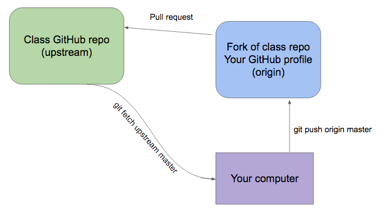

# Git resources
This README file will contain information about how we will be using github as a class. In addition to the setup materials you have already seen there is a section meant to be used as a cheat sheet for the common git/GitHub things that we will need to do on a regular basis.

## Useful links
Here are some links to Git tutorials and other resources that may help if you're looking for extra Git practice or a refresher. 
* [Link to interactive Git tutorial](https://try.github.io/levels/1/challenges/1)
* [List of GitHub recommened resources](https://help.github.com/articles/git-and-github-learning-resources/)

## Diagram of class's Git workflow

The diagram above shows the normal workflow we will be using a class. Notice that it does not include the Git commands that you will be entering locally on your computer to add and commit changes. For more detailed instructions see the cheat sheet below.

## Git cheat sheet
The subsections points below cover many of the common commands that we will be using daily in class.

### Getting new code from the class repo
Running the three commands found here in your local project and you should be in sync with the class repo
* `git fetch upstream` - this command will tell git to grab any changes to the class's repo and bring them into your project under the branch named `upstream/master`
* `git checkout master` - this tells git to move you to your local `master` branch
* `git merge upstream/master` - this command tells git to merge your local `master` branch with the `upstream/master` branch you fetched in the first command

### Making changes and committing code
The commands below are used to save changes that you make locally
* `git status` - shows you the current status of what is ready to be committed (staged) or what files need to be added
* `git add <file_name>` - this will tell git to stage the file that you run the command with so that it can be committed
* `git status` - running git status again should now show the file that you ran the `git add` command with in a different section called staged
* `git commit -m "type your commit message here"` - this will commit (basically like a quick save) any of the files that were staged to be committed in the steps above

### Pushing your local changes to your GitHub repo
Once you're done working on a section of the class project you can push all of the commits you made along the way to the GitHub version of your project that you made on your GitHub profile. This is done so that there is a remote version of the project you're working on that isn't tied to one computer. Later on it will also allow us to have multiple people work on the same pieces of code in an organized way. 
* `git status` - make sure that you aren't missing any changes that you wanted to save. You should see a message saying that your branch is ahead of `origin/master` by some number of commits
* `git push origin master` - this tells Git to push the local changes you have up to the remote repo called `origin` on the branch called `master`

### Submitting a pull request to the class repo
Once you've committed your changes, and pushed those changes to your remote repo called `origin` you're ready to submit a pull request.
* go to your GitHub profile and and navigate to the fork of the class project that you created
* the name of your fork should be `<your_GitHub_name>/civicu-pythonii-summer-2017`
* look for the `new pull request` button on the main page of the repo, left side right above the list of files
* click the pull request button and follow the instructions to make a new pull request

## Troubleshooting
If you ever run into trouble with the instructions above make sure to read the messages that Git gives you, they're super well written and can often point you in the right direction. Also feel free to reach out on Slack for an extra hand. I'll include and update a list of common problems below as they happen throughout the class. If you run into any problem that isn't included here let me know and it will be added or submitted as a PR (pull request) to add a change.
* Permission denied when trying `git push origin master`
    * often this problem can happen if you're trying to commit code to the class repo directly and not your copy on GitHub
    * run `git remote -v` and make sure that the remote for your project is pointing to `<your_GitHub_name>/civicu-pythonii-summer-2017`
    * if your remote called origin is pointing to the class repo `hackoregon/civicu-pythonii-summer-2017` you'll need to follow the instructions to [change a remote url](https://help.github.com/articles/changing-a-remote-s-url/)
    * also make sure to double check that you have a remote called `origin` and one called `upstream` when you run the `git remote -v` command, if you don't have both setup you'll need to follow the initial class setup instructions or move to a local copy of the project that has both remotes set up

## Initial setup instructions
Below is a copy of the setup instructions that we followed on the first night of class. These are the steps needed to fork a project, and set it up so that it can be synced with the class's GitHub repo.

### Steps for class GitHub setup
* Fork the class repo to your GitHub account
  * [class repo](https://github.com/hackoregon/civicu-pythonii-summer-2017)
* Clone the forked repo onto your local machine
  * `git clone <github_url_to_forked_repo>`
* Move into the directory of the repo you just cloned
* Run the command `git remote -v` you should see the repo you forked to your GitHub as `origin`
* Link your forked repo to the original
  * [docs on configuring a remote fork](https://help.github.com/articles/configuring-a-remote-for-a-fork/)
  * URL for `upsteam` repo: `https://github.com/hackoregon/civicu-pythonii-summer-2017.git`
* Sync your forked repo with the original
  * We will follow the process in the link below to get new code for each day in class
  * [docs on syncing a fork](https://help.github.com/articles/syncing-a-fork/)
* Make a new directory using your name as the title inside the `student-work` directory in the class repo. Using the command `mkdir <your_name_here>`
* Inside your newly created directory use the command `touch README.md` to create a new README.md file 
* Use git to add and commit the file you just created 
    * Remember the commands `git status`, `git add`, and `git commit -m "your message here"`
* Push the changes to your GitHub fork (called `origin`) with the command `git push origin master`
* Go to your forked `civicu-pythonii-summer-2017` repo on GitHub and make a pull request against the class repo with your changes
  * URL to your forked repo `https://github.com/<your_user_name>/civicu-pythonii-summer-2017`
  * Click on `new pull request` button
  * Make sure the base fork is: `hackoregon/civicu-pythonii-summer-2017` and that the base branch is `master`
  * Click `create pull request`

